# AgentForge `agents/` — සම්පූර්ණ සිංහල මාර්ගෝපදේශය

> **මේක කාටද?**
> ඔබ programmer කෙනෙක් නොවුණත් කමක් නෑ. මේ ලියවිල්ල `agents/` folder එකේ තියෙන
> **source file 54 ම**, ඒවා ක්‍රියාත්මක වෙන පිළිවෙලටම (pipeline order එකට)
> segment 25 කින් සරල සිංහලෙන් පැහැදිලි කරනවා.
>
> ඔබ මුල ඉඳන් අන්තිමට කියවලා, එක එක segment එක type කරගෙන ගියොත් —
> අන්තිමට **සම්පූර්ණ app builder එකක්ම** ඔබට හැදෙනවා.
>
> *(`__pycache__`, `.pyc` වගේ automatic හැදෙන file මෙතන නෑ — ඒවා code නෙවෙයි.)*

---

## 📊 මොනවද මේ ඇතුළේ තියෙන්නේ?

| වර්ගය | ගාන |
|---|---|
| `.py` — Python code | 47 |
| `.md` — AI ට දෙන උපදෙස් + README | 4 |

| **එකතුව** | **54** |

| Folder | File ගාන | වගකීම |
|---|---|---|
| `core/` | 13 | 🧰 හැමෝටම common මෙවලම් |
| `features/` | 10 | 🧩 පස්සේ කරන වෙනස්කම් |
| `server/` | 9 | 🎬 වැඩ බලන foreman |
| `build/` | 4 | 🚶 Browser test |
| `planner/` | 6 | 🧭 Plan + code ලිවීම |
| `data/` | 5 | 🍃 MongoDB |
| `analysis/` | 5 | 🔍 වැරදි හොයනවා |
| root | 2 | 📖 `__init__.py` + `README.md` |

---

## 📖 පටුන

| # | කොටස | මොකද තියෙන්නේ |
|---|---|---|
| 1 | [AgentForge කියන්නේ මොකක්ද?](#1-agentforge-කියන්නේ-මොකක්ද) | උපමාවකින් මුළු පද්ධතියම |
| 2 | [විශාල චිත්‍රය](#2-විශාල-චිත්‍රය) | Full pipeline diagram |
| 3 | [File 54 ම එක සිතියමක](#3-file-54-ම-එක-සිතියමක) | කවුද මොනවද කරන්නේ |
| 4 | [Segment by Segment](#4-segment-by-segment) | **ප්‍රධාන කොටස** — segment 26 |
| 5 | [දත්ත ගමන් මාර්ගය](#5-දත්ත-ගමන්-මාර්ගය) | `plan.json` යන පාර |
| 6 | [ඔබම type කරන අනුපිළිවෙල](#6-ඔබම-type-කරන-අනුපිළිවෙල) | Build order |
| 7 | [File 54 ම — ලකුණු කරන ලැයිස්තුව](#7-file-54-ම--ලකුණු-කරන-ලැයිස්තුව) | එකක්වත් අතහැරලා නෑ |
| 8 | [වචන මාලාව](#8-වචන-මාලාව) | තාක්ෂණික වචන සිංහලෙන් |

---

## 1. AgentForge කියන්නේ මොකක්ද?

### 🏠 උපමාව — ගෙයක් හදන කණ්ඩායමක්

ඔබ ගොඩනැගිලි කොන්ත්‍රාත්කරුවෙක් ළඟට ගිහින් කියනවා:

> *"මට online පොත් සාප්පුවක් ඕන. මිනිස්සුන්ට පොත් බලන්න, cart එකට දාන්න,
> order කරන්න පුළුවන් වෙන්න ඕන."*

සාමාන්‍ය කණ්ඩායමක් කරන දේම තමයි AgentForge කරන්නේ — නමුත් **මිනිස්සුන්ට වෙනුවට
agent කියන program කෑලි කිහිපයක්** මේ වැඩ බෙදාගෙන කරනවා:

| සැබෑ ලෝකයේ කවුද | AgentForge එකේ | File එක |
|---|---|---|
| 🧭 **ගෘහ නිර්මාණ ශිල්පියා** — plan එක අඳිනවා | `PlannerAgent` | `planner/planning.py` |
| 🧱 **මේසන් බාස්** — plan එක බලාගෙන හදනවා | `ArchitectAgent` | `planner/architecture.py` |
| 🚰 **ජල/විදුලි කාරයා** — connection දෙනවා | `MongoManager` | `data/mongo_lifecycle.py` |
| 🔨 **QC engineer** — හරියටම හැදිලාද බලනවා | `run_build_fix_loop` | `server/build_repair.py` |
| 🔍 **නිරීක්ෂකයා** — plan එකයි code එකයි ගළපනවා | `AnalyzerAgent` | `analysis/analyzer.py` |
| 🚶 **පදිංචිකරු** — ඇතුළට ගිහින් ඇවිදලා බලනවා | `TesterAgent` | `build/tester_browser.py` |
| 🩹 **වෛද්‍යවරයා** — කැඩුණු එක හදනවා | `BugFixerAgent` | `analysis/bugfixer_apply.py` |
| 🧩 **පස්සේ කාමරයක් දාන කාරයා** | `FeaturesAgent` | `features/features_apply.py` |
| 🎨 **චිත්‍ර ශිල්පියා** — රූප අඳිනවා | `ImageAgent` | `features/images.py` |
| 🧰 **මෙවලම් පෙට්ටිය** — හැමෝටම common | `core/` | `core/*.py` |

### 🎯 මූලික අදහස් තුනක්

**අදහස 1 — Plan එක තමයි නීතිය.**
Planner plan එකක් හදනවා. ඊට පස්සේ **හැම කෙනෙක්ම** ඒ plan එකට එකඟවෙන්න ඕන.
Builder plan එකේ නැති දෙයක් හදන්නේ නෑ. Analyzer plan එකට සාපේක්ෂවයි වැරදි හොයන්නේ.

**අදහස 2 — සාක්ෂි නැතුව අත ගහන්නේ නෑ.**
"මේක වැරදි වගේ" කියලා code වෙනස් කරන්නේ නෑ. Browser එකේ error එකක්, HTTP 500 එකක්,
compile error එකක් — **ඇත්තටම දැක්කම** විතරයි වෙනස් කරන්නේ.

**අදහස 3 — වැරදුනොත් ආපහු කලින් තැනට.**
අලුත් feature එකක් දාලා app එක කැඩුනොත්, ඒ file ඔක්කොම **automatic ම** කලින්
තිබ්බ තැනට ආපහු දානවා (rollback). කැඩුණු app එකක් user ට දෙන්නේ නෑ.

---

## 2. විශාල චිත්‍රය

මුළු pipeline එකම එක තැනකින්:

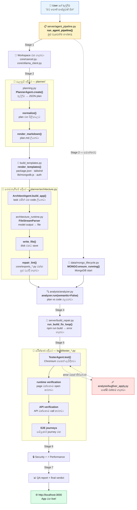

### 🔁 දෙවෙනි ගමන — දැනටමත් තියෙන app එකක් වෙනස් කරනවා

```mermaid
flowchart LR
    A["👤 'මට dark mode<br/>එකක් ඕන'"] --> B

    B["server/feature_actions.py<br/><b>run_feature()</b>"]
    B --> C["📸 _capture_feature_transaction()<br/><i>දැන් තියෙන file ඔක්කොම copy</i>"]
    C --> D["server/scope_map.py<br/>වෙනස් කරන්න ඕන file<br/>මොනවද කියලා හොයනවා"]
    D --> E["features/features_planning.py<br/><b>plan_feature()</b><br/>වෙනස plan කරනවා"]
    E --> F["features/features_apply.py<br/><b>apply()</b><br/>code ලියනවා"]
    F --> AU["features/features_audit.py<br/><b>audit_change()</b><br/>ඇත්තටම වුණාද?"]
    AU --> G{"verify_after_edit()<br/>build එක හරිද?"}
    G -->|"✅ හරි"| H["_stabilize_feature_upgrade()<br/>browser එකෙන් බලනවා"]
    G -->|"❌ බැරි"| R["↩ _restore_feature_transaction()<br/><b>ඔක්කොම ආපහු කලින් තැනට</b>"]
    H -->|"✅ හොඳයි"| OK["🎉 Feature එක save"]
    H -->|"❌ කැඩුණා"| R

    style R fill:#fee2e2,stroke:#dc2626,color:#111
    style OK fill:#dcfce7,stroke:#16a34a,color:#111
```

---

## 3. File 54 ම එක සිතියමක

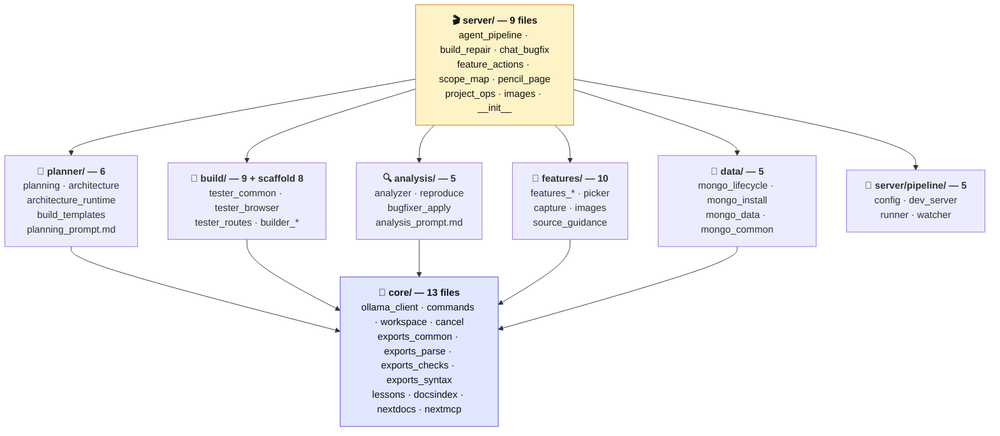

### 📂 File එකින් එක — කවුද මොකද කරන්නේ

| # | File | සරලව | Segment |
|---|---|---|---|
| 1 | `__init__.py` | 📖 Package එකේ විස්තරය | S1 |
| 2 | `README.md` | 📖 English guide එක | S1 |
| 3 | `server/__init__.py` | 📖 Server package විස්තරය | S1 |
| 5 | `core/cancel.py` | 🛑 Cancel කළොත් ඔක්කොම මකනවා | S2 |
| 6 | `core/__init__.py` | 📖 Core package විස්තරය | S3 |
| 7 | `core/ollama_client.py` | 🧠 AI model එකට කතා කරනවා | S3 |
| 8 | `planner/__init__.py` | 📖 Planner package විස්තරය | S4 |
| 9 | `planner/planning_prompt.md` | 📜 Planner ට දෙන නීති | S4 |
| 10 | `planner/planning.py` | 🧭 ඉල්ලීම → JSON plan | S4·S5·S6 |
| 11 | `planner/build_templates.py` | 📦 package.json · tailwind · auth | S7 |
| 12 | `planner/architecture.py` | 🧱 plan → සැබෑ code files | S8 |
| 13 | `planner/architecture_runtime.py` | 📥 model output → file | S9 |
| 14 | `core/commands.py` | 🛡 Safe commands විතරක් | S10 |
| 15 | `core/workspace.py` | 🔦 Agent ට file කියවන tools | S10 |
| 16 | `core/exports_common.py` | 🔗 Import/export මූලික මෙවලම් | S11 |
| 17 | `core/exports_parse.py` | 🔗 Import/export කියවනවා | S11 |
| 18 | `core/exports_checks.py` | 🔗 කැඩුණු import හොයනවා | S11 |
| 19 | `core/exports_syntax.py` | 🔗 Code එක parse වෙනවාද | S11 |
| 20 | `core/docsindex.py` | 📚 Next.js docs (local) | S12 |
| 21 | `core/nextdocs.py` | 📚 Next.js docs (internet) | S12 |
| 22 | `core/nextmcp.py` | 📡 App එකෙන්ම error ගන්නවා | S12 |
| 23 | `core/lessons.py` | 🎓 පරණ වැරදිවලින් ඉගෙනීම | S12 |
| 24 | `data/__init__.py` | 📖 Data package විස්තරය | S13 |
| 25 | `data/mongo_common.py` | 🔧 Mongo මූලික මෙවලම් | S13 |
| 26 | `data/mongo_install.py` | ⬇️ MongoDB download | S13 |
| 27 | `data/mongo_lifecycle.py` | ▶️ MongoDB start/stop | S13 |
| 28 | `data/mongo_data.py` | 🧹 Database clear කරනවා | S13 |
| 4 | `server/agent_pipeline.py` | 🎬 මුළු වැඩෙන්ම භාරකරු — Stage 1–7 | S1 |
| 29 | `server/build_repair.py` | 🔨 npm run build → error හදනවා | S14 |
| 30 | `analysis/__init__.py` | 📖 Analysis package විස්තරය | S15 |
| 31 | `analysis/analysis_prompt.md` | 📜 Analyzer ට දෙන නීති | S15 |
| 32 | `analysis/analyzer.py` | 🔍 plan vs code — වැරදි ලැයිස්තුව | S15 |
| 33 | `build/__init__.py` | 📖 Build package විස්තරය | S16 |
| 34 | `build/tester_common.py` | 🚶 Test එකේ මූලික කොටස | S16 |
| 35 | `build/tester_browser.py` | 🎭 Chromium open කරලා බලනවා | S16 |
| 36 | `build/tester_routes.py` | 🔗 Page ඔක්කොම හොයනවා | S16 |
| 37 | `analysis/reproduce.py` | 🔁 Error එක ආපහු කරලා බලනවා | S17 |
| 38 | `analysis/bugfixer_apply.py` | 🩹 Test/runtime වැරදි හදනවා | S17 |
| 39 | `server/chat_bugfix.py` | 🐛 "වැඩ කරන්නේ නෑ" කිව්වම | S18 |
| 40 | `features/__init__.py` | 📖 Features package විස්තරය | S19 |
| 41 | `features/feature_prompt.md` | 📜 Feature agent ට දෙන නීති | S19 |
| 42 | `features/source_guidance.py` | 📜 Prompt load + image intent | S19 |
| 43 | `features/features_common.py` | 📐 `FeatureSpec` + path safety | S19 |
| 44 | `features/features_planning.py` | 🗺 වෙනස plan කරනවා | S20 |
| 45 | `features/features_apply.py` | ✍️ වෙනස ලියනවා | S20 |
| 46 | `features/features_audit.py` | 🕵️ ඇත්තටම වුණාද බලනවා | S20 |
| 47 | `server/feature_actions.py` | 🧩 Feature flow එක | S21 |
| 48 | `server/scope_map.py` | 🎯 අඩුම file ගාන හොයනවා | S21 |
| 49 | `features/picker.py` | 👆 Click කරපු එක code එකේ කොහෙද | S22 |
| 50 | `features/capture.py` | 📸 Screen එකේ photo ගන්නවා | S22 |
| 51 | `server/pencil_page.py` | ✏️ ඇඳලා වෙනස් කරන එක | S22 |
| 52 | `features/images.py` | 🎨 Fooocus එකෙන් රූප හදනවා | S23 |
| 53 | `server/images.py` | 🖼 රූප stage එක manage කරනවා | S23 |
| 54 | `server/project_ops.py` | 📁 Project list · delete · save | S24 |

---

## 4. Segment by Segment

මෙතන ඉඳන් තමයි **ප්‍රධාන කොටස**. Code එක ක්‍රියාත්මක වෙන පිළිවෙලටම,
segment 25 කින්, **file 54 ම** පැහැදිලි කරනවා.

### 📌 Code block එකක් කියවන විදිය

හැම code block එකකම **පළමු පේළියේ file path එක** තියෙනවා. ඒක තමයි ඒ code එක
**කොහෙද ලියන්නේ** කියලා කියන්නේ:

```python
# ═══ agents/planner/planning.py ═══════════════════════════════
#     ↑ මේ file එකේ තමයි මේ code එක ලියන්නේ
```

**හැම file එකකම මුලින්ම import ටික දෙනවා** — ඒවා නැතුව code එක වැඩ කරන්නේ නෑ.

### ⚠️ ඉතාම වැදගත් — `server/` folder එකේ file වලට import නෑ!

`agents/server/` ඇතුළේ තියෙන file 8 ට (`agent_pipeline.py`, `build_repair.py`,
`chat_bugfix.py`, `feature_actions.py`, `scope_map.py`, `pencil_page.py`,
`project_ops.py`, `images.py`) **import පේළියක්වත් නෑ**. ඒක වැරැද්දක් නෙවෙයි —
හිතාමතාම එහෙම කරලා තියෙන්නේ.

ඒවා load වෙන්නේ **project root එකේ `server_runtime.py`** එකෙන්, `exec()`
පාවිච්චි කරලා, **එකම මතක අවකාශයකට** (namespace):

```python
# ═══ server_runtime.py  (agents/ එකෙන් පිටත, project root එකේ) ═══
#!/usr/bin/env python3
"""Load the server modules into the legacy shared runtime namespace."""
from __future__ import annotations

from pathlib import Path

# Order matters because these files share one runtime namespace.
_RUNTIME_PARTS = (
    'server_modules/core/bootstrap.py',      # ← import ඔක්කොම මෙතන!
    'server_modules/core/dev_runtime.py',
    'server_modules/core/build_entry.py',
    'agents/server/build_repair.py',         # ← S14
    'qa_agent/server/unit_support.py',
    'server_modules/srs/srs_runtime.py',
    'server_modules/deploy/deploy_runtime.py',
    'qa_agent/server/unit_stage.py',
    'qa_agent/server/e2e_stage.py',
    'qa_agent/server/e2e_final.py',
    'qa_agent/server/runtime_repair.py',
    'agents/server/images.py',                # ← S23
    'qa_agent/server/verification.py',
    'agents/server/chat_bugfix.py',           # ← S18
    'agents/server/agent_pipeline.py',        # ← S1
    'agents/server/feature_actions.py',       # ← S21
    'agents/server/scope_map.py',             # ← S21
    'agents/server/pencil_page.py',           # ← S22
    'agents/server/project_ops.py',           # ← S24
    'server_modules/ui/http_base.py',
    'server_modules/ui/http_handler.py',
    # … තව ටිකක්
)


def _load_runtime_parts() -> None:
    root = Path(__file__).resolve().parent
    namespace = globals()                     # ⭐ එකම dictionary එකක්
    for relative_path in _RUNTIME_PARTS:
        path = root / relative_path
        source = path.read_text(encoding="utf-8")
        exec(compile(source, str(path), "exec"), namespace, namespace)


_load_runtime_parts()
```

**මොකද වෙන්නේ:** `bootstrap.py` එකේ import කරපු **හැම දෙයක්ම**, ඊට පස්සේ
load වෙන file ඔක්කොමට **automatic ම** පේනවා. ඒ නිසා `agent_pipeline.py`
එකේ `MONGO`, `ArchitectAgent`, `threading` කියලා ලියන්න පුළුවන් —
import නොකර.

`server_modules/core/bootstrap.py` එකේ තියෙන ප්‍රධාන import:

```python
# ═══ server_modules/core/bootstrap.py  (agents/ එකෙන් පිටත) ═══
import atexit, base64, signal, sys, json, asyncio, logging, threading
import time, re, socket, subprocess, os, textwrap, urllib3, uuid, io
from concurrent.futures import ThreadPoolExecutor
from pathlib import Path

import requests

from agents.planner.planning import RefinerAgent
from agents.planner.architecture import ArchitectAgent, FileStreamParser
from agents.build.builder_generation import BuilderAgent
from agents.build.builder_common import set_stream_callback
from agents.build.tester_browser import TesterAgent
from agents.build.tester_common import set_emit as set_tester_emit
from agents.analysis.analyzer import (AnalyzerAgent, AnalyzerReport, Finding,
                                      REPAIRABLE_MAJOR)
from agents.analysis.bugfixer_apply import BugFixerAgent
from agents.core import nextdocs, cancel
from agents.core.exports_checks import check_named_imports
from agents.core.exports_syntax import check_syntax, syntax_messages
from agents.core.commands import CommandRunner
from agents.core.workspace import WorkspaceTools, TOOL_HELP
from agents.features.features_apply import FeaturesAgent
from agents.features.features_common import FeatureSpec
from agents.features.capture import PENCIL_SYSTEM, capture_region
from agents.features.images import ImageAgent
from agents.features.source_guidance import feature_image_requested
from agents.features.picker import (ELEMENT_EDIT_SYSTEM, ElementResolver,
                                    describe, guard_scope, routes_rendering)
from agents.data.mongo_lifecycle import MONGO
from agents.data.mongo_common import db_name_for
from qa_agent.core.session_files import QASession
from qa_agent.unit.snapshot import FileSnapshot
# … තව ගොඩක්
```

> 💡 **ඔබ මේක type කරනවා නම්:** `agents/server/*.py` file ලියද්දී import
> දාන්න එපා. ඒ වෙනුවට `server_runtime.py` සහ `bootstrap.py` හදලා, ඒකෙන්
> load කරන්න. **අනිත් හැම folder එකකම** (`core/`, `planner/`, `analysis/`,
> `features/`, `data/`, `build/`) file සාමාන්‍ය Python module — ඒවාට import ඕන.

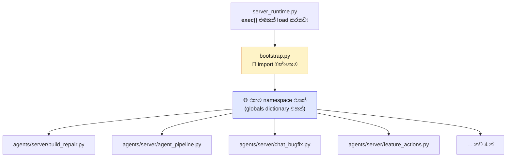

### 🗺 Segment 26 — එක බැල්මකින්

```mermaid
flowchart LR
    A["S1–S3<br/>🎬 පටන්ගැනීම<br/><i>pipeline · cancel · model</i>"]
    B["S4–S6<br/>🧭 සැලසුම<br/><i>planner</i>"]
    C["S7–S9<br/>🧱 ලිවීම<br/><i>scaffold · architect · parser</i>"]
    D["S10–S12<br/>🧰 මෙවලම්<br/><i>core</i>"]
    E["S13–S16<br/>🔨 පරීක්ෂාව<br/><i>mongo · build · analyzer · tester</i>"]
    F["S17–S18<br/>🩹 අලුත්වැඩියාව<br/><i>reproduce · bugfix</i>"]
    G["S19–S24<br/>🧩 වෙනස්කම්<br/><i>features · pencil · images</i>"]
    H["S25–S26<br/>🕰 පරණ ක්‍රම<br/><i>vite builder · watcher</i>"]

    A --> B --> C --> D --> E --> F --> G --> H

    style A fill:#fef3c7,stroke:#d97706,color:#111
    style C fill:#dbeafe,stroke:#2563eb,color:#111
    style E fill:#fce7f3,stroke:#db2777,color:#111
    style H fill:#dcfce7,stroke:#16a34a,color:#111
```

---

### 🟡 SEGMENT 1 — ඇතුල් වෙන දොර

📁 **Files (4):**
`agents/__init__.py` · `agents/README.md` ·
`agents/server/__init__.py` · `agents/server/agent_pipeline.py`

🎯 **වැඩේ:** User ගේ ඉල්ලීම අරගෙන, project folder එකක් හදලා, මුළු වැඩේම පටන් ගන්නවා.

🧠 **සරලව:** මේක තමයි **වැඩ බලන foreman**. හැම දෙයක්ම මෙතනින් පටන් ගන්නවා,
මෙතනින්ම ඉවර වෙනවා. ඇතුළේ Stage 1 සිට Stage 7 දක්වා පියවර 7 ක් තියෙනවා.

#### 📄 පොඩි file දෙක මුලින්ම

```python
# ═══ agents/__init__.py ═══════════════════════════════════════
"""AgentForge pipeline: plan, build, prepare data, verify, then improve."""
```

```python
# ═══ agents/server/__init__.py ════════════════════════════════
"""Connect UI requests to the build, repair, and feature pipelines."""
```

> 💡 **`__init__.py` කියන්නේ මොකක්ද?**
> Python ට *"මේ folder එක package එකක්"* කියලා කියන file එක. හිස් වුණත්
> කමක් නෑ. AgentForge එකේ ඒවා ඇතුළේ **එක වාක්‍යයක්** තියෙනවා — ඒ folder එකේ
> වගකීම මොකක්ද කියලා. Folder 7 ටම එහෙම එකක් තියෙනවා.

`agents/README.md` — English කියවන අයට තියෙන කෙටි guide එක. package
කියවන්න ඕන පිළිවෙල කියනවා:

```text
# ═══ agents/README.md ═══
1. server   → ඉල්ලීම භාරගෙන මුළු වැඩේම කරනවා
2. planner  → ඉල්ලීම requirements + file map එකක් කරනවා
3. build    → plan කරපු file ලියලා, පිරිසිදු කරලා, package install කරනවා
4. data     → MongoDB start කරලා project data වෙන් කරනවා
5. analysis → app එකයි plan එකයි ගළපලා ඇත්ත අඩුපාඩු කියනවා
6. features → පස්සේ, පොඩි පොඩි වෙනස්කම් කරනවා
7. core     → cancel · commands · model calls · file tools
```

#### 🎬 දැන් ප්‍රධාන එක — `agent_pipeline.py`

**⚠️ මතක තියාගන්න:** මේ file එකට import නෑ (උඩ පැහැදිලි කළා). `bootstrap.py`
එකෙන් `cancel`, `MONGO`, `ArchitectAgent`, `threading`, `Path` ඔක්කොම එනවා.

```python
# ═══ agents/server/agent_pipeline.py ══════════════════════════
# (import නෑ — server_runtime.py එකෙන් bootstrap.py එකේ namespace එකට load වෙනවා)

# Main flow: prepare -> plan -> build -> verify -> report -> serve.
def run_agent_pipeline(prompt: str, model: str, think: bool = None,
                       qa_model: str = "", resume_project: str = "",
                       logo: str = "", srs_id: str = ""):
    """Build and verify one app from a request or an approved SRS."""
    # Stage 1: restore or create the owned project workspace.
    cancel.begin()
    warn_if_agents_stale()
    set_tester_emit(emit)
```

**පේළියෙන් පේළිය:**

| Code | කොහෙන් එනවද | සිංහලෙන් |
|---|---|---|
| `prompt` | parameter | User ලිව්ව දේ. උදා: *"පොත් සාප්පුවක්"* |
| `model` | parameter | AI model එක. උදා: `qwen3-coder:480b-cloud` |
| `think` | parameter | "හොඳට හිතලා උත්තර දෙන්න" කියනවාද? |
| `qa_model` | parameter | Test ලියන්න වෙන model එකක් ඕනද? |
| `resume_project` | parameter | නැවතුණු project එකක් ආපහු පටන් ගන්නවාද? |
| `logo` | parameter | User approve කරපු logo එකක් තියෙනවාද? |
| `srs_id` | parameter | SRS document එකකින් ආවේ නම් ඒකේ ID |
| `cancel.begin()` | `agents/core/cancel.py` | "අලුත් වැඩක් පටන් ගන්නවා" |
| `warn_if_agents_stale()` | `agents/server/chat_bugfix.py` | Code update කරලා restart කරලා නැත්නම් අනතුරු අඟවනවා |
| `set_tester_emit(emit)` | `agents/build/tester_common.py` | Test agent ට UI එකට message යවන පාරක් දෙනවා |

💻 **Project folder එක හදන කොටස:**

```python
# ═══ agents/server/agent_pipeline.py — run_agent_pipeline() ඇතුළේ ═══
        if resume_project:
            proj_dir = PROD_DIR / resume_project        # පරණ එකට ආපහු
            pname = proj_dir.name
            if not (proj_dir / ".agentforge" / "plan.json").is_file():
                intent = load_run_intent(proj_dir)      # plan නෑ — මුල ඉඳන්
                if not intent.get("prompt"):
                    eerr(f"{resume_project} has nothing to resume from")
                    return
                elog("INFO", "   ↩ no plan yet — restarting from the original request")
                prompt = prompt or intent.get("prompt", "")
                model = model or intent.get("model", "")
                qa_model = qa_model or intent.get("qa_model", "")
                srs_id = srs_id or intent.get("srs_id", "")
                logo = logo or intent.get("logo", "")
                if think is None:
                    think = intent.get("think")
                resume_project = ""
        else:
            proj_dir = _project_dir_for(
                _project_slug(_srs_app_name(srs_id), prompt[:40]), "next")
            pname = proj_dir.name                       # අලුත් නමක් හදනවා

        proj_dir.mkdir(parents=True, exist_ok=True)     # folder එක හදනවා
        save_run_intent(proj_dir, prompt=prompt, model=model, think=think,
                        qa_model=qa_model, srs_id=srs_id, logo=logo)
        elog("INFO", f"   📁 {proj_dir}")
        # From here a cancel has something to undo.
        cancel.note(project=pname, srs_id=srs_id)
        eproject(pname)
```

| Function | කොහෙන් | වැඩේ |
|---|---|---|
| `_project_dir_for()` | `agents/server/build_repair.py` | Folder path එක හදනවා |
| `_project_slug()` | `agents/server/build_repair.py` | නම safe කරනවා |
| `save_run_intent()` | `agents/server/chat_bugfix.py` | ඉල්ලීම disk එකේ save |
| `load_run_intent()` | `agents/server/chat_bugfix.py` | ඉල්ලීම ආපහු කියවනවා |
| `cancel.note()` | `agents/core/cancel.py` | Cancel කළොත් මකන එක මතක තියනවා |

> 💡 **`save_run_intent` ඇයි?**
> Current run එකේ විස්තර disk එකේ save කරනවා. Computer එක off වුණොත්,
> ආපහු on කරලා **ඒ තැනින්ම** පටන් ගන්න පුළුවන්.

💻 **Stage 2 — Database එක සමාන්තරව start කරනවා:**

```python
# ═══ agents/server/agent_pipeline.py — run_agent_pipeline() ඇතුළේ ═══
        # Stage 2: plan and generate while database startup runs beside it.
        mongo_thread = threading.Thread(target=MONGO.ensure_running, daemon=True)
        mongo_thread.start()

        estep("plan", "active")
        cb = _agent_callbacks(proj_dir)
```

> 💡 **`threading.Thread` කියන්නේ?**
> **සමාන්තරව** වැඩ දෙකක් කරන එක. MongoDB download කරලා start වෙන්න විනාඩි
> 2-3 ක් යනවා. ඒක බලාගෙන ඉන්නවා වෙනුවට, **ඒ අතරේම** plan එකයි code එකයි
> ලියනවා. කුස්සියේ බත් උයද්දීම එළවලු කපනවා වගේ.
>
> `daemon=True` කියන්නේ — ප්‍රධාන program එක ඉවර වුණාම මේකත් නවතිනවා.

💻 **රූප ඇඳීමත් සමාන්තරව:**

```python
# ═══ agents/server/agent_pipeline.py — run_agent_pipeline() ඇතුළේ ═══
        drawing = {"thread": None}

        def _draw_when_planned(event):
            """Draw the planned pictures beside code generation, not after it."""
            ephase(event)
            if drawing["thread"] or event.get("status") != "done":
                return
            if not ((event.get("plan") or {}).get("images")):
                return
            drawing["thread"] = threading.Thread(
                target=run_image_stage, args=(arch, proj_dir), daemon=True)
            drawing["thread"].start()

        cb["on_phase"] = _draw_when_planned
```

**මොකද වෙන්නේ:** Plan එක ඉවර වුණ **හරියටම ඒ මොහොතේම**, plan එකේ රූප
තියෙනවා නම් — රූප ඇඳීම background එකේ පටන් ගන්නවා. Code ලියලා ඉවර වෙනකම්
බලාගෙන ඉන්නේ නෑ. (`run_image_stage` → `agents/server/images.py`, S23)

💻 **QA session එක හදනවා:**

```python
# ═══ agents/server/agent_pipeline.py — run_agent_pipeline() ඇතුළේ ═══
        qa_model = qa_model or model
        qa = QASession(proj_dir, callbacks=_qa_callbacks(), model=qa_model,
                       enabled=is_cloud_model(qa_model))
        if qa.enabled and qa_model != model:
            elog("INFO", f"   🧪 QA runs on {qa_model}")
        if not qa.enabled:
            elog("WARN", "   ⚠ QA is cloud-only — no unit tests, no "
                         "end-to-end flow, and no signed-in page sweep for "
                         f"{qa_model}. Pick a cloud QA model to get them.")
        cb["on_phase"] = qa.on_phase(cb["on_phase"])
        cb["on_file_written"] = qa.on_file_written(cb["on_file_written"])
```

> 💡 **QA cloud-only ඇයි?**
> Test ලියන එක **ගොඩක් අමාරු වැඩක්**. Local model එකකට ඒක හරියට කරන්න බෑ.
> ඒ නිසා cloud model එකක් නැත්නම් test අදියර skip කරලා, **පැහැදිලිවම
> user ට කියනවා** — "test නෑ" කියලා. හංගන්නේ නෑ.
>
> (`QASession` → `qa_agent/core/session_files.py`, `agents/` එකෙන් පිටත)

💻 **Architect එක හදලා run කරනවා:**

```python
# ═══ agents/server/agent_pipeline.py — run_agent_pipeline() ඇතුළේ ═══
        arch = ArchitectAgent(ollama, model, proj_dir, cb,
                              stack="next",
                              mongo_uri=MONGO.uri_for(pname),
                              db_name=db_name_for(pname),
                              dev_port=DEV_PORT,
                              think=think)
        qa.bind(arch)

        if resume_project:
            arch.load_existing()
            left = len(arch.unfinished())
            elog("INFO", f"⏭️  Resuming {pname} — {left} file(s) still missing")
            ok = arch.resume(brief=_srs_brief(proj_dir, model) if srs_id else "")
        else:
            requirement_brief = prompt
            if srs_id:
                requirement_brief = (_srs_name_line(proj_dir) + requirement_brief
                                     + _srs_brief(proj_dir, model))

            brief = requirement_brief
            if logo_ready:
                brief += ("\n\nThe app's logo already exists at `/logo.png` "
                          "(public/logo.png). Use it in the header and the "
                          "footer with a plain  and the app's name as its "
                          "alt text.")
            brief += _image_brief_line(proj_dir, requirement_brief)
            ok = arch.run(brief, requirement_source=requirement_brief)
```

| Object / function | කොහෙන් |
|---|---|
| `ArchitectAgent` | `agents/planner/architecture.py` (S8) |
| `MONGO.uri_for()` | `agents/data/mongo_data.py` (S13) |
| `db_name_for()` | `agents/data/mongo_common.py` (S13) |
| `_image_brief_line()` | `agents/server/images.py` (S23) |

> 💡 **`requirement_brief` සහ `brief` දෙකක් ඇයි?**
> `requirement_brief` = **user ට ඕන දේ** (product requirements).
> `brief` = ඒකට + **තාක්ෂණික උදව්** (logo එක කොහෙද, රූප මොනවද).
>
> මේ දෙක වෙන් කරන්නේ ඇයි? Planner ට *"logo එකක් තියෙනවා"* කියන එක
> **අලුත් requirement එකක්** විදියට වැරදියට තේරෙන්න පුළුවන්. වෙන් කරලා
> දුන්නම, ඒක *"මේක පාවිච්චි කරන්න පුළුවන් දෙයක්"* කියලා විතරයි තේරෙන්නේ.

💻 **Stage 7 — අවසාන තීන්දුව:**

```python
# ═══ agents/server/agent_pipeline.py — run_agent_pipeline() ඇතුළේ ═══
        # Stage 7: write one final verdict and keep the preview available.
        quality_clean = bool(build_ok and flow_clean and flow_conclusive
                             and runtime_clean and api_clean
                             and security_clean and e2e_clean and unit_clean
                             and not runtime_errors)
        emit({"type": "quality_summary",
              "clean": quality_clean, "build": bool(build_ok),
              "flow": bool(flow_clean), "flow_conclusive": bool(flow_conclusive),
              "runtime": bool(runtime_clean), "api": bool(api_clean),
              "security": bool(security_clean), "e2e": bool(e2e_clean),
              "unit": bool(unit_clean), "runtime_errors": len(runtime_errors)})
```

**"Clean" වෙන්න ඕන කොන්දේසි 8 ක්:**

| # | කොන්දේසිය | අදහස |
|---|---|---|
| 1 | `build_ok` | `npm run build` වැඩ කරනවා |
| 2 | `flow_clean` | Plan එකයි code එකයි ගැළපෙනවා |
| 3 | `flow_conclusive` | ඒක **ඔප්පු කරන්න පුළුවන්** |
| 4 | `runtime_clean` | Page ඔක්කොම open වෙනවා |
| 5 | `api_clean` | API ඔක්කොම උත්තර දෙනවා |
| 6 | `security_clean` | ලොකු ආරක්ෂක වැරදි නෑ |
| 7 | `e2e_clean` | User journey ඔක්කොම වැඩ කරනවා |
| 8 | `unit_clean` | Unit test ඔක්කොම pass |

**එකක්වත් fail නම් — "clean" කියලා label කරන්නේ නෑ.** App එක live කරනවා,
ඒත් *"මේක clean නෑ"* කියලා **පැහැදිලිවම** කියනවා.

💻 **Cancel වුණොත් සහ අන්තිමට:**

```python
# ═══ agents/server/agent_pipeline.py — run_agent_pipeline() අන්තිමේ ═══
    except cancel.BuildCancelled:
        # Everything this run made goes with it.
        elog("WARN", "   ⏹ build cancelled — removing what it had made")
        detail = cancel.cleanup(PROD_DIR, delete_project)
        if detail.get("project_error"):
            elog("WARN", f"   ⚠ {detail['project']} did not delete: "
                         f"{detail['project_error']}")
        ecancel(detail)
    except Exception as e:
        eerr(f"Agent error: {e}")
        log.exception("Agent pipeline error")
    finally:
        try:
            qa.stop()
        except Exception:
            pass
        stop_model(model)      # model එකේ memory එක නිදහස් කරනවා
        cancel.finish()
```

**Stage 7 ක් — චිත්‍රයෙන්:**

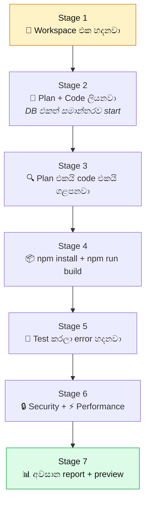

➡️ **ඊළඟට:** Cancel system එක (Segment 2)

---

### 🟡 SEGMENT 2 — Cancel කළොත් මොකද වෙන්නේ?

📁 **File (1):** `agents/core/cancel.py`

🎯 **වැඩේ:** මැදදී cancel කළොත්, ඒ වෙනකම් හදපු ඔක්කොම මකලා දානවා.

🧠 **සරලව:** ගෙයක් හදද්දී අඩක් හදලා නවත්තලා ගියොත් — ඉතුරු වෙන්නේ අනතුරුදායක
කොන්ක්‍රීට් කණු ටිකයි. AgentForge එහෙම කරන්නේ නෑ. Cancel කළොත් **ඔක්කොම මකලා**
පිරිසිදු තැනක් තියලා යනවා.

💻 **File එකේ මුල — imports:**

```python
# ═══ agents/core/cancel.py ════════════════════════════════════
"""Stops a build and removes its unfinished output safely."""

from __future__ import annotations

import shutil
import subprocess
import sys
import threading
from pathlib import Path

__all__ = [
    "BuildCancelled", "begin", "note", "request", "check", "cancelled",
    "track", "finish", "cleanup", "state", "run",
]
```

💻 **Cancel exception එක:**

```python
# ═══ agents/core/cancel.py ═══
class BuildCancelled(BaseException):
    """User cancelled the build."""
```

> 💡 **`BaseException` ඇයි, `Exception` නොවෙයි?**
> Python එකේ `except Exception:` කියලා ලියපු තැන් ගොඩක් තියෙනවා — error
> එකක් ආවම නොනවත්වා දිගටම යන්න. ඒත් **cancel කරන එක නවත්තන්න ඕන**.
> `BaseException` පාවිච්චි කළාම, ඒ `except Exception:` ඒවා මේක **අල්ලන්නේ නෑ**
> — ඒ නිසා cancel එක **ඇත්තටම** නවත්තනවා.

💻 **ප්‍රධාන function:**

```python
# ═══ agents/core/cancel.py ═══
def begin() -> None:
    """අලුත් build එකක් පටන් ගන්නවා."""
    _STATE.update(active=True, requested=False, project="", srs_id="")


def note(project: str = "", srs_id: str = "") -> None:
    """Cancel කළොත් මකන්න ඕන දේවල් මතක තියාගන්නවා."""
    if project:
        _STATE["project"] = project
    if srs_id:
        _STATE["srs_id"] = srs_id


def cancelled() -> bool:
    return bool(_STATE.get("requested"))


def check() -> None:
    """Cancel කරලාද කියලා බලනවා. කරලා නම් නවත්තනවා."""
    if cancelled():
        raise BuildCancelled()
```

**මෙතන තියෙන දක්ෂකම:** `check()` කියන function එක **code එකේ තැන් ගොඩක්**
කැඳවනවා. ඒ නිසා cancel button එක ඔබපු ගමන් නවතින්නේ නෑ — **ඊළඟ safe තැනට**
ආවම නවතිනවා. ඒකෙන් file අඩක් ලියලා තියෙන තත්වයක් එන්නේ නෑ.

💻 **Process එකක් අල්ලාගෙන ඉන්න එක:**

```python
# ═══ agents/core/cancel.py ═══
class track:
    """Remember a running process so cancel can kill it."""

    def __init__(self, proc):
        self.proc = proc

    def __enter__(self):
        _STATE.setdefault("procs", []).append(self.proc)
        return self.proc

    def __exit__(self, *exc):
        try:
            _STATE.get("procs", []).remove(self.proc)
        except ValueError:
            pass
```

> 💡 **`with` statement එකක් කියන්නේ?**
> `with cancel.track(proc):` කිව්වම — ඇතුළට යනකොට `__enter__` run වෙනවා,
> පිටතට එනකොට `__exit__` run වෙනවා. **error එකක් ආවත්** `__exit__` run වෙනවා.
> ඒ නිසා process එක list එකෙන් අයින් වෙන එක **කවදාවත් අමතක වෙන්නේ නෑ**.

💻 **Cleanup එක:**

```python
# ═══ agents/core/cancel.py ═══
def cleanup(prod_dir: Path, delete_project=None) -> dict:
    """Cancel කරපු build එකේ ඔක්කොම මකනවා."""
    detail = {}
    project = _STATE.get("project")
    if project and delete_project:
        try:
            delete_project(project)          # project folder එක මකනවා
            detail["project"] = project
        except Exception as e:
            detail["project_error"] = str(e)

    srs_id = _STATE.get("srs_id")
    if srs_id:
        try:
            discard_srs(srs_id)              # SRS එකත් මකනවා
            detail["srs_id"] = srs_id
        except Exception as e:
            detail["srs_error"] = str(e)
    return detail
```

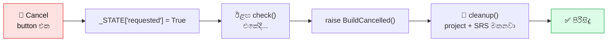

➡️ **ඊළඟට:** AI model එකට කතා කරන විදිය (Segment 3)

---

### 🟡 SEGMENT 3 — AI model එකට කතා කරනවා

📁 **Files (2):** `agents/core/__init__.py` · `agents/core/ollama_client.py`

🎯 **වැඩේ:** Local computer එකේ හෝ cloud එකේ තියෙන AI model එකට කතා කරලා,
උත්තරය **වචනෙන් වචනය** ගලාගෙන එනවා.

🧠 **සරලව:** ෆෝන් call එකක් වගේ. නමුත් වෙනස මේකයි — කතාව ඉවර වෙනකම්
බලාගෙන ඉන්නේ නෑ. **වචනයක් වචනයක් ගානේ** එනකොටම process කරනවා. ඒ නිසා
user ට screen එකේ code එක **type වෙනවා වගේ** පේනවා.

```python
# ═══ agents/core/__init__.py ══════════════════════════════════
"""Shared services used by AgentForge agents."""
```

💻 **File එකේ මුල — imports සහ constants:**

```python
# ═══ agents/core/ollama_client.py ═════════════════════════════
"""Routes Ollama requests to a local service or Ollama Cloud."""
import json
import logging
import os
import re
import time
from concurrent.futures import ThreadPoolExecutor
from pathlib import Path

import requests

log = logging.getLogger("ollama")

DEFAULT_LOCAL_HOST = "http://localhost:11434"
CLOUD_HOST = "https://ollama.com"
SETTINGS_PATH = Path.home() / ".agentforge" / "settings.json"

FALLBACK_CLOUD = [
    "gemma4:31b-cloud", "bjoernb/gemma4-31b-fast:latest",
    "qwen3-coder:480b-cloud", "deepseek-v3.1:671b-cloud",
    "gpt-oss:120b-cloud", "kimi-k2:1t-cloud", "glm-4.6:cloud",
    "minimax-m2:cloud",
]

# Use the full cloud window when Ollama reports a smaller placeholder value.
CLOUD_DEFAULT_CTX = 262144
LOCAL_DEFAULT_CTX = 16384

# Some cloud wrappers do not include "cloud" in their names.
_KNOWN_CLOUD = {m.lower() for m in FALLBACK_CLOUD}
_KNOWN_CLOUD |= {m[: -len(":latest")] for m in _KNOWN_CLOUD
                 if m.endswith(":latest")}
```

💻 **Cloud ද local ද කියලා තීරණය:**

```python
# ═══ agents/core/ollama_client.py ═══
def is_cloud_model(model: str) -> bool:
    """Check whether a model runs through Ollama Cloud."""
    if not model:
        return False
    m = model.strip().lower()
    if m.endswith("-cloud") or m.endswith(":cloud") or m in _KNOWN_CLOUD:
        return True
    return model.strip() in _default_client().remote_names()
```

| Model නම | Cloud ද? | ඇයි |
|---|---|---|
| `qwen3-coder:480b-cloud` | ✅ ඔව් | `-cloud` කියලා ඉවර වෙනවා |
| `glm-4.6:cloud` | ✅ ඔව් | `:cloud` කියලා ඉවර වෙනවා |
| `bjoernb/gemma4-31b-fast:latest` | ✅ ඔව් | `_KNOWN_CLOUD` list එකේ තියෙනවා |
| `llama3:8b` | ❌ නෑ | Local එකේ run වෙනවා |

> 💡 සමහර cloud model නමේ "cloud" කියලා නෑ. ඒ නිසා **දන්නා නම් ලැයිස්තුවක්**
> (`FALLBACK_CLOUD`) තියාගෙන ඉන්නවා.

💻 **Context window එක තෝරනවා:**

```python
# ═══ agents/core/ollama_client.py ═══
def max_context(model: str) -> int:
    """Choose a safe context size for the model.

    Cloud models use their full window. Local models use the configured limit.
    """
    real = _default_client().model_context(model)

    if is_cloud_model(model):
        return max(real, CLOUD_DEFAULT_CTX)   # cloud = 262,144 tokens

    override = (os.environ.get("AGENTFORGE_NUM_CTX", "").strip()
                or str(load_settings().get("local_num_ctx", "")).strip())
    want = max(4096, int(override)) if override.isdigit() else LOCAL_DEFAULT_CTX
    return min(want, real) if real else want   # local = 16,384 tokens
```

> 💡 **Context window එක කියන්නේ මොකක්ද?**
> AI model එකේ **මතකයේ ප්‍රමාණය**. Cloud model එකකට වචන 262,144 ක් එකපාරට
> මතක තියාගන්න පුළුවන් (පොත් 3-4 ක් වගේ). Local model එකකට 16,384 යි (පිටු 20 ක් වගේ).
> ඒ නිසා local model එකකින් ලොකු app එකක් හදන එක අමාරුයි.

💻 **Settings කියවනවා/ලියනවා:**

```python
# ═══ agents/core/ollama_client.py ═══
def load_settings() -> dict:
    """Read AgentForge settings, or return an empty result on failure."""
    try:
        if SETTINGS_PATH.exists():
            return json.loads(SETTINGS_PATH.read_text(encoding="utf-8"))
    except Exception as e:
        log.warning(f"settings read failed: {e}")
    return {}


def get_api_key() -> str:
    """Read the API key from the environment or saved settings."""
    return (os.environ.get("OLLAMA_API_KEY", "").strip()
            or str(load_settings().get("ollama_api_key", "")).strip())


def get_local_host() -> str:
    """Return the configured address of the local Ollama service."""
    host = (os.environ.get("OLLAMA_HOST", "").strip()
            or str(load_settings().get("ollama_host", "")).strip()
            or DEFAULT_LOCAL_HOST)
    if not host.startswith("http"):
        host = f"http://{host}"
    return host.rstrip("/")
```

> 💡 **පිළිවෙල වැදගත්:** මුලින්ම **environment variable**, ඊට පස්සේ
> **settings file එක**, අන්තිමට **default එක**. ඒකෙන් developer කෙනෙකුට
> settings file එක වෙනස් නොකර temporary ව වෙනස් කරන්න පුළුවන්.

💻 **Route එක — කොහෙටද යවන්නේ:**

```python
# ═══ agents/core/ollama_client.py — class OllamaClient ඇතුළේ ═══
    def route(self, model: str):
        """Return the address and headers needed for this model."""
        headers = {"Content-Type": "application/json"}
        if is_cloud_model(model) and self.api_key:
            headers["Authorization"] = f"Bearer {self.api_key}"
            return CLOUD_HOST, headers            # https://ollama.com
        return self.host, headers                 # http://localhost:11434
```

💻 **Streaming — වචනෙන් වචනය:**

```python
# ═══ agents/core/ollama_client.py — class OllamaClient ඇතුළේ ═══
    def chat_stream(self, model: str, messages: list, tools: list = None,
                    options: dict = None, keep_alive=None, timeout: int = 1800,
                    think: bool = None, stall: int = 300):
        """Yield chat updates as they arrive.

        Unsupported thinking options are retried without that option. ``stall``
        limits silence, while ``timeout`` limits the whole response.
        """
```

| Parameter | අදහස |
|---|---|
| `timeout=1800` | මුළු කතාවටම දෙන කාලය — විනාඩි 30 |
| `stall=300` | **නිශ්ශබ්දව** ඉන්න පුළුවන් උපරිමය — තත්පර 300 |
| `keep_alive` | Model එක memory එකේ තියාගන්න කාලය |
| `think` | "හොඳට හිතන්න" mode එක |
| `tools` | Model එකට දෙන මෙවලම් |

> 💡 **`stall` සහ `timeout` දෙකක් ඇයි?**
> ලොකු file එකක් ලියද්දී විනාඩි 10 ක් යන්න පුළුවන් — ඒත් **වචන එනවා**.
> ඒක ප්‍රශ්නයක් නෑ. ප්‍රශ්නය තමයි **වචනයක්වත් නොඑන** එක. `stall` එකෙන්
> "නිශ්ශබ්දතාවය" මනිනවා, `timeout` එකෙන් මුළු කාලය මනිනවා.

💻 **Thinking option එක reject වුණොත්:**

```python
# ═══ agents/core/ollama_client.py — class OllamaClient ඇතුළේ ═══
    @staticmethod
    def _rejected_think(status: int, text: str) -> bool:
        """Check whether the model rejected the thinking option."""
        return status == 400 and "think" in (text or "").lower()
```

**සමහර model "think" කියන option එක දන්නේ නෑ.** එතකොට HTTP 400 error එකක්
එනවා. ඒක අඳුරගෙන, **`think` නැතුව ආපහු try කරනවා**. Crash වෙන්නේ නෑ.

💻 **Model list එකට icon දාන එක:**

```python
# ═══ agents/core/ollama_client.py ═══
_ICONS = [
    ("coder", "⚛"), ("code", "⚛"), ("qwen", "⚛"), ("kimi", "🌙"),
    ("deepseek", "🔍"), ("gpt-oss", "🌀"), ("glm", "🧊"), ("minimax", "🎯"),
    ("nemotron", "🟩"), ("gemma", "💎"), ("llama", "🦙"), ("mistral", "⚡"),
    ("phi", "🔬"), ("vl", "👁"),
]


def _icon_for(model_id: str) -> str:
    """Turn a model ID into an icon."""
    m = model_id.lower()
    for key, icon in _ICONS:
        if key in m:
            return icon
    return "🧠"


def _pretty_label(model_id: str) -> str:
    """Turn a model ID into a readable label."""
    base = re.sub(r"[-:]cloud$", "", model_id.strip())
    base = base.split("/")[-1]
    parts = re.split(r"[:\-]", base)
    out = []
    for p in parts:
        if not p or p == "latest":
            continue
        if re.fullmatch(r"\d+(\.\d+)?[bmt]", p, re.I):
            out.append(p.upper())                 # 480b → 480B
        elif p.lower() in ("vl", "moe", "gpt", "oss", "glm"):
            out.append(p.upper())                 # glm → GLM
        else:
            out.append(p[:1].upper() + p[1:])     # qwen3 → Qwen3
    return " ".join(out) or model_id
```

| Model ID | Icon | Label |
|---|---|---|
| `qwen3-coder:480b-cloud` | ⚛ | Qwen3 Coder 480B |
| `deepseek-v3.1:671b-cloud` | 🔍 | Deepseek V3.1 671B |
| `gemma4:31b-cloud` | 💎 | Gemma4 31B |
| `llama3:8b` | 🦙 | Llama3 8B |

➡️ **ඊළඟට:** Planner — plan එක හදනවා (Segment 4)

---

### 🔵 SEGMENT 4 — Planner: ඉල්ලීම plan එකක් කරනවා

📁 **Files (3):**
`agents/planner/__init__.py` · `agents/planner/planning_prompt.md` ·
`agents/planner/planning.py`

🎯 **වැඩේ:** User ලිව්ව සරල වාක්‍යය අරගෙන, **විස්තරාත්මක JSON plan** එකක් හදනවා.

🧠 **සරලව:** ඔබ ගෘහ නිර්මාණ ශිල්පියෙක් ළඟට ගිහින් *"මට කාමර 3 ක ගෙයක් ඕන"*
කිව්වම, එයා ඔබට **සම්පූර්ණ blueprint එකක්** අඳිනවා — කාමර මොනවද, දොර කොහෙද,
වහල මොන වගේද, ලයිට් කීයද. Planner කරන්නෙත් ඒකමයි.

#### 📄 `planner/__init__.py`

```python
# ═══ agents/planner/__init__.py ═══════════════════════════════
"""Plans products and builds their application structure."""

from agents.planner.architecture import ArchitectAgent, FileStreamParser
from agents.planner.planning import PlanBundle, PlannerAgent, RefinerAgent

__all__ = [
    "ArchitectAgent", "FileStreamParser", "PlanBundle", "PlannerAgent",
    "RefinerAgent",
]
```

> 💡 **`__all__` කියන්නේ?**
> මේ package එකෙන් **පිටතට දෙන** නම් ලැයිස්තුව. අනිත් හැම දෙයක්ම
> "ඇතුළත වැඩ" — පිටින් පාවිච්චි කරන්න නෙවෙයි.

#### 📜 `planner/planning_prompt.md` — Planner ට දෙන නීති

මේක **code එකක් නෙවෙයි** — AI model එකට කියවන්න දෙන **උපදෙස් ලැයිස්තුවක්**.
ප්‍රධාන නීති:

```text
# ═══ agents/planner/planning_prompt.md ═══
## Non-negotiable interpretation rules

1. User ලිව්ව හැම වැදගත් දෙයක්ම තියාගන්න. එකක්වත් අතහරින්න එපා.
2. හැම ක්‍රියා පදයක්ම වැඩක්. browse, search, filter, create, edit, delete,
   upload, download, approve, reject, pay, schedule, assign, export, sign in —
   හැම එකකටම පේන ප්‍රතිඵලයක් ඕන.
3. වෙන app එකකින් entity, role, label, sample data, flow කොපි කරන්න එපා.
4. අපැහැදිලි නම් — ආරක්ෂිත උපකල්පනයක් ගන්න, ඒක `assumptions` එකේ ලියන්න.
   අපැහැදිලි නිසා requirement එකක් අතහරින්න එපා.
5. FR-001 වගේ ID තිබ්බොත් ඒවම තියාගන්න. නැත්නම් REQ-001 කියලා හදන්න.
6. පේන button එකක් UI → API → database → ආපහු UI කියලා පූර්ණව වැඩ කරන්න ඕන.
   TODO, "coming soon", href="#", disabled button — කිසිවක් නෑ.
7. පුරුද්දට login එකක් දාන්න එපා. ඇත්තටම account, රහස්‍ය දත්ත,
   role, permission තිබ්බොත් විතරයි.
8. දෙන stack එකම පාවිච්චි කරන්න. router, database, framework මාරු කරන්න එපා.
```

**Design ගැනත් නීති තියෙනවා:**

```text
# ═══ agents/planner/planning_prompt.md — design section ═══
- Domain, audience, brand story එකට ගැළපෙන එක කලා දිශාවක් හදන්න.
- Page එක කතාවක් වගේ සකසන්න:
  orient → desire → explore → answer doubt → prove value → next action.
- Scale, weight, contrast, position, whitespace එකෙන් hierarchy හදන්න.
  එක පැහැදිලි primary action එකක්; secondary/tertiary නිහඬ විය යුතුයි.
- 8-point spacing rhythm, disciplined type scale, කියවන්න පුළුවන් පළල.
- 360px, tablet, wide desktop — තුනටම වෙනස් composition, එකම hierarchy.
- Accessibility = visual craft. Semantic order, keyboard flow, contrast,
  touch target, label, reduced motion.
- ප්‍රධාන page එකකට සාමාන්‍යයෙන් වෙනස් section 7-12 ක්. හැම එකක්ම
  requirement එකකින්, real data එකකින්, navigation වැඩකින් හෝ
  objection එකකින් තමන්ගේ තැන උපයාගන්න ඕන.
```

> 💡 **ඇයි මේ නීති `.md` file එකක තියෙන්නේ, code එකේ නොවෙයි?**
> නීතියක් වෙනස් කරන්න ඕන වුණාම — **Python code එකට අත ගහන්න ඕන නෑ**.
> `.md` file එක edit කරලා save කරාම ඇති. `agents/README.md` එකේ මේක
> පැහැදිලිවම කියනවා: *"Prompt details belong in the package prompt Markdown
> files, not in long Python comments."*

#### 🧭 දැන් `planning.py`

💻 **File එකේ මුල — imports:**

```python
# ═══ agents/planner/planning.py ═══════════════════════════════
"""Turns a user's request into one complete, normalized product plan."""
from __future__ import annotations

import json
import logging
import re
from dataclasses import dataclass
from pathlib import Path
from typing import Any, Callable
from xml.sax.saxutils import escape, quoteattr

from agents.core.ollama_client import OllamaClient, max_context
from agents.features.source_guidance import feature_image_requested


log = logging.getLogger("planner")
PROMPT_PATH = Path(__file__).with_name("planning_prompt.md")
```

| Import | ඇයි ඕන |
|---|---|
| `json` | JSON plan එක කියවන්න/ලියන්න |
| `re` | Text pattern හොයන්න (regex) |
| `dataclass` | `PlanBundle` වගේ පොඩි data container |
| `Path` | File path හසුරුවන්න |
| `escape`, `quoteattr` | `sitemap.xml` එකට XML safe කරන්න |
| `OllamaClient`, `max_context` | AI model එකට කතා කරන්න (S3) |
| `feature_image_requested` | රූප ඉල්ලලාද කියලා බලන්න (S19) |

💻 **Stack එක තෝරනවා:**

```python
# ═══ agents/planner/planning.py ═══
NEXT_STACK = """\
FIXED IMPLEMENTATION STACK
- Next.js 16 App Router, React 19, JavaScript only; no TypeScript.
- Tailwind utilities for styling; lucide-react icons; framer-motion only when motion helps.
- MongoDB official driver through the generated @/lib/mongodb module.
- Files live under app/, components/, and lib/. Pages use .jsx, route/lib modules use .js.
- Filesystem routing; no react-router-dom, Pages Router, Mongoose, Prisma, or external APIs.
- Better Auth is generated only when the product genuinely needs authentication.
- AgentForge already owns package/config/Mongo/auth defaults. Never put those in file_plan/tasks.
- Every product page, component, seed module, API route, loading/error/empty
  behavior, and E2E journey must be planned.
"""

VITE_STACK = """\
FIXED IMPLEMENTATION STACK
- React 18 + Vite, JavaScript .jsx only; no TypeScript.
- Tailwind utilities, react-router-dom v6, lucide-react, framer-motion.
- Browser state plus localStorage only. No server, database, private API.
- Files live under src/.
"""
```

> 💡 **ඇයි මේක fix කරලා තියෙන්නේ?**
> Model එකට *"ඔයාට ඕන framework එකක් පාවිච්චි කරන්න"* කිව්වොත්, එක වතාවක්
> React, තව වතාවක් Vue, තව වතාවක් Angular තෝරයි. **එකම විදිය** හැම වතාවෙම
> පාවිච්චි කරන එකෙන් තමයි විශ්වාසනීයභාවය එන්නේ.

💻 **`PlanBundle` — plan එකේ ප්‍රතිඵලය:**

```python
# ═══ agents/planner/planning.py ═══
@dataclass
class PlanBundle:
    data: dict                    # JSON plan එක
    markdown: str                 # plan.md
    architecture_markdown: str    # architecture.md
    design_markdown: str          # design.md
    raw: str                      # model එකෙන් ආපු අමු text එක
    sitemap_xml: str = ""         # sitemap.xml
```

> 💡 **`@dataclass` කියන්නේ?**
> දත්ත ටිකක් එකට තියාගන්න class එකක් හදන කෙටි ක්‍රමයක්. Python ම
> `__init__`, `__repr__` වගේ ඒවා **automatic ම** හදනවා.

💻 **`create()` — ප්‍රධාන function එක:**

```python
# ═══ agents/planner/planning.py — class PlannerAgent ඇතුළේ ═══
    def create(self, user_input: str, requirement_source: str = "") -> PlanBundle | None:
        requirements = str(requirement_source or user_input or "").strip()
        context = str(user_input or "").strip()
        if not requirements:
            self._log("ERROR", "   ❌ Planning needs non-empty user input")
            return None

        user = (
            "AUTHORITATIVE USER INPUT\n\n" + requirements +
            ("\n\nBUILD CONTEXT (implementation resources/constraints, not extra "
             "product requirements)\n\n" + context
             if context and context != requirements else "") +
            "\n\nCreate the complete JSON plan now. Preserve every stated detail."
        )
        messages = [
            {"role": "system", "content": self._system_prompt()},   # නීති
            {"role": "user", "content": user},                       # ඉල්ලීම
        ]
        chunks = []
        self._fire("on_file_start", "plan.md")     # UI එකට "පටන් ගත්තා"

        def receive(delta: str) -> None:
            chunks.append(delta)
            self._fire("on_file_token", "plan.md", delta)   # වචනෙන් වචනය UI එකට

        try:
            self._call(messages, receive)          # model එකට කතා කරනවා
        except Exception as exc:
            self._log("ERROR", f"   ❌ Planner failed: {exc}")
            return None

        raw = "".join(chunks)                      # ඔක්කොම එකතු කරනවා
        parsed = _json_object(raw)                 # JSON එක වෙන් කරගන්නවා
        if not parsed:
            self._log("ERROR", "   ❌ Planner returned no JSON object")
            return None

        plan = self.normalize(parsed, requirements)         # පිළිවෙලට දානවා
        markdown = self.render_markdown(plan)               # මිනිස්සුන්ට කියවන්න
        architecture = "# Architecture\n\n" + self.render_architecture(plan)
        design = "# Product Design\n\n" + self.render_design(plan)
        self._fire("on_file_end", "plan.md", markdown)
        return PlanBundle(plan, markdown, architecture, design, raw,
                          render_sitemap_xml(plan))
```

**මෙතන වෙන දේ පියවර 6 කින්:**

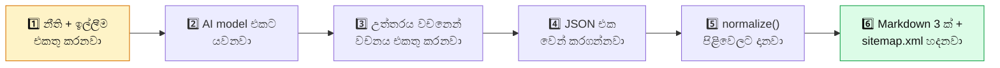

💻 **System prompt එක හදනවා:**

```python
# ═══ agents/planner/planning.py — class PlannerAgent ඇතුළේ ═══
    def _system_prompt(self) -> str:
        body = PROMPT_PATH.read_text(encoding="utf-8")      # planning_prompt.md
        stack = VITE_STACK if self.stack == "vite" else NEXT_STACK
        return body + "\n\n" + stack
```

**මේකෙන් වෙන්නේ:** `planning_prompt.md` එකේ **පොදු නීති** + තෝරගත්ත
**stack එකේ නීති** එකතු වෙනවා.

💻 **JSON එක සොයාගන්නා දක්ෂ ක්‍රමය:**

```python
# ═══ agents/planner/planning.py ═══
def _json_object(raw: str) -> dict:
    """Read the first complete JSON object in a model response."""
    source = str(raw or "").strip()
    # 1. ```json ... ``` ඇතුළේ තියෙනවාද බලනවා
    fenced = re.findall(r"```(?:json)?\s*(\{.*?\})\s*```", source,
                        flags=re.I | re.S)
    candidates = list(reversed(fenced))
    candidates.append(source)                    # 2. නැත්නම් මුළු text එකම
    decoder = json.JSONDecoder()
    for candidate in candidates:
        for match in re.finditer(r"\{", candidate):     # හැම { එකකින්ම try
            try:
                value, _ = decoder.raw_decode(candidate[match.start():])
            except json.JSONDecodeError:
                continue
            if isinstance(value, dict):
                return value                     # 3. හම්බුනා!
    return {}
```

> 💡 **ඇයි මෙච්චර සංකීර්ණ?**
> AI model එකක් සමහර වෙලාවට *"Here is your plan:"* කියලා text එකකුත් එක්ක
> JSON එක දෙනවා. සමහර වෙලාවට ```` ```json ```` ඇතුළේ දානවා. සමහර වෙලාවට
> JSON එකට පස්සේ තව text ලියනවා. මේ function එක **හැම අවස්ථාවකදීම** JSON එක
> හොයාගන්නවා.
>
> `raw_decode()` කියන්නේ — *"මෙතනින් පටන් ගන්න JSON එකක් තියෙනවාද?
> තියෙනවා නම් ඒක විතරක් අරන් ඉතුරු දේ දාන්න"*.

💻 **Callback එකක් crash වුණොත්:**

```python
# ═══ agents/planner/planning.py — class PlannerAgent ඇතුළේ ═══
    def _fire(self, name: str, *args) -> None:
        callback = self.cb.get(name)
        if callable(callback):
            try:
                callback(*args)
            except Exception as exc:  # A callback failure must not stop planning.
                log.warning("planner callback %s failed: %s", name, exc)
```

> 💡 **Callback කියන්නේ?**
> "මේක වුණාම මට කියන්න" කියලා දෙන function එකක්. UI එකට progress
> පෙන්නන්න පාවිච්චි කරනවා. **UI එකේ ප්‍රශ්නයක් නිසා plan එක නවතින්නේ නෑ** —
> `try/except` එකෙන් ඒක වළක්වනවා.

➡️ **ඊළඟට:** Plan එක පිළිවෙලට දාන `normalize()` (Segment 5)

---

### 🔵 SEGMENT 5 — Normalize: plan එක පිළිවෙලට දානවා

📁 **File:** `agents/planner/planning.py` — `normalize()` සහ ඒකේ උදව්කරුවෝ

🎯 **වැඩේ:** AI එකෙන් ආපු plan එකේ නම්, ID, path වගේ දේවල් **එකම standard**
එකකට හදනවා. නැති දේවල් පුරවනවා.

🧠 **සරලව:** ගෘහ නිර්මාණ ශිල්පියා blueprint එක අඳිද්දී සමහර මිනුම් "3m" කියලා,
සමහර ඒවා "300cm" කියලා ලියලා තියෙනවා. Normalize කරන කෙනා ඔක්කොම **එකම
ඒකකයකට** හදනවා. ඒ වගේම "වැසිකිළියක් නෑනේ?" කියලා අඩුපාඩුත් හදනවා.

💻 **පොඩි උදව්කරුවෝ මුලින්ම:**

```python
# ═══ agents/planner/planning.py ═══
def _text(value: Any, limit: int = 0) -> str:
    result = " ".join(str(value or "").split())    # වැඩිපුර space අයින්
    return result[:limit] if limit else result     # දිග කපනවා


def _list(value: Any) -> list:
    return value if isinstance(value, list) else []       # list නැත්නම් හිස්


def _dict(value: Any) -> dict:
    return value if isinstance(value, dict) else {}       # dict නැත්නම් හිස්


def _strings(value: Any, limit: int = 0) -> list[str]:
    out = []
    for item in _list(value):
        text = _text(item, limit)
        if text and text not in out:               # හිස් සහ දෙපාරක් අයින්
            out.append(text)
    return out


def _records(value: Any) -> list[dict]:
    return [dict(item) for item in _list(value) if isinstance(item, dict)]


def _slug(value: str, fallback: str = "agentforge-app") -> str:
    result = re.sub(r"[^a-z0-9]+", "-", _text(value).lower()).strip("-")
    return result[:48].strip("-") or fallback
```

> 💡 **ඇයි මේ පොඩි function?**
> AI model එකක් `"tags": "one"` කියලා දෙන්න පුළුවන් — list එකක් වෙනුවට
> string එකක්. `_list()` එකෙන් ඒක හිස් list එකක් කරනවා, **crash වෙනවා
> වෙනුවට**. මුළු plan එකම මේ safety net එක හරහා යනවා.

**`_slug()` උදාහරණ:**

| ඇතුළට | පිටතට |
|---|---|
| `My Book Store!` | `my-book-store` |
| `පොත් සාප්පුව 2024` | `2024` |
| (හිස්) | `agentforge-app` |

💻 **ප්‍රධාන `normalize()`:**

```python
# ═══ agents/planner/planning.py — class PlannerAgent ඇතුළේ ═══
    def normalize(self, raw: dict, source_input: str = "") -> dict:
        """Make plan names consistent without changing its decisions."""
        plan = dict(raw)
        project = _dict(plan.get("project"))

        # 1. Project එකේ නම හරි විදියට හදනවා
        project["name"] = _slug(project.get("name") or project.get("title"))
        project["title"] = _text(project.get("title") or
                                 project["name"].replace("-", " ").title())
        project["summary"] = _text(project.get("summary") or source_input, 600)
        project["target_audiences"] = _strings(project.get("target_audiences"), 120)
        plan["project"] = project

        # 2. Requirement ඔක්කොම REQ-001, REQ-002 විදියට අංක දානවා
        requirements = []
        for index, item in enumerate(_records(plan.get("requirements")), 1):
            rid = _text(item.get("id") or f"REQ-{index:03d}").upper()
            requirements.append({
                "id": rid,
                "actor": _text(item.get("actor") or "user", 80),
                "source_text": _text(item.get("source_text") or item.get("behavior"), 700),
                "behavior": _text(item.get("behavior") or item.get("source_text"), 700),
                "business_rule": _text(item.get("business_rule"), 800),
                "acceptance": _strings(item.get("acceptance"), 500),
                "priority": _text(item.get("priority") or "must", 30),
            })
        plan["requirements"] = requirements

        # 3. හැම කොටසක්ම පිළිවෙලට දානවා
        plan["roles_and_access"] = self._normalize_access(plan.get("roles_and_access"))
        plan["site_map"] = self._normalize_site_map(
            plan.get("site_map"), plan["information_architecture"],
            plan["roles_and_access"])
        plan["api_contracts"] = self._normalize_apis(plan.get("api_contracts"))
        plan["routes"] = self._normalize_routes(
            plan.get("routes"), plan["site_map"], plan["api_contracts"])
        plan["data_model"] = self._normalize_data(plan.get("data_model"))
        plan["capabilities"] = self._normalize_capabilities(plan.get("capabilities"))
        plan["e2e_plan"] = self._normalize_e2e(plan.get("e2e_plan"))
        plan["file_plan"] = self._normalize_files(
            plan.get("file_plan"), plan["routes"], plan["api_contracts"],
            plan["capabilities"], plan["roles_and_access"])
        plan["tasks"] = self._normalize_tasks(plan.get("tasks"), plan["file_plan"])
        plan["dependencies"] = self._normalize_dependencies(plan.get("dependencies"))
        self._compatibility_views(plan)
        return plan
```

**පිළිවෙල වැදගත්:**

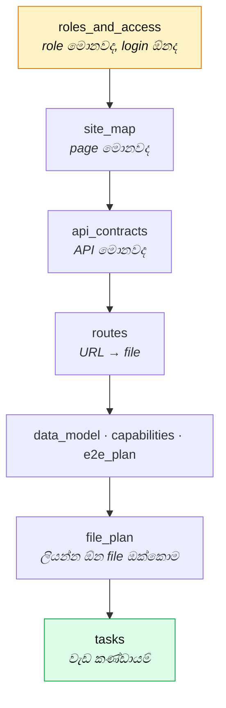

> 💡 **ඇයි මේ පිළිවෙල?** හැම එකක්ම **තනිව** හැඩගැන්වෙනවා, ඒත් `file_plan`
> එකට `routes` ඕන — route එකේ `purpose`, `reads`, `writes` වගේ දේවල් file
> entry එකට **default විදියට** පුරවන්න. ඒක **LLM එකේම දත්ත එකට එකතු කරන
> එකක්** මිසක් අලුත් දෙයක් හදන එකක් නෙවෙයි.

💻 **Normalizer එකක් — හැඩය විතරයි, අන්තර්ගතය නෙවෙයි:**

```python
# ═══ agents/planner/planning.py — class PlannerAgent ඇතුළේ ═══
    def _normalize_site_map(self, value: Any) -> list[dict]:
        out = []
        source = _records(value)
        for item in source:
            path = _text(item.get("path"))
            if not path:
                continue
            out.append({
                "path": path, "parent": _text(item.get("parent")),
                "label": _text(item.get("label") or item.get("purpose"), 120),
                "type": _text(item.get("type") or "page", 20),
                "audience": _text(item.get("audience") or "PUBLIC", 100),
                "purpose": _text(item.get("purpose"), 500),
                "reached_from": _strings(item.get("reached_from"), 300),
                "children": _strings(item.get("children"), 180),
            })
        return out
```

> 🎯 **ඉතාම වැදගත් නීතියක් මෙතන තියෙනවා:**
>
> **Python එකෙන් plan එකට page එකක්, route එකක්, file එකක් හෝ task එකක්
> කවදාවත් එකතු කරන්නේ නෑ.** Normalizer හතරම කරන්නේ **හැඩය හදන එක** විතරයි —
> නම කපනවා, list නොවෙන එකක් list කරනවා, default දානවා.
>
> ඇයි? Python එකෙන් හදන page එකකට **purpose එකක් නෑ, section නෑ,
> requirement link නෑ, E2E journey එකක් නෑ**. ඒක plan කරපු එකට **තරඟ කරන**
> අඩක් හදපු දෙයක් විතරයි.
>
> ඒ වෙනුවට — **අඩුපාඩුව LLM එකටම ආපහු කියනවා.**

💻 **`plan_gaps()` — Python එක **පරීක්ෂා** කරනවා, හදන්නේ නෑ:**

```python
# ═══ agents/planner/planning.py — class PlannerAgent ඇතුළේ ═══
    def plan_gaps(self, plan: dict) -> list[str]:
        """Every hole the planner left, phrased so the planner can close it."""
        gaps = []
        # … site_map page එකකට routes entry එකක් තියෙනවාද?
        for item in pages:
            path = _text(item.get("path"))
            if path and path not in route_paths:
                gaps.append(f"site_map page {path} has no routes entry naming "
                            f"its file.")
        # … login ඕන නම් sign-in page එකක් තියෙනවාද?
        for label, aliases, required in (
            ("sign-in", SIGN_IN_PATHS, bool(access.get("authentication_required"))),
            ("sign-up", SIGN_UP_PATHS,
             _text(access.get("signup")).lower() == "open"),
        ):
            if required and not (page_paths & aliases):
                gaps.append(
                    f"roles_and_access needs a {label} flow, but no site_map "
                    f"page serves one. Add the page you intend (for example "
                    f"/{label}) with its route, file and journey.")
        # … තව පරීක්ෂා 7 ක්: nav link · api handler · route file ·
        #    capability file · shell · seed · task
        return gaps
```

💻 **`_close_gaps()` — LLM එකට ආපහු කියනවා, **නෑ කියනකම්**:**

```python
# ═══ agents/planner/planning.py — class PlannerAgent ඇතුළේ ═══
    def _close_gaps(self, messages, plan, raw, requirements):
        """Send the planner its own holes until it reports a complete plan."""
        for attempt in range(1, GAP_ROUNDS + 1):        # GAP_ROUNDS = 3
            gaps = self.plan_gaps(plan)
            if not gaps:
                return plan, raw                        # ✅ ඉවරයි
            self._log("WARN", f"   🧩 {len(gaps)} gap(s) in the plan — asking "
                              f"the planner to complete it")
            messages = messages + [
                {"role": "assistant", "content": raw},
                {"role": "user", "content":
                    "That plan is incomplete. Every item below is a hole in "
                    "your own plan, not a new requirement:\n\n"
                    + "\n".join(f"- {gap}" for gap in gaps)
                    + "\n\nKeep every decision you already made. Add exactly "
                      "what is missing, with the same quality as the rest: real "
                      "purpose, sections, actions, states, requirement links and "
                      "journey coverage — never a placeholder. Return the "
                      "COMPLETE JSON plan again as one raw JSON object."},
            ]
            # … model එකට කතා කරලා, ආපහු normalize කරලා, ආපහු බලනවා
        return plan, raw
```

**මුළු චක්‍රය:**

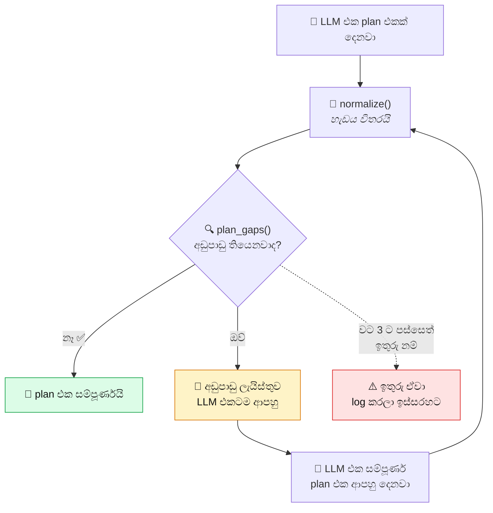

> 💡 **ඇයි මේ විදිය හොඳ?**
>
> | | Python එකෙන් පුරවනවා | LLM එකෙන්ම පුරවනවා |
> |---|---|---|
> | Page එකේ purpose | ❌ generic වාක්‍යයක් | ✅ ඇත්ත purpose එකක් |
> | Section · action | ❌ නෑ | ✅ තියෙනවා |
> | Requirement link | ❌ නෑ | ✅ තියෙනවා |
> | E2E journey | ❌ නෑ | ✅ තියෙනවා |
> | `/login` දාලා තියෙද්දී | ❌ `/sign-in` **තව එකක්** දානවා | ✅ තියෙන එක පිළිගන්නවා |
>
> කලින් තිබ්බ ක්‍රමයේ ඇත්ත ප්‍රශ්නයක් තිබුණා: LLM එක `/login` සහ `/signup`
> plan කරලා තිබ්බත්, Python එකෙන් ඒ උඩට `/sign-in` සහ `/sign-up` **තව
> දෙකක්** දාපු නිසා — auth page **4 ක්** හැදුණා. දෙකක් අඩක් හදපු ඒවා.

💻 **Route එකට file එකක්:**

```python
# ═══ agents/planner/planning.py ═══
def _app_file(route_path: str, leaf: str = "page.jsx") -> str:
    route = _text(route_path).split("?", 1)[0].split("#", 1)[0].strip()
    if not route.startswith("/"):
        return ""
    segments = [part for part in route.strip("/").split("/") if part]
    if any(part in {".", ".."} for part in segments):
        return ""        # 🛡 ".." දාලා folder එකෙන් පිටතට යන්න බෑ
    return "app/" + ("/".join(segments) + "/" if segments else "") + leaf


def _runtime_path(file_path: str) -> str:
    """File එකෙන් ආපහු URL එක හදනවා — _app_file() එකේ ප්‍රතිවිරුද්ධ දේ."""
    rel = _text(file_path).replace("\\", "/")
    if not rel.startswith("app/"):
        return ""
    parts = rel.split("/")
    if not parts[-1].startswith(("page.", "route.")):
        return ""
    segments = [part for part in parts[1:-1]
                if not (part.startswith("(") and part.endswith(")"))]
    return "/" + "/".join(segments) if segments else "/"
```

| Route | File | ආපහු Route |
|---|---|---|
| `/` | `app/page.jsx` | `/` |
| `/books` | `app/books/page.jsx` | `/books` |
| `/books/[id]` | `app/books/[id]/page.jsx` | `/books/[id]` |
| `/api/cart` | `app/api/cart/route.js` | `/api/cart` |
| — | `app/(shop)/books/page.jsx` | `/books` ← `(shop)` ගණන් ගන්නේ නෑ |
| `/../etc/passwd` | *(හිස් — ප්‍රතික්ෂේප)* 🛡 | — |

> 💡 **`(shop)` වගේ වරහන් folder කියන්නේ?**
> Next.js එකේ **"route group"**. URL එකට බලපාන්නේ නෑ — file organize
> කරන්න විතරයි. ඒ නිසා `_runtime_path()` එකෙන් ඒවා අයින් කරනවා.

💻 **Seed එකත් gap එකක් — Python එකෙන් හදන්නේ නෑ:**

```python
# ═══ agents/planner/planning.py — plan_gaps() ඇතුළේ ═══
        seeds = bool(access.get("demo_accounts")) or any(
            _seed_count(model) for model in plan.get("data_model") or [])
        if seeds:
            seed = next((item for item in plan.get("file_plan") or []
                         if _text(item.get("path")) == "lib/seed.js"), None)
            if seed is None:
                gaps.append(
                    "the plan seeds demo accounts or rows, but file_plan has "
                    "no lib/seed.js. AgentForge calls its ensureSeeded export, "
                    "so plan that file exporting ensureSeeded.")
            elif "ensureSeeded" not in (seed.get("exports") or []):
                gaps.append(
                    "lib/seed.js must list ensureSeeded in its exports — "
                    "AgentForge calls that exact name.")
```

> 💡 **Demo account තියෙනවා නම් — `lib/seed.js` අනිවාර්යයි.**
> නැත්නම් app එකේ *"admin@example.com / demo123 කියලා login වෙන්න"*
> කියලා තියෙනවා, ඒත් ඒ account එක **database එකේ නෑ**.
>
> ඒත් ඒක **Python එකෙන් හදන්නේ නෑ** — LLM එකට *"ඔයාට seed එකක් ඕන,
> `ensureSeeded` export කරන්න"* කියලා කියනවා. එතකොට LLM එක **ඇත්ත
> collection නම්, ඇත්ත field, ඇත්ත demo row** එක්ක ලියනවා.
>
> **"Idempotent" කියන්නේ:** කී පාරක් run කළත් **එකම ප්‍රතිඵලයම**. දෙපාරක්
> run කළාට account දෙකක් හැදෙන්නේ නෑ.

> ⚠️ **`ensureSeeded` කියන නම **හරියටම** ඕන ඇයි?**
> Scaffold එකේ `app/api/seed/route.js` එකෙන් ඒක call කරනවා. නම වෙනස් නම්
> seed එක **කවදාවත් run වෙන්නේ නෑ**. ඒ නිසා `plan_gaps()` එකෙන් **export
> එකේ නමත්** පරීක්ෂා කරනවා.

💻 **`_compatibility_views` — පරණ නම් තියාගන්නවා:**

```python
# ═══ agents/planner/planning.py — class PlannerAgent ඇතුළේ ═══
    def _compatibility_views(self, plan: dict) -> None:
        access = plan["roles_and_access"]
        plan["signup_role"] = access.get("signup_role") or ""
        plan["demo_accounts"] = access.get("demo_accounts") or []
        plan["role_homes"] = {role["name"]: role["home"]
                              for role in access.get("roles") or []
                              if role.get("name") and role.get("home")}
        design = plan.get("design") or {}
        plan["images"] = _records(design.get("images"))
        plan["look_and_feel"] = _text(design.get("direction") or design.get("mood"))

        # tasks → phases (පරණ නම)
        plan["phases"] = []
        for task in plan.get("tasks") or []:
            plan["phases"].append({
                "id": task["id"], "title": task["title"], "goal": task["goal"],
                "done_when": "; ".join(task.get("done_when") or []),
                "covers": task.get("requirement_ids") or [],
                "files": task.get("files") or [],
            })

        # e2e journeys → workflows (පරණ නම)
        plan["workflows"] = []
        for journey in plan["e2e_plan"].get("journeys") or []:
            steps = []
            for step in journey.get("steps") or []:
                text = " — ".join(x for x in [step.get("at"), step.get("action"),
                                              step.get("expect")] if x)
                if text:
                    steps.append(text)
            plan["workflows"].append({
                "name": journey["name"], "who": journey["actor"],
                "covers": journey.get("capability_ids") or [], "steps": steps,
            })
```

> 💡 **ඇයි එකම දේට නම් දෙකක්?**
> Code එකේ පරණ කොටස් `phases` සහ `workflows` කියලා හොයනවා. අලුත් plan එකේ
> ඒවා `tasks` සහ `e2e_plan.journeys`. **දෙකම දෙන එකෙන්** පරණ code වෙනස්
> කරන්නේ නැතුව අලුත් structure එක පාවිච්චි කරන්න පුළුවන්.

➡️ **ඊළඟට:** Plan එක මිනිස්සුන්ට කියවන්න පුළුවන් විදියට (Segment 6)

---

### 🔵 SEGMENT 6 — Markdown සහ sitemap.xml

📁 **File:** `agents/planner/planning.py` — `render_markdown()` · `render_design()` ·
`render_architecture()` · `render_sitemap_xml()` · `RefinerAgent`

🎯 **වැඩේ:** JSON plan එක අරගෙන, **කියවන්න පුළුවන් document 4 ක්** හදනවා.

🧠 **සරලව:** Blueprint එක engineer ලාට තේරෙනවා. ඒත් ගෙදර අයට තේරෙන්නේ නෑ.
ඒ නිසා **සරල විස්තරයක්** ලියනවා — "පහළ තට්ටුවේ කාමර 2 ක්, උඩ තට්ටුවේ 1 ක්..."

💻 **`render_markdown()`:**

```python
# ═══ agents/planner/planning.py — class PlannerAgent ඇතුළේ ═══
    def render_markdown(self, plan: dict) -> str:
        project = plan["project"]
        lines = [f"# {project['title']}", "", "## Overview", "",
                 project["summary"], "",
                 f"**Product type:** {project['product_type']}",
                 f"**Primary goal:** {project['primary_goal']}", "",
                 "**Target audiences:** "
                 + (", ".join(project["target_audiences"]) or "Not specified"),
                 "", "## Source Requirement Ledger", ""]

        # Requirement ඔක්කොම ලියනවා
        for req in plan["requirements"]:
            lines += [f"### {req['id']} — {req['behavior']}", "",
                      f"- Source: {req['source_text']}",
                      f"- Actor: {req['actor']}",
                      f"- Business rule: {req['business_rule'] or 'None beyond the stated behavior'}",
                      "- Acceptance:"]
            lines += [f"  - {item}" for item in req["acceptance"]] \
                     or ["  - Observable implementation proof"]
            lines.append("")

        # Route ඔක්කොම table එකකට
        lines += ["", "## Routes", "",
                  "| Path | File | Kind | Audience | Reads | Writes | Requirements |",
                  "|---|---|---|---|---|---|---|"]
        for row in plan["routes"]:
            lines.append("| " + " | ".join(_md_cell(row[key]) for key in
                         ("path", "file", "kind", "audience",
                          "reads", "writes", "requirement_ids")) + " |")
            if row["sections"]:
                lines.append(f"\n**`{row['path']}` sections:** "
                             + "; ".join(row["sections"]))

        # Data model
        lines += ["", "## Data Model", ""]
        for model in plan["data_model"]:
            lines += [f"### `{model['collection']}`", "",
                      model["purpose"] or "Application data", ""]
            for field in model["fields"]:
                required = "required" if field["required"] else "optional"
                lines.append(f"- `{field['name']}`: {field['type']} ({required}) "
                             f"— {field['rules'] or 'no extra rule'}")

        return "\n".join(lines).strip() + "\n"
```

💻 **Table cell එකක් safe කරන එක:**

```python
# ═══ agents/planner/planning.py ═══
def _md_cell(value: Any) -> str:
    if isinstance(value, list):
        value = ", ".join(_text(item) for item in value)
    return _text(value).replace("|", "\\|").replace("\n", " ") or "—"
```

> 💡 Markdown table එකක `|` කියන අකුර column වෙන් කරන්න පාවිච්චි කරනවා.
> ඒ නිසා content එකේ `|` තිබ්බොත් table එක කැඩෙනවා. ඒක `\|` කරලා fix කරනවා.
> හිස් නම් `—` දානවා — කොටුව හිස්ව තියෙනවා වෙනුවට.

💻 **`render_design()` — Design document එක:**

```python
# ═══ agents/planner/planning.py — class PlannerAgent ඇතුළේ ═══
    def render_design(self, plan: dict) -> str:
        design = plan.get("design") or {}
        lines = [f"**Direction:** {_text(design.get('direction'))}",
                 f"**Mood:** {_md_cell(design.get('mood'))}", ""]
        for title, key in (("Colors", "colors"), ("Typography", "typography"),
                           ("Layout", "layout"), ("Composition", "composition"),
                           ("Components", "components")):
            lines.append(f"### {title}")
            lines.append("")
            section = _dict(design.get(key))
            for name, value in section.items():
                lines.append(f"- **{str(name).replace('_', ' ').title()}:** "
                             f"{_md_cell(value)}")
            lines.append("")
        states = _dict(design.get("screen_states"))
        lines += ["### Screen states", ""]
        for name, value in states.items():
            lines.append(f"- **{name.title()}:** {_text(value)}")
        return "\n".join(lines).strip()
```

💻 **`render_architecture()` — තාක්ෂණික ව්‍යුහය:**

```python
# ═══ agents/planner/planning.py — class PlannerAgent ඇතුළේ ═══
    def render_architecture(self, plan: dict) -> str:
        arch = plan.get("architecture") or {}
        lines = [f"**Style:** {_text(arch.get('style')) or 'Modular application'}",
                 f"**Runtime:** {_text(arch.get('runtime'))}", "", "### Layers", ""]
        for layer in _records(arch.get("layers")):
            lines.append(f"- **{_text(layer.get('name'))}:** "
                         + "; ".join(_strings(layer.get("responsibilities"))))
            if layer.get("files"):
                lines.append("  - Files: " + ", ".join(f"`{path}`"
                             for path in _strings(layer.get("files"))))
        lines += ["", "### Component tree", "", *_bullets(arch.get("component_tree")),
                  "", "### Data flows", "", *_bullets(arch.get("data_flows")),
                  "", "### Decisions", ""]
        for decision in _records(arch.get("decisions")):
            lines.append(f"- **{_text(decision.get('decision'))}:** "
                         f"{_text(decision.get('reason'))} "
                         f"Trade-off: {_text(decision.get('tradeoff'))}")
        return "\n".join(lines).strip()
```

💻 **`render_sitemap_xml()` — මුළු app එකේම සිතියම XML එකකින්:**

```python
# ═══ agents/planner/planning.py ═══
def render_sitemap_xml(plan: dict) -> str:
    """One XML document joining every planned page, API and navigation link."""
    project = _dict(plan.get("project"))
    ia = _dict(plan.get("information_architecture"))
    access = _dict(plan.get("roles_and_access"))
    known = {_text(page.get("path")): page for page in _records(plan.get("site_map"))}
    pages = [route for route in _records(plan.get("routes"))
             if _text(route.get("kind")) != "route"]
    apis = _records(plan.get("api_contracts"))

    lines = ["<sitemap" + _xml_attrs(app=project.get("title"),
                                     pages=len(pages), apis=len(apis)) + ">",
             "  <navigation" + _xml_attrs(model=ia.get("navigation_model")) + ">"]
    for nav in _records(ia.get("global_navigation")):
        lines.append("    <link" + _xml_attrs(
            audience=nav.get("audience"), label=nav.get("label"),
            path=nav.get("path"), testid=nav.get("test_id")) + "/>")
    for role in _records(access.get("roles")):
        lines.append("    <home" + _xml_attrs(role=role.get("name"),
                                              path=role.get("home")) + "/>")
    lines.append("  </navigation>")

    for page in pages:
        meta = _dict(known.get(_text(page.get("path"))))
        lines.append("  <page" + _xml_attrs(
            path=page.get("path"), file=page.get("file"), kind=page.get("kind"),
            audience=page.get("audience") or meta.get("audience"),
            parent=meta.get("parent"), label=meta.get("label")) + ">")
        for tag, value in (("purpose", page.get("purpose") or meta.get("purpose")),
                           ("layout", page.get("layout"))):
            if _text(value):
                lines.append(f"    <{tag}>{escape(_text(value, 700))}</{tag}>")
        for tag, item_tag, items in (
                ("sections", "section", page.get("sections")),
                ("actions", "action", page.get("actions")),
                ("reads", "collection", page.get("reads")),
                ("writes", "collection", page.get("writes")),
                ("reached-from", "entry", meta.get("reached_from")),
                ("requirements", "req", page.get("requirement_ids"))):
            lines += _xml_list(tag, item_tag, items)
        lines.append("  </page>")
    # … API ටිකත් එහෙමම
    return "\n".join(lines)
```

**හැදෙන XML එක මේ වගේ:**

```xml
<!-- ═══ production-ready/my-app/sitemap.xml  (හැදෙන app එකේ) ═══ -->
<sitemap app="Book Store" pages="5" apis="3">
  <navigation model="top bar">
    <link audience="PUBLIC" label="Books" path="/books" testid="nav-books"/>
    <link audience="PUBLIC" label="Cart" path="/cart" testid="nav-cart"/>
    <home role="admin" path="/admin"/>
  </navigation>
  <page path="/books" file="app/books/page.jsx" kind="server" audience="PUBLIC">
    <purpose>Show every book with a filter and an add-to-cart action</purpose>
    <sections>
      <section>Filter bar</section>
      <section>Book grid</section>
    </sections>
    <reads><collection>books</collection></reads>
    <requirements><req>REQ-001</req></requirements>
  </page>
</sitemap>
```

💻 **මේ sitemap එක Builder ට හැම වටේම දෙනවා:**

```python
# ═══ agents/planner/architecture.py — class ArchitectAgent ඇතුළේ ═══
    def _sitemap_block(self) -> str:
        """The whole site map, re-sent with every build round the model gets."""
        xml = render_sitemap_xml(self.plan) if self.plan else ""
        if "<page" not in xml:
            return ""
        return ("\n\nAPPROVED SITE MAP — every route that exists, with its owner "
                "file, audience, composition and links. Link only to these paths.\n"
                + xml)
```

> 💡 **ඇයි XML, JSON නෙවෙයි?**
> XML එකේ **attribute** (`path="/books"`) සහ **child** (`<section>`) කියලා
> වෙනසක් තියෙනවා. ඒකෙන් *"මේක මේ page එකේ ගුණාංගයක්"* සහ *"මේක ඇතුළේ
> තියෙන දෙයක්"* කියලා AI model එකට **පැහැදිලිවම** තේරෙනවා. ඒ වගේම JSON
> එකට වඩා අඩු අකුරු ගාණකින් එකම දේ කියන්න පුළුවන්.
>
> **ඇයි හැම වටේම දෙන්නේ?** Model එකට *"මේ app එකේ තියෙන්නේ මේ page
> ටිකයි"* කියලා **හැම වතාවෙම** මතක් කරනවා. එතකොට නැති page එකකට link
> එකක් දාන එක (dead link) අඩු වෙනවා.

💻 **XML safe කරන පොඩි උදව්කරුවෝ:**

```python
# ═══ agents/planner/planning.py ═══
def _xml_attrs(**values) -> str:
    """Build XML attributes, skipping empty ones."""
    out = ""
    for key, value in values.items():
        text = _text(value)
        if text:
            out += f" {key.replace('_', '-')}={quoteattr(text)}"
    return out
```

> 💡 `quoteattr()` කියන්නේ Python එකේම function එකක් — `"` සහ `&` වගේ
> අකුරු XML එකට safe කරනවා. නැත්නම් page title එකේ `"` එකක් තිබ්බොත්
> XML එකම කැඩෙනවා.

**හැදෙන file 4 ක්:**

| File | ඇතුළේ මොනවද | කාටද |
|---|---|---|
| `plan.md` | Requirement · route · data · task ඔක්කොම | හැමෝටම |
| `architecture.md` | Layer · component tree · data flow · තීරණ | Developer ට |
| `design.md` | Color · font · layout · screen states | Designer ට |
| `sitemap.xml` | Page · API · navigation link ඔක්කොම | **AI model එකට** |

💻 **`RefinerAgent` — පරණ Vite pipeline එකට පාලමක්:**

```python
# ═══ agents/planner/planning.py ═══
class RefinerAgent:
    """Keep the original Vite planning interface working."""

    def __init__(self, ollama_url: str, model: str):
        self.client = OllamaClient(ollama_url)
        self.model = model

    def refine(self, raw_idea: str) -> str:
        planner = PlannerAgent(self.client, self.model, stack="vite")
        bundle = planner.create(raw_idea)
        if not bundle:
            return ""
        plan = bundle.data
        project = plan["project"]
        design = plan.get("design") or {}
        features = [cap["behavior"] for cap in plan.get("capabilities") or []]
        routes = [route["path"] for route in plan.get("routes") or []]
        spec = {
            "project_name": project["name"],
            "site_type": project.get("product_type") or "app",
            "strategy": "react-app" if len(routes) <= 1 else "react-sections",
            "title": project["title"],
            "description": project["summary"],
            "color_scheme": json.dumps(design.get("colors") or {}, ensure_ascii=False),
            "style": design.get("direction") or design.get("mood") or "modern",
            "key_features": features,
            "special_instructions": bundle.markdown,
            "sections": [entry.get("label") for entry in plan.get("site_map") or []
                         if entry.get("type") == "page"],
            "plan": plan,
            "_raw_idea": raw_idea,
        }
        return json.dumps(spec, indent=2, ensure_ascii=False)
```

> 💡 **මේක ඇයි තියෙන්නේ?**
> පරණ Vite pipeline එක (S25, S26) `refine()` කියලා function එකක්
> බලාපොරොත්තු වෙනවා — **JSON string එකක්** දෙන එකක්. අලුත් Planner එක
> `PlanBundle` **object එකක්** දෙනවා. `RefinerAgent` කරන්නේ
> **පරිවර්තකයෙක්** විදියට වැඩ කරන එක — අලුත් plan එක පරණ format එකට හරවනවා.

➡️ **ඊළඟට:** Scaffold — app එකේ ඇටසැකිල්ල (Segment 7)

---

### 🟢 SEGMENT 7 — Scaffold: app එකේ ඇටසැකිල්ල

📁 **File (1):** `agents/planner/build_templates.py` — පේළි 426

🎯 **වැඩේ:** හැම Next.js app එකකටම ඕන **මූලික file** ටික AI එකෙන් නොහදා,
කලින්ම ලියලා තියෙන template වලින් හදනවා.

🧠 **සරලව:** ගෙයක් හදද්දී **අත්තිවාරම, කණු, වහල** — ඒවා හැම ගෙදරකටම එකයි.
ඒවා ගැන අලුතෙන් හිතන්න ඕන නෑ. AI එකට හිතන්න දෙන්නේ **විශේෂ දේවල් විතරයි**.

💻 **File එකේ මුල — imports:**

```python
# ═══ agents/planner/build_templates.py ════════════════════════
"""Provides runtime defaults created before product code is written."""
from __future__ import annotations

import json
import re
import secrets
import textwrap
```

| Import | ඇයි ඕන |
|---|---|
| `json` | `package.json`, `jsconfig.json` හදන්න |
| `re` | Database නම safe කරන්න |
| `secrets` | **Random රහස් password** හදන්න 🔐 |
| `textwrap` | Code block indent එක හදන්න |

> 💡 මේ file එකට **වෙන agent එකකින් import එකක් නෑ**. ඒක තනිවම වැඩ කරන
> "template කම්හලක්" — dependency නෑ.

💻 **දන්නා dependency ලැයිස්තුව:**

```python
# ═══ agents/planner/build_templates.py ═══ (පේළි 13–66)

NEXT_DEPENDENCIES = {
    "next": "16.0.0",
    "react": "19.0.0",
    "react-dom": "19.0.0",
    "mongodb": "^6.10.0",
    "better-auth": "^1.2.0",
    # …
}
NEXT_DEV_DEPENDENCIES = { "tailwindcss": "^3.4.0", "autoprefixer": "^10.4.0", ... }
VITE_DEPENDENCIES = { "react": "^18.2.0", "react-router-dom": "^6.22.0", ... }

KNOWN_DEPENDENCIES = {**NEXT_DEPENDENCIES, **NEXT_DEV_DEPENDENCIES,
                      **VITE_DEPENDENCIES, **VITE_DEV_DEPENDENCIES}
```

> 💡 **ඇයි version number hard-code කරලා?**
> AI model එකක් `"next": "^13.0.0"` වගේ **පරණ version** එකක් දෙන්න පුළුවන්.
> එතකොට code එක Next.js 16 වලට ලියලා, install වෙන්නේ 13 — **crash**.
> මෙතන fix කරලා තියෙන එකෙන් ඒක වළක්වනවා.
>
> `KNOWN_DEPENDENCIES` කියන එක `agents/planner/architecture.py` එකේ
> `sync_dependencies()` එකෙනුත් පාවිච්චි කරනවා (S8 බලන්න).

💻 **ප්‍රධාන function එක:**

```python
# ═══ agents/planner/build_templates.py ═══ (පේළි 421–426)

def render_templates(stack: str, plan: dict, *, mongo_uri: str = "",
                     db_name: str = "", dev_port: int = 5173) -> dict[str, str]:
    if stack == "vite":
        return render_vite_templates(plan)
    return render_next_templates(plan, mongo_uri=mongo_uri, db_name=db_name,
                                 dev_port=dev_port)
```

💻 **Next.js template ටික:**

```python
# ═══ agents/planner/build_templates.py ═══ (පේළි 349–400)

def render_next_templates(plan: dict, *, mongo_uri: str, db_name: str,
                          dev_port: int, ui_port: int = 7824) -> dict[str, str]:
    project = plan.get("project") or {}
    title = str(project.get("title") or "AgentForge App")
    summary = str(project.get("summary") or title)
    slug = str(project.get("name") or "agentforge-app")
    database = db_name or "agentforge_" + re.sub(r"[^a-z0-9_]+", "_", slug.lower())
    uri = mongo_uri or f"mongodb://127.0.0.1:27017/{database}"

    files = {
        "package.json": _next_package(plan),
        "next.config.mjs": NEXT_CONFIG,
        "jsconfig.json": json.dumps({"compilerOptions": {
            "baseUrl": ".", "paths": {"@/*": ["./*"]}}}, indent=2) + "\n",
        "tailwind.config.js": NEXT_TAILWIND,
        "postcss.config.js": "module.exports = { plugins: { tailwindcss: {}, "
                             "autoprefixer: {} } }\n",
        "app/globals.css": NEXT_GLOBALS,
        "app/layout.jsx": textwrap.dedent(f"""\
            import './globals.css'

            export const metadata = {{ title: {json.dumps(title)},
                                       description: {json.dumps(summary)} }}

            export default function RootLayout({{ children }}) {{
              return (
                <html lang="en" suppressHydrationWarning>
                  <body suppressHydrationWarning>{{children}}</body>
                </html>
              )
            }}
            """),
        "app/page.jsx": "export default function Page() { "
                        "return <main><p>Building…</p></main> }\n",
        "lib/mongodb.js": MONGODB_MODULE,
        "app/api/health/route.js": HEALTH_ROUTE,
        ".env.local": (
            f"MONGODB_URI={uri}\nMONGODB_DB={database}\n"
            f"BETTER_AUTH_SECRET={secrets.token_hex(32)}\n"
            f"BETTER_AUTH_URL=http://localhost:{dev_port}\n"
            f"NEXT_TELEMETRY_DISABLED=1\n"
        ),
        ".gitignore": "node_modules/\n.next/\nout/\n.env*.local\n"
                      ".agentforge/\n*.log\n",
    }
    return files
```

**හැදෙන file ටික:**

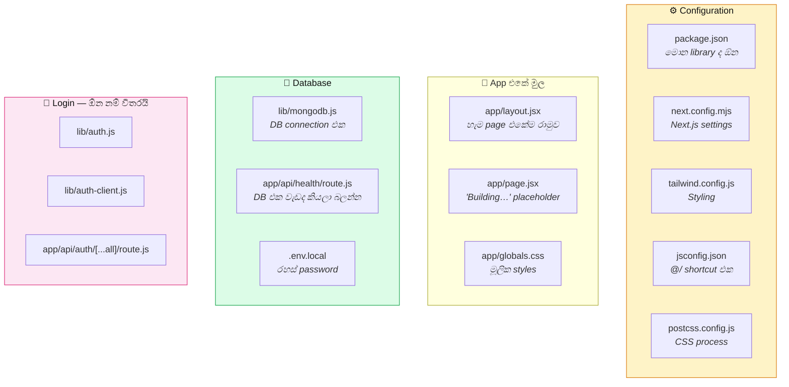

💻 **`app/page.jsx` එකේ "Building…" ඇයි?**

```python
# ═══ agents/planner/build_templates.py ═══
"app/page.jsx": "export default function Page() { return <main><p>Building…</p></main> }\n",
```

මේක **තාවකාලික placeholder** එකක්. AI එක තාම මුල් page එක ලියලා නෑ.
ඒත් Next.js එකට `app/page.jsx` **තියෙන්නම ඕන** — නැත්නම් start වෙන්නේ නෑ.
පස්සේ Analyzer එකට මේක අඳුරගන්න පුළුවන්:

```python
# ═══ agents/analysis/analyzer.py ═══ (පේළි 83, 318–320)

PLACEHOLDER_MARKERS = ("Building…", "Building&hellip;", "Building...")

def _is_placeholder(self, rel):
    body = self.source_files().get(rel, "")
    return bool(body) and len(body) < 400 and any(
        x in body for x in self.PLACEHOLDER_MARKERS)
```

> 💡 **දක්ෂ trick එකක්:** File එක තියෙනවා (Next.js සතුටුයි), ඒත් *"මේක තාම
> ලියලා නෑ"* කියලා Analyzer එකට **හරියටම** අඳුරගන්න පුළුවන් — 400 characters
> ට අඩු + "Building…" කියලා තියෙනවා නම්.

💻 **Login ඕන නම් විතරයි එකතු කරන එක:**

```python
# ═══ agents/planner/build_templates.py ═══ (පේළි 221–224, 388–398)

def _auth_required(plan: dict) -> bool:
    access = plan.get("roles_and_access") or {}
    return bool(access.get("authentication_required"))


if _auth_required(plan):
    origins = ["http://localhost:*", "http://127.0.0.1:*"]
    files.update({
        "lib/auth.js": _auth_module(
            _signup_role(plan), origins,
            (plan.get("roles_and_access") or {}).get("demo_accounts") or []),
        "lib/auth-client.js": AUTH_CLIENT,
        "app/api/auth/[...all]/route.js": AUTH_ROUTE,
    })
```

> 💡 **වැදගත් තීරණයක්:**
> App එකට login එකක් **ඕන නම් විතරයි** ඒ file හදන්නේ. Calculator එකකට login
> එකක් ඕන නෑ. ඒත් සමහර AI model "හැම app එකකටම login ඕන" කියලා හිතනවා.

💻 **Password එක random හදනවා:**

```python
f"BETTER_AUTH_SECRET={secrets.token_hex(32)}\n"
```

`secrets.token_hex(32)` කියන්නේ **හැම වතාවෙම වෙනස්** random අකුරු 64 ක්.
හැම project එකකටම වෙනස් රහසක්.

💻 **`origins` දෙකක් ඇයි?**

```python
origins = ["http://localhost:*", "http://127.0.0.1:*"]
```

Browser එකට `localhost` සහ `127.0.0.1` කියන්නේ **වෙනස් දෙකක්**. Login cookie
එක එකකින් හදලා අනිත් එකෙන් කියෙව්වොත් — වැඩ කරන්නේ නෑ. `*` කියන්නේ
**ඕන port එකක්** — preview port එක වෙනස් වුණත් login එක කැඩෙන්නේ නෑ.

➡️ **ඊළඟට:** Architect — ඇත්තටම code ලියනවා (Segment 8)

---

### 🟢 SEGMENT 8 — Architect: ඇත්තටම code ලියනවා

📁 **File (1):** `agents/planner/architecture.py` — **පේළි 762, මුළු build එකේම හදවත**

🎯 **වැඩේ:** Plan එකේ තියෙන file එකින් එක, AI එකෙන් ලියවලා disk එකට save කරනවා.

🧠 **සරලව:** **මේසන් බාස්**. Blueprint එක අතේ තියාගෙන, කාමරයෙන් කාමරය හදනවා.

💻 **File එකේ මුල — imports:**

```python
# ═══ agents/planner/architecture.py ═══════════════════════════
"""Builds an application from its approved plan."""
from __future__ import annotations

import json
import logging
import os
import re
import textwrap
import time
from pathlib import Path

from agents.core import docsindex
from agents.core.commands import CommandRunner
from agents.core.exports_checks import check_named_imports, group_messages
from agents.core.ollama_client import OllamaClient, is_cloud_model, max_context
from agents.planner.architecture_runtime import (
    CMD_RE, FENCE_RE, OPEN_RE, PARTIAL_OPEN_RE, FileStreamParser, _strip_fence,
)
from agents.planner.build_templates import KNOWN_DEPENDENCIES, render_templates
from agents.planner.planning import (NEXT_STACK, PROMPT_PATH, VITE_STACK,
                                     PlannerAgent)

log = logging.getLogger("architect")
CHARS_PER_TOKEN = 3.4
HISTORY_BUDGET = 0.62
EDIT_TIMEOUT = 150
```

| Import | කොහෙන් | ඇයි ඕන |
|---|---|---|
| `docsindex` | S12 | Next.js documentation index එක |
| `CommandRunner` | S10 | `npm install` safe විදියට |
| `check_named_imports`, `group_messages` | S11 | කැඩුණු import හොයන්න |
| `OllamaClient`, `is_cloud_model`, `max_context` | S3 | AI model එකට කතා කරන්න |
| `FileStreamParser`, `_strip_fence`, `CMD_RE` | S9 | Model output → file |
| `KNOWN_DEPENDENCIES`, `render_templates` | S7 | Scaffold + package version |
| `PlannerAgent`, `NEXT_STACK` | S4 | Plan එක හදන්න |

💻 **Builder ට දෙන නීති (system prompt එක):**

```python
# ═══ agents/planner/architecture.py ═══ (පේළි 39–100)

NEXT_BUILDER_SYSTEM = """\
You are a senior Next.js engineer implementing one approved AgentForge plan.
The plan is a contract, not a suggestion.

QUALITY BAR
- Implement every section, action, requirement, API contract, data read/write,
  design decision, responsive rule, and E2E-visible outcome assigned to a file.
- No TODO, placeholder, coming-soon screen, href="#", fake JSX record, dead
  button, console-only error, or permanently disabled feature.
- A list/table/fetched panel has designed loading, empty, error, and success
  behavior. Mutation success updates state without a manual reload.

STACK AND FILE BOUNDARIES
- Never TypeScript, Pages Router, react-router-dom, Mongoose, Prisma.
- Server files must await every getCollection(name) and getSessionUser() call.
- Client files begin with 'use client', are never async, never import
  server/database modules.
- Files that read MongoDB export `const dynamic = 'force-dynamic'`.

DATA, AUTH, AND ACTIONS
- Use exact collection and field names from the plan.
- Add auth only when roles_and_access.authentication_required is true.
- Ownership, role, price, totals, and user identity come from the session and
  database, never trusted request fields.

Write only the requested files. Say BUILD COMPLETE when done.
"""
```

💻 **මුළු ගමනම — `run()`:**

```python
# ═══ agents/planner/architecture.py ═══ (පේළි 423–447)

def run(self, user_prompt: str, *, requirement_source: str = "") -> bool:
    self.project_dir.mkdir(parents=True, exist_ok=True)
    try:
        self._fire("on_progress", "Planning…", 5)
        if not self.make_plan(user_prompt, requirement_source):   # 1️⃣ plan
            return False
        self._fire("on_progress", "Scaffolding…", 15)
        self.scaffold()                    # 2️⃣ ඇටසැකිල්ල
        self.install_planned_deps()        # 3️⃣ library install
        self._fire("on_progress", "Writing files…", 18)
        self.build_app()                   # 4️⃣ code ලියනවා ⭐
        if self._outstanding():            # 5️⃣ ඉතුරු වුණාද?
            self._log("WARN", f"   ⚠ Closing {len(self._outstanding())} "
                              f"remaining planned file(s)")
            self._run_write_loop(self._task_prompt(
                {"id": "closure", "title": "Complete the approved plan",
                 "goal": "No planned file remains"}, self._outstanding()))
        self.repair_missing_imports()      # 6️⃣ නැති import හදනවා
        self.sync_dependencies()           # 7️⃣ package.json update
        self.install_unresolved()          # 8️⃣ නැති library install
        self.repair_lint()                 # 9️⃣ සුළු වැරදි හදනවා
        return self._verify_output()       # 🔟 ඔක්කොම හරිද?
    finally:
        self.save_convo()                  # කතාව මතක තියාගන්නවා
```

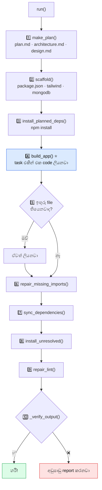

💻 **`make_plan()` — plan එක හදලා save කරනවා:**

```python
# ═══ agents/planner/architecture.py ═══ (පේළි 286–308)

def make_plan(self, user_prompt: str, requirement_source: str = "") -> bool:
    self._log("INFO", "🧭 Planning — requirements, design, routes, "
                      "architecture and E2E")
    self._fire("on_phase", {"phase": 0, "title": "Planning", "status": "active"})
    planner = PlannerAgent(self.client, self.model, stack=self.stack,
                           callbacks=self.cb, think=self.think,
                           stream=self._stream)        # 👈 S4 එකේ class එක
    bundle = planner.create(user_prompt, requirement_source)
    if not bundle:
        self._fire("on_phase", {"phase": 0, "title": "Planning", "status": "error"})
        return False
    self.plan, self.plan_md = bundle.data, bundle.markdown
    self.architecture_md, self.design_md = (bundle.architecture_markdown,
                                            bundle.design_markdown)
    for path, body in (("plan.md", self.plan_md),
                       ("architecture.md", self.architecture_md),
                       ("design.md", self.design_md)):
        self.write_file(path, body)
    self._save_plan_json()                       # .agentforge/plan.json
    self.start_conversation(user_prompt)
    self.save_convo()
    return True
```

💻 **`start_conversation()` — AI එකට plan එක දෙනවා:**

```python
# ═══ agents/planner/architecture.py ═══ (පේළි 310–321)

def start_conversation(self, user_prompt: str) -> None:
    plan_json = json.dumps(self.plan, ensure_ascii=False, indent=2)
    self.convo = [
        {"role": "system", "content": self._builder_sys()},
        {"role": "user", "content": (
            "AUTHORITATIVE USER INPUT\n" + user_prompt +
            "\n\nAPPROVED PLAN JSON\n" + plan_json +
            "\n\nThe plan owns requirements, design, site map, routes, "
            "architecture, file contracts, and E2E proof. Do not alter it.")},
        {"role": "assistant", "content": "Understood. I will implement the "
                                         "approved plan exactly, one complete "
                                         "file at a time."},
    ]
```

> 💡 **තුන්වෙනි message එක ඇයි assistant ගෙන්?**
> AI ට *"ඔයා දැනටමත් මේකට එකඟ වුණා"* කියලා **පෙන්නන** trick එකක්.
> ඒකෙන් model එක plan එකට වඩාත් හොඳින් ඇලෙනවා.

💻 **`_builder_sys()` — නීති + පාඩම් + docs:**

```python
# ═══ agents/planner/architecture.py ═══ (පේළි 196–206)

def _builder_sys(self) -> str:
    prompt = self._P["builder"]                    # NEXT_BUILDER_SYSTEM
    try:
        learned = __import__("agents.core.lessons",
                             fromlist=["prompt_block"]).prompt_block()   # S12
        if learned:
            prompt += "\n\nPROJECT-GENERATION LESSONS\n" + learned
    except Exception as exc:
        log.debug("builder lessons unavailable: %s", exc)
    docs = docsindex.index_block(self.project_dir) if self.stack == "next" else ""
    #      ↑ agents/core/docsindex.py — S12
    return prompt + ("\n\nINSTALLED NEXT.JS DOCUMENT INDEX\n" + docs if docs else "")
```

💻 **`build_app()` — task එකින් එක:**

```python
# ═══ agents/planner/architecture.py ═══ (පේළි 399–421)

def build_app(self) -> int:
    total = len(self._planned_files())
    phases = self.plan.get("phases") or []
    written = 0
    self._log("INFO", f"⚙️  Building {total} planned files across "
                      f"{len(phases)} tasks")

    for index, task in enumerate(phases, 1):
        # මේ task එකේ තාම ලියලා නැති file විතරක් ගන්නවා
        files = [item for item in task.get("files") or []
                 if not self._implemented(item.get("path", ""))]
        if not files:
            continue                        # ඔක්කොම ලියලා — skip

        self._fire("on_phase", {"phase": index, "total": len(phases),
                                "title": task.get("title"), "status": "active",
                                "files": [item["path"] for item in files]})

        written += self._run_write_loop(self._task_prompt(task, files))   # ⭐

        # තාම ඉතුරු වෙලාද? ආපහු එකපාරක් උත්සාහ කරනවා
        left = [item for item in files if not self._implemented(item["path"])]
        if left:
            written += self._run_write_loop(
                "Finish the same approved task. These planned files are still "
                "absent or still defaults:\n"
                + "\n".join("- " + item["path"] for item in left)
                + "\nWrite each complete file now; do not change the plan.")

        done = total - len(self._outstanding())
        self._fire("on_progress", f"Task {index}/{len(phases)} — {done}/{total} files",
                   18 + int(58 * done / max(1, total)))     # progress bar
        self.save_convo()
    return written
```

> 💡 **"දෙවෙනි උත්සාහය" ඇයි?**
> AI model එකට file 5 ක් ලියන්න කිව්වම, සමහර වෙලාවට 3 ක් විතරක් ලියලා නවතිනවා.
> එතකොට *"ඔයාට තව මේ 2 ලියන්න තියෙනවා"* කියලා **නැවත** කියනවා.

💻 **`_implemented()` — ලියලාද කියලා දැනගන්නා දක්ෂ ක්‍රමය:**

```python
# ═══ agents/planner/architecture.py ═══ (පේළි 335–337)

def _implemented(self, path: str) -> bool:
    body = self.files.get(path)
    return body is not None and body != self._scaffold_baseline.get(path)
```

**File එක තියෙනවා විතරක් මදි — ඒක `scaffold` එකේ default එකට වඩා
වෙනස් වෙන්නත් ඕන.** `app/page.jsx` එකේ තාම "Building…" කියලා තියෙනවා නම්,
ඒක ලියලා **නෑ**.

💻 **`_task_prompt()` — task එකට ඕන දේ විතරක් දෙනවා:**

```python
# ═══ agents/planner/architecture.py ═══ (පේළි 342–362)

def _task_prompt(self, task: dict, files: list[dict]) -> str:
    payload = dict(task)
    payload["files"] = files
    cap_ids = {rid for file in files for rid in file.get("requirements") or []}

    # මේ task එකට අදාළ capability විතරක්
    capabilities = [cap for cap in self.plan.get("capabilities") or []
                    if cap_ids & set(cap.get("requirement_ids") or []) or
                    set(cap.get("files") or []) & {f["path"] for f in files}]

    # මේ task එකට අදාළ API contract විතරක්
    apis = [api for api in self.plan.get("api_contracts") or []
            if api.get("handler_file") in {f["path"] for f in files} or
            set(api.get("called_from") or []) & {f["path"] for f in files}]

    return ("IMPLEMENT THIS APPROVED BUILD TASK. Write every listed file "
            "completely.\n\n"
            + json.dumps(payload, ensure_ascii=False, indent=2)
            + "\n\nCAPABILITIES TOUCHING THIS TASK\n"
            + json.dumps(capabilities, ensure_ascii=False, indent=2)
            + "\n\nAPI CONTRACTS TOUCHING THIS TASK\n"
            + json.dumps(apis, ensure_ascii=False, indent=2)
            + "\n\nUse exact planned names and paths. Output complete "
              "<write_file> blocks only.")
```

> 💡 **ඇයි ඔක්කොම නොදී, අදාළ ඒවා විතරක්?**
> Model එකේ මතකය සීමිතයි. Plan එකේ API 50 ක් තිබ්බත්, **මේ task එකට
> අදාළ 3 විතරයි** දෙන්නේ. එතකොට model එකට **focus කරන්න** පුළුවන්.

💻 **`_run_write_loop()` — ඇත්තටම code ලියන තැන:**

```python
# ═══ agents/planner/architecture.py ═══ (පේළි 364–397)

def _run_write_loop(self, user_content: str, _tool_depth: int = 0) -> int:
    self.convo.append({"role": "user", "content": user_content})
    self._trim_convo()                              # මතකය පිරෙනවා නම් කපනවා
    raw, state = [], {"path": None, "count": 0}

    # Model output එකෙන් file කැඩිලා ගන්න parser එක (S9)
    parser = FileStreamParser(
        lambda text: self._fire("on_chat", text.strip()),           # සාමාන්‍ය text
        lambda path: (state.update(path=path),
                      self._fire("on_file_start", path)),           # file පටන්
        lambda token: self._fire("on_file_token", state["path"], token),  # වචන
        lambda path, body: (self._fire("on_file_end", path, body),
                            state.update(count=state["count"] +
                                (1 if self.write_file(path, body) else 0))),  # save
    )

    calls = self._stream(self.convo,
                         lambda delta: (raw.append(delta), parser.feed(delta)),
                         temperature=0.35)
    parser.close()
    reply = "".join(raw)
    self.convo.append({"role": "assistant", "content": reply})
    self.run_requested_commands(reply)              # <run_command> තිබ්බොත් (S10)

    # Tool call එකකින් file එකක් ආවොත් ඒකත් ලියනවා
    for call in calls:
        function = (call or {}).get("function") or {}
        if function.get("name") != "write_file":
            continue
        args = function.get("arguments") or {}
        if isinstance(args, str):
            args = json.loads(args)
        if args.get("path") and args.get("content") and self.write_file(
                args["path"], args["content"]):
            state["count"] += 1

    # Model එක file එකක්වත් ලිව්වේ නැත්නම් — tools දෙනවා (S10)
    if state["count"] == 0 and _tool_depth < 2:
        from agents.core.workspace import WorkspaceTools
        observations, used = WorkspaceTools(self).serve(reply)
        if used:
            self.convo.append({"role": "user",
                               "content": "Tool observations:\n" + observations})
            return self._run_write_loop("Continue the same task from those "
                                        "observations and write its files.",
                                        _tool_depth + 1)
    return state["count"]
```

**මෙතන තියෙන දක්ෂකම:** Model එක *"මට මුලින්ම `app/cart/page.jsx` බලන්න ඕන"*
කිව්වොත් — AgentForge ඒ file එක කියවලා දීලා, *"දැන් ලියන්න"* කියනවා.

💻 **මතකය manage කරන එක:**

```python
# ═══ agents/planner/architecture.py ═══ (පේළි 24–26, 232–242)

CHARS_PER_TOKEN = 3.4
HISTORY_BUDGET = 0.62

def _budget_chars(self) -> int:
    return int(self.num_ctx * HISTORY_BUDGET * CHARS_PER_TOKEN)

def _trim_convo(self) -> None:
    budget = self._budget_chars()
    while (sum(len(str(item.get("content") or "")) for item in self.convo)
           > budget and len(self.convo) > 4):
        self.convo.pop(3)              # 👈 index 3 — මුල් 3 කවදාවත් අයින් නෑ
```

> 💡 **`self.convo.pop(3)` — ඇයි 3?**
> මුල් message 3 ක් = **system prompt + plan + assistant ගේ එකඟතාවය**.
> ඒවා **කවදාවත් අයින් කරන්නේ නෑ**. අයින් කරන්නේ index 3 ඉඳන් —
> ඒ කියන්නේ **පරණම කතාව**. Plan එක සහ නීති ඉතුරු වෙනවා.
>
> **Context budget එක:** මුළු context එකෙන් **62%** විතරයි කතාවට.
> ඉතුරු 38% model එකට **උත්තර ලියන්න** අවශ්‍යයි.

💻 **`write_file()` — disk එකට save කරන එක:**

```python
# ═══ agents/planner/architecture.py ═══ (පේළි 263–283)

def write_file(self, rel: str, content: str) -> bool:
    try:
        target = self._safe_path(rel)                    # 🛡 path එක safe ද?
        key = target.relative_to(self.project_dir.resolve()).as_posix()

        # 🛡 Scaffold file එකක් overwrite කරන්න බෑ
        protected = (self.NEXT_PROTECTED if self.stack == "next"
                     else self.VITE_PROTECTED)
        planned = {item.get("path") for item in self._planned_files()}
        if key in protected and not self._scaffolding and key not in planned:
            self._log("WARN", f"   ⛔ kept scaffold-owned default {key}")
            return False

        body = _strip_fence(content).rstrip() + "\n"     # ``` කපනවා (S9)
        target.parent.mkdir(parents=True, exist_ok=True)
        target.write_text(body, encoding="utf-8")        # ✍️ save!
        self.files[key], self.write_seq = body, self.write_seq + 1
        size = (f"{len(body) / 1024:.1f}KB" if len(body) >= 1024
                else f"{len(body)}B")
        self._fire("on_file_written", key, size, body)
        self._log("INFO", f"   📝 {key} ({size})")
        return True
    except Exception as exc:
        self._log("ERROR", f"   ❌ write failed {rel}: {exc}")
        return False
```

💻 **`_safe_path()` — ආරක්ෂාව:**

```python
# ═══ agents/planner/architecture.py ═══ (පේළි 251–261)

def _safe_path(self, rel: str) -> Path:
    raw = str(rel or "").strip().replace("\\", "/").lstrip("/")
    parts = [part for part in raw.split("/") if part not in {"", ".", ".."}]
    if not parts:
        raise ValueError("empty project path")
    target = (self.project_dir / "/".join(parts)).resolve()
    root = self.project_dir.resolve()
    if target != root and root not in target.parents:
        raise ValueError("path leaves project")          # 🛡 පිටතට යන්න බෑ!
    return target
```

> 🛡 **ඇයි මේක ගොඩක් වැදගත්?**
> AI model එකක් `../../../Windows/System32/config` වගේ path එකක් දුන්නොත්,
> මේ check එක නැත්නම් **ඔබේ computer එකේ system file overwrite වෙනවා**.
>
> Check දෙකක් තියෙනවා:
> 1. `..` සහ `.` **අයින් කරනවා** (path traversal වළක්වනවා)
> 2. `resolve()` කරලා **ඇත්ත ස්ථානය** බලනවා (symlink trick වළක්වනවා)

💻 **`repair_lint()` — සුළු වැරදි හදනවා:**

```python
# ═══ agents/planner/architecture.py ═══ (පේළි 552–597)

def lint_generated(self) -> list[str]:
    errors = []
    better_auth = "betterAuth(" in self.files.get("lib/auth.js", "")
    for path, body in self.files.items():
        if not path.endswith((".js", ".jsx", ".mjs")):
            continue
        # 'use client' පළවෙනි පේළියේ තියෙන්න ඕන
        directive = self.STRAY_DIRECTIVE_RE.search(body)
        if directive and body[:directive.start()].strip():
            errors.append(f"{path}: 'use client' is not the first statement")
        # TypeScript ලියලාද?
        if re.search(r"^\s*interface\s+\w+|:\s*(?:string|number|boolean|any)\s*[,)=;]",
                     body, re.M):
            errors.append(f"{path}: contains TypeScript syntax")
        # Next.js app එකේ react-router-dom පාවිච්චි කරලාද?
        if self.stack == "next" and "react-router-dom" in body:
            errors.append(f"{path}: imports react-router-dom in a Next app")
        # route.js එකේ default export දාලාද?
        if path.endswith("route.js") and re.search(r"export\s+default", body):
            errors.append(f"{path}: route handlers cannot default export")
        # await කරන්න අමතක වුණාද?
        if re.search(r"\b(?:const|let|var)\s+\w+\s*=\s*"
                     r"(?:getCollection|getSessionUser)\s*\(", body):
            errors.append(f"{path}: await async getCollection/getSessionUser")
        # Client file එකකින් database import කරලාද?
        if (re.match(r"\s*[\"']use client[\"']", body)
                and re.search(r"@/lib/(?:mongodb|auth|seed)(?:[\"'/]|$)", body)):
            errors.append(f"{path}: client file imports server/database code")
        # Better Auth demo password එක වැරදි විදියට දාලාද?
        if (better_auth and "seed" in path.lower()
                and re.search(r"\bpassword\s*:", body)
                and not re.search(r"\b(?:auth\.api\.signUpEmail|"
                                  r"ensureDemoAccounts)\s*\(", body)):
            errors.append(f"{path}: Better Auth demo passwords must be created "
                          f"through auth.api.signUpEmail")

    # Syntax check + import check + නොලියපු file  (S11)
    from agents.core.exports_syntax import check_syntax, syntax_messages
    broken, _ = check_syntax(self.project_dir, self.files)
    errors.extend(syntax_messages(broken))
    errors.extend(group_messages(check_named_imports(self.files)))
    errors.extend(f"{path}: planned file was not implemented"
                  for path in self.unfinished())
    errors.extend(f"{name}: imported package is unavailable"
                  for name in self.unresolved_packages())
    return list(dict.fromkeys(errors))
```

**මේ check කරන දේවල් — සරලව:**

| Check එක | ඇයි වැදගත් | නොකළොත් මොකද වෙන්නේ |
|---|---|---|
| `'use client'` පළමු පේළියේ | Next.js නීතියක් | Compile error |
| TypeScript නෑ | Stack එකේ JS විතරයි | Build fail |
| `react-router-dom` නෑ | Next.js එකේ තමන්ගේ routing තියෙනවා | Page load වෙන්නේ නෑ |
| `route.js` default export නෑ | API route නීතියක් | API වැඩ කරන්නේ නෑ |
| `await` දාලා | DB call එකක් | `undefined` error |
| Client එකෙන් DB නෑ | Browser එකෙන් DB එකට යන්න බෑ | රහස් password browser එකට යනවා 🛡 |
| Better Auth signUpEmail | Password hash කරන්න ඕන | Login කරන්න බෑ (401) |

💻 **Package automatic ම හොයාගන්නවා:**

```python
# ═══ agents/planner/architecture.py ═══ (පේළි 449–460, 476–495)

@classmethod
def imported_packages(cls, content: str) -> list[str]:
    out = []
    for spec in cls.IMPORT_SPEC_RE.findall(content or ""):
        if spec.startswith((".", "/", "@/", "node:")) or spec.startswith("next/"):
            continue                                  # local import — skip
        name = ("/".join(spec.split("/")[:2]) if spec.startswith("@")
                else spec.split("/")[0])
        if (name not in cls.NODE_BUILTINS and name not in cls.PREINSTALLED
                and cls.PKG_NAME_RE.match(name) and name not in out):
            out.append(name)
    return out


def sync_dependencies(self) -> int:
    """Code එකේ පාවිච්චි කරන package, package.json එකට දානවා."""
    path = self.project_dir / "package.json"
    package = json.loads(path.read_text(encoding="utf-8"))
    dependencies, added = package.setdefault("dependencies", {}), []
    for file, body in self.files.items():
        if not self.is_source(file):
            continue
        for name in self.imported_packages(body):
            if name not in dependencies and name in KNOWN_DEPENDENCIES:  # S7
                dependencies[name] = KNOWN_DEPENDENCIES[name]
                added.append(name)
    if added:
        path.write_text(json.dumps(package, indent=2) + "\n", encoding="utf-8")
        self._log("INFO", "   📦 Declared " + ", ".join(added))
    return len(added)
```

**උදාහරණයක්:** AI එක `import { Heart } from 'lucide-react'` කියලා ලිව්වා.
ඒත් `package.json` එකේ `lucide-react` නෑ. `sync_dependencies()` එකෙන්
**automatic ම** ඒක එකතු කරනවා.

💻 **නැති import හදනවා:**

```python
# ═══ agents/planner/architecture.py ═══ (පේළි 526–550)

def _resolve_import(self, owner: str, spec: str) -> bool:
    if spec.startswith("@/"):
        base = spec[2:]
    elif spec.startswith("."):
        base = os.path.normpath(str(Path(owner).parent / spec)).replace("\\", "/")
    else:
        return True                            # npm package — වෙන තැනකින්
    return any(candidate in self.files or (self.project_dir / candidate).is_file()
               for candidate in (base, base + ".js", base + ".jsx",
                                 base + "/index.js", base + "/index.jsx"))


def repair_missing_imports(self) -> int:
    missing = []
    for owner, body in self.files.items():
        if not owner.endswith((".js", ".jsx")):
            continue
        for spec in (self.LOCAL_IMPORT_RE.findall(body)
                     + ["@/" + v for v in self.ALIAS_IMPORT_RE.findall(body)]):
            if not self._resolve_import(owner, spec):
                missing.append(f"{owner} imports {spec}")
    if not missing:
        return 0
    return self._run_write_loop(
        "Resolve these missing local imports using approved file-plan paths. "
        "Create a planned file when absent or correct the importing file.\n"
        + "\n".join("- " + item for item in dict.fromkeys(missing)))
```

💻 **කතාව save කරනවා:**

```python
# ═══ agents/planner/architecture.py ═══ (පේළි 675–710)

PLAN_JSON, CONVO_JSON = ".agentforge/plan.json", ".agentforge/convo.json"

def _write_atomic(self, rel: str, text: str) -> None:
    path = self.project_dir / rel
    path.parent.mkdir(parents=True, exist_ok=True)
    temporary = path.with_suffix(path.suffix + ".tmp")
    temporary.write_text(text, encoding="utf-8")
    os.replace(temporary, path)          # 👈 atomic!

def save_convo(self) -> bool:
    if len(self.convo) < 3:
        return False
    messages = self.convo[-16:]          # අන්තිම 16 විතරයි
    self._write_atomic(self.CONVO_JSON, json.dumps(
        {"model": self.model, "stack": self.stack, "messages": messages},
        ensure_ascii=False, indent=1))
    return True
```

> 💡 **"Atomic write" කියන්නේ?**
> මුලින්ම `.tmp` file එකකට ලියනවා. ඉවර වුණාම, **එක මොහොතකින්** ඒක
> ඇත්ත නමට rename කරනවා (`os.replace`). ලියද්දී power කැපුනොත් —
> පරණ file එක **තාම නරක් වෙලා නෑ**.

➡️ **ඊළඟට:** Model output එකෙන් file කැඩිලා ගන්න parser එක (Segment 9)

---

### 🟢 SEGMENT 9 — FileStreamParser: වචන ගොඩෙන් file වෙන් කරගන්නවා

📁 **File (1):** `agents/planner/architecture_runtime.py` — පේළි 89

🎯 **වැඩේ:** AI එකෙන් වචනෙන් වචනය එන text එකෙන්, **file කොහෙන් පටන් ගන්නවාද
කොහෙන් ඉවර වෙනවාද** කියලා හඳුනාගන්නවා.

🧠 **සරලව:** රේඩියෝ එකකින් එන කතාවක් ඇහෙනවා. ඒක ඇතුළේ ගීතයක් තියෙනවා,
ඊට පස්සේ ආපහු කතාව. ඔබට ඕන **ගීතය විතරක්** record කරන්න. ඒත් ඔබට ඇහෙන්නේ
එකපාරට වචනයක් විතරයි — ඉස්සරහට මොකද එන්නේ කියලා දන්නේ නෑ.

💻 **File එකේ මුල — imports:**

```python
# ═══ agents/planner/architecture_runtime.py ═══════════════════
"""Reads file blocks from a model response as it arrives."""
from __future__ import annotations

import re
```

> 💡 මේ file එකට **`re` විතරයි** ඕන. හරිම සරලයි — ඒත් මුළු build එකේම
> **ඉතාම වැදගත්** කොටසක්.

**Model එකෙන් එන text එක මේ වගේ:**

```text
I will now create the cart page.

<write_file path="app/cart/page.jsx">
export default function CartPage() {
  return <main>My Cart</main>
}
</write_file>

Now the API route.

<write_file path="app/api/cart/route.js">
...
</write_file>

BUILD COMPLETE
```

💻 **හඳුනාගන්න pattern:**

```python
# ═══ agents/planner/architecture_runtime.py ═══ (පේළි 7–10)

FENCE_RE = re.compile(r"^\s*```[a-zA-Z0-9+#-]*\s*\n(.*?)\n?\s*```\s*$", re.S)
OPEN_RE = re.compile(r"<(write_file|file)\s+path\s*=\s*[\"']([^\"'>]+)[\"']\s*>", re.I)
PARTIAL_OPEN_RE = re.compile(r"<(write_file|file)\b", re.I)
CMD_RE = re.compile(r"<run_command>(.*?)</run_command>", re.I | re.S)
```

| Pattern | හොයන්නේ | උදාහරණය |
|---|---|---|
| `OPEN_RE` | **සම්පූර්ණ** file tag එක | `<write_file path="a.js">` |
| `PARTIAL_OPEN_RE` | **අඩක්** ආපු tag එක | `<write_file` |
| `FENCE_RE` | Markdown fence එක | ` ```jsx ... ``` ` |
| `CMD_RE` | Command එකක් | `<run_command>npm i x</run_command>` |

💻 **Fence එක කපනවා:**

```python
# ═══ agents/planner/architecture_runtime.py ═══ (පේළි 13–15)

def _strip_fence(text: str) -> str:
    match = FENCE_RE.match(text or "")
    return match.group(1) if match else str(text or "")
```

**AI සමහර වෙලාවට මේ වගේ දෙනවා:**

````text
<write_file path="app/page.jsx">
```jsx
export default function Page() { ... }
```
</write_file>
````

`` ```jsx `` සහ `` ``` `` **code එකේ කොටසක් නෙවෙයි**. ඒවා තිබ්බොත් file
එක compile වෙන්නේ නෑ. `_strip_fence()` එකෙන් ඒවා අයින් කරනවා.

💻 **Class එක:**

```python
# ═══ agents/planner/architecture_runtime.py ═══ (පේළි 25–37)

class FileStreamParser:
    """Separate normal text from complete file blocks while streaming."""

    def __init__(self, on_text, on_file_start, on_file_token, on_file_end):
        self.on_text, self.on_file_start = on_text, on_file_start
        self.on_file_token, self.on_file_end = on_file_token, on_file_end
        self.buf, self.mode = "", "text"      # මුලින් "text" mode එකේ
        self.tag, self.path, self.content = None, None, ""

    def feed(self, chunk: str) -> None:
        self.buf += chunk        # අලුත් වචන එකතු කරනවා
        self._drain()            # process කරනවා
```

**Callback 4 ක්:**

| Callback | කවදා call වෙනවද |
|---|---|
| `on_text(text)` | සාමාන්‍ය කතාවක් ආවම |
| `on_file_start(path)` | අලුත් file එකක් පටන් ගත්තම |
| `on_file_token(token)` | File එකේ අකුරු ටිකක් ආවම |
| `on_file_end(path, body)` | File එක ඉවර වුණාම → **save කරන්න** |

**දෙකක් තියෙනවා — `text` mode සහ `file` mode:**

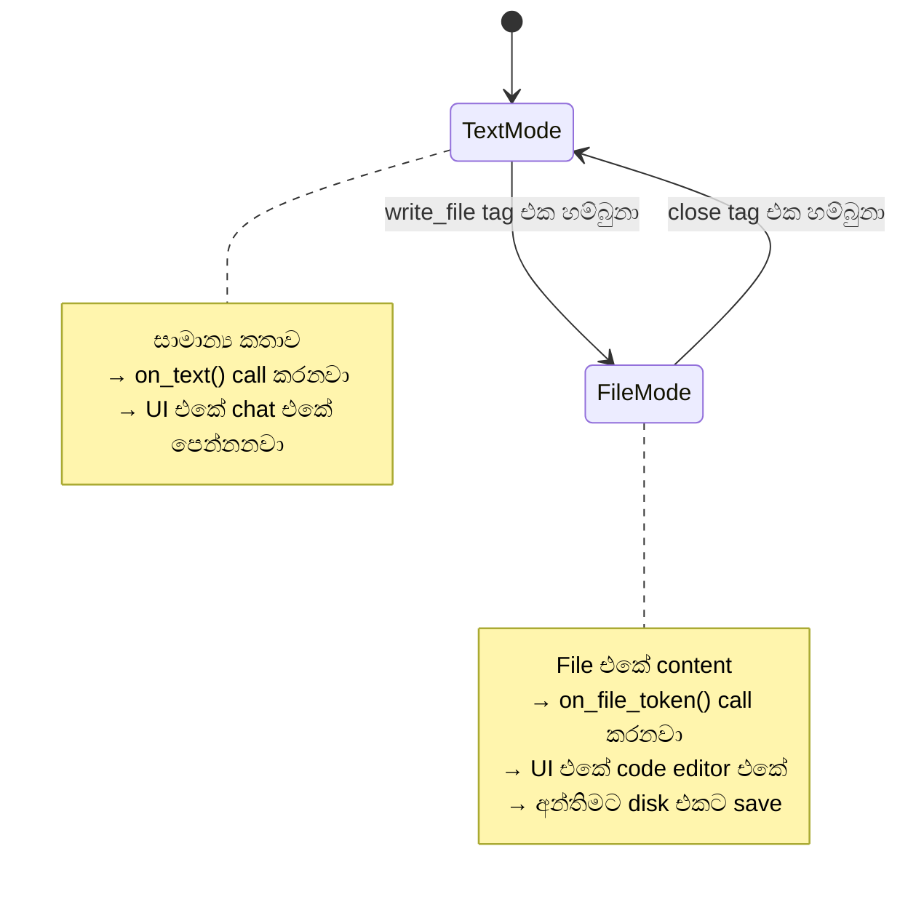

💻 **වැදගත්ම කොටස — `_safe_flush_len()`:**

```python
# ═══ agents/planner/architecture_runtime.py ═══ (පේළි 18–22)

def _safe_flush_len(buffer: str, tag: str) -> int:
    """Tag එකක් අඩක් ඇවිත් නම්, ඒ කොටස තියාගන්නවා."""
    for size in range(min(len(tag) - 1, len(buffer)), 0, -1):
        if buffer.endswith(tag[:size]):
            return len(buffer) - size
    return len(buffer)
```

> 💡 **මේක ඇයි ඕන?**
>
> Model එකෙන් වචන කෑලි වශයෙන් එනවා. හිතන්න මේ වගේ එනවා කියලා:
>
> - කෑල්ල 1: `"Hello <wri"`
> - කෑල්ල 2: `"te_file path='a.js'>"`
>
> කෑල්ල 1 එනකොට `<wri` කියන්නේ මොකක්ද කියලා දන්නේ නෑ. ඒක `<write_file` එකේ
> මුල් කොටස වෙන්න පුළුවන්! ඒ නිසා `Hello ` විතරක් UI එකට යවලා, `<wri`
> **තියාගන්නවා** ඊළඟ කෑල්ල එනකම්.
>
> මේක නැත්නම් — user ට chat එකේ `<wri` කියලා පේනවා, file එකත් හැදෙන්නේ නෑ.

💻 **`_drain()` — ප්‍රධාන loop එක:**

```python
# ═══ agents/planner/architecture_runtime.py ═══ (පේළි 47–84)

def _drain(self) -> None:
    while True:
        if self.mode == "text":
            match = OPEN_RE.search(self.buf)
            if match:                                    # ✅ සම්පූර්ණ tag එකක්
                if match.start():
                    self.on_text(self.buf[:match.start()])   # ඊට කලින් text
                self.tag = match.group(1).lower()
                self.path = match.group(2).strip()
                self.buf = self.buf[match.end():]
                if self.buf.startswith("\n"):
                    self.buf = self.buf[1:]              # පළමු newline අයින්
                self.content, self.mode = "", "file"     # → file mode
                self.on_file_start(self.path)
                continue

            partial = PARTIAL_OPEN_RE.search(self.buf)
            if partial:                                  # ⏳ අඩක් ඇවිත්
                if partial.start():
                    self.on_text(self.buf[:partial.start()])
                    self.buf = self.buf[partial.start():]
                return                                   # ඉතුරු කොටස බලාගෙන

            size = _safe_flush_len(self.buf, "<write_file")
            if size:
                self.on_text(self.buf[:size])
                self.buf = self.buf[size:]
            return

        # file mode — close tag එක හොයනවා
        close = f"</{self.tag}>"
        index = self.buf.find(close)
        if index >= 0:                                   # ✅ ඉවරයි
            head, self.buf = self.buf[:index], self.buf[index + len(close):]
            if head:
                self.content += head
                self.on_file_token(head)
            self.on_file_end(self.path, _strip_fence(self.content))   # 💾 save!
            self.mode, self.path, self.content = "text", None, ""
            continue

        size = _safe_flush_len(self.buf, close)
        if size:
            part, self.buf = self.buf[:size], self.buf[size:]
            self.content += part
            self.on_file_token(part)                     # UI එකට වචන
        return
```

💻 **`close()` — අන්තිමට:**

```python
# ═══ agents/planner/architecture_runtime.py ═══ (පේළි 39–45)

def close(self) -> None:
    if self.mode == "file":
        if self.buf:
            self.content += self.buf
            self.on_file_token(self.buf)
        self.on_file_end(self.path, _strip_fence(self.content))
    elif self.buf:
        self.on_text(self.buf)
    self.buf, self.mode, self.path, self.content = "", "text", None, ""
```

> 💡 **Model එක file එක අඩක් ලියලා නැවතුනොත්?**
> `close()` එකෙන් **තියෙන කොටස save කරනවා**. ඊට පස්සේ `repair_lint()`
> එකෙන් *"මේ file එක parse වෙන්නේ නෑ"* කියලා අඳුරගෙන, ආපහු ලියවනවා.

➡️ **ඊළඟට:** Agent ට දෙන මෙවලම් (Segment 10)

---

### 🟠 SEGMENT 10 — Commands + Workspace: agent ට දෙන මෙවලම්

📁 **Files (2):** `agents/core/commands.py` (පේළි 269) · `agents/core/workspace.py` (පේළි 390)

🎯 **වැඩේ:** AI agent එකට **ආරක්ෂිත විදියට** command run කරන්නත්, file කියවන්නත් දෙනවා.

🧠 **සරලව:** ළමයෙකුට මුළුතැන්ගෙයට යන්න දෙනවා — ඒත් **පිහිය අල්ලන්න දෙන්නේ නෑ**.
`npm install` කරන්න පුළුවන්. ඒත් `rm -rf /` කරන්න බෑ.

#### 🛡 කොටස A — `commands.py`

💻 **File එකේ මුල — imports:**

```python
# ═══ agents/core/commands.py ══════════════════════════════════
"""Runs approved package commands inside generated projects.

Commands stay inside the project and have time, output, and call limits.
"""
import logging
import os
import re
import shlex
import shutil
import subprocess
from pathlib import Path

log = logging.getLogger("commands")

DEFAULT_TIMEOUT = 300
MAX_OUTPUT = 4000
MAX_CALLS = 20
MAX_COMMAND_CHARS = 4096
```

| Import | ඇයි ඕන |
|---|---|
| `shlex` | Command එක **හරියට කැඩීම** (quote සලකලා) |
| `shutil` | `npm` කොහෙද කියලා හොයන්න (`which`) |
| `subprocess` | Command එක ඇත්තටම run කරන්න |
| `re` | භයානක වචන හොයන්න |

💻 **අවසර ලත් command:**

```python
# ═══ agents/core/commands.py ═══ (පේළි 21–47)

ALLOWED = {
    "npm": {"install", "i", "add", "uninstall", "remove", "un",
            "ls", "list", "run", "why", "view", "info", "dedupe", "prune", "audit"},
    "npx": None,        # None = හැම subcommand එකකටම අවසර
    "node": None,
    "yarn": {"add", "remove", "install", "list", "why"},
    "pnpm": {"add", "remove", "install", "list", "why"},
}

ALLOWED_NPM_SCRIPTS = {"build", "dev", "start", "lint"}

DANGEROUS = re.compile(
    r"(^|[^\w])(rm|rmdir|del|rd|format|mkfs|dd|shutdown|reboot|kill|taskkill|"
    r"chmod|chown|icacls|reg|sudo|su|curl|wget|iwr|invoke-webrequest|"
    r"powershell|pwsh|cmd|bash|sh|zsh|python|pip|git)([^\w]|$)", re.I)

BANNED_FLAGS = {"--prefix", "-g", "--global", "--ignore-scripts=false",
                "--unsafe-perm", "--allow-same-version"}
```

💻 **`validate()` — check කරන පිළිවෙල:**

```python
# ═══ agents/core/commands.py ═══ (පේළි 80–144)

def validate(command: str):
    """Return the safe command parts, or a reason for refusing the command."""
    command = (command or "").strip()
    if not command:
        return None, "empty command"
    if len(command) > MAX_COMMAND_CHARS:
        return None, f"command too long"
    if "\n" in command or "\r" in command:
        return None, "one command per block — no newlines"

    # 🛡 Shell විශේෂ අකුරු තහනම්
    for ch in ("&", "|", ">", "<", ";", "`", "$("):
        if ch in command:
            return None, (f"'{ch}' is not supported — commands run without a "
                          f"shell. Send one plain command per block.")

    argv = shlex.split(command, posix=(os.name != "nt"))
    prog = Path(argv[0]).name.lower()
    for suffix in (".exe", ".cmd", ".bat"):
        if prog.endswith(suffix):
            prog = prog[: -len(suffix)]              # npm.cmd → npm

    if prog not in ALLOWED:                          # 🛡 දන්නා program එකක්ද?
        return None, f"'{prog}' is not allowed."

    rest = argv[1:]
    if DANGEROUS.search(" ".join(rest)):             # 🛡 භයානක වචනයක්ද?
        return None, "that command touches the system — refused"

    sub = ALLOWED[prog]
    if sub is not None:
        if not rest:
            return None, f"'{prog}' needs a subcommand"
        if rest[0] not in sub:                       # 🛡 subcommand එක හරිද?
            return None, f"'{prog} {rest[0]}' is not allowed"
        if prog == "npm" and rest[0] == "run":
            script = rest[1] if len(rest) > 1 else ""
            if script not in ALLOWED_NPM_SCRIPTS:    # 🛡 script එක හරිද?
                return None, f"only these scripts may be run: {ALLOWED_NPM_SCRIPTS}"

    for token in rest:
        if token.lower() in BANNED_FLAGS:            # 🛡 භයානක flag එකක්ද?
            return None, f"'{token}' is not allowed"
        if prog in ("npm", "yarn", "pnpm") and rest[0] in (
                "install", "i", "add", "uninstall", "remove", "un"):
            if token == rest[0]:
                continue
            if not _PKG_RE.match(token):             # 🛡 package නමක්ද?
                return None, f"'{token}' is not a plain package name"

    return argv, None                                # ✅ හරි
```

**උදාහරණ:**

| Command | ප්‍රතිඵලය | ඇයි |
|---|---|---|
| `npm install lucide-react` | ✅ අවසර | දන්නා package එකක් |
| `npm run build` | ✅ අවසර | අවසර ලත් script එකක් |
| `npx tailwindcss init` | ✅ අවසර | `npx` ට full අවසර |
| `rm -rf /` | ❌ ප්‍රතික්ෂේප | `rm` දන්නා program එකක් නෙවෙයි |
| `npm install && rm -rf .` | ❌ ප්‍රතික්ෂේප | `&&` තියෙනවා |
| `npm run deploy` | ❌ ප්‍රතික්ෂේප | `deploy` අවසර ලත් script නෙවෙයි |
| `npm install -g typescript` | ❌ ප්‍රතික්ෂේප | `-g` = global install |
| `npm install ../../evil` | ❌ ප්‍රතික්ෂේප | package නමක් නෙවෙයි |

> 🛡 **`&`, `|`, `;` තහනම් ඇයි?**
> `npm install react; rm -rf /` කිව්වොත් — command **දෙකක්**. පළවෙනි එක safe.
> දෙවෙනි එක ඔබේ computer එක මකනවා. ඒ නිසා **එක command එකයි** අවසර.

💻 **`CommandResult` — ප්‍රතිඵලය:**

```python
# ═══ agents/core/commands.py ═══ (පේළි 49–65)

class CommandResult:
    def __init__(self, ok: bool, command: str, output: str, code=None):
        self.ok, self.command, self.output, self.code = ok, command, output, code

    def as_feedback(self) -> str:
        head = f"$ {self.command}\n"
        if not self.ok and self.code is None:
            return head + f"REFUSED: {self.output}"
        status = "exit 0" if self.code == 0 else f"exit {self.code}"
        return head + f"[{status}]\n{self.output}".rstrip()
```

> 💡 **`as_feedback()` කියන්නේ?** Model එකට **ආපහු කියන** ආකෘතිය.
> ප්‍රතික්ෂේප කළොත් *"REFUSED: ඇයි"* කියලා කියනවා — ඒ නිසා model එකට
> **ඉගෙන ගන්න** පුළුවන්, ආපහු ඒ වගේම එකක් නොකර.

| සීමාව | අගය | ඇයි |
|---|---|---|
| `DEFAULT_TIMEOUT` | තත්පර 300 | `npm install` හිර වුණොත් නවත්තනවා |
| `MAX_OUTPUT` | අකුරු 4000 | Model එකේ මතකය පිරෙන්නේ නෑ |
| `MAX_CALLS` | 20 | Loop එකකට වැටෙන එක වළක්වනවා |
| `cwd=project_dir` | — | හැම command එකක්ම **project එක ඇතුළේ** |

#### 🔦 කොටස B — `workspace.py`

💻 **File එකේ මුල — imports:**

```python
# ═══ agents/core/workspace.py ═════════════════════════════════
"""Gives agents safe, read-only access to the current project."""
from __future__ import annotations

import json
import re
from pathlib import Path
```

💻 **මෙවලම් ලැයිස්තුව (model එකට පෙන්නන එක):**

```python
# ═══ agents/core/workspace.py ═══ (පේළි 9–27)

TOOL_HELP = r"""
AGENTIC WORKSPACE TOOLS — use them only when current context is insufficient.
Ask for at most four read-only tools in one turn, one tag per line.

<read_file path="app/cart/page.jsx"/>
<search_code query="stock_quantity"/>
<list_files prefix="components/"/>
<route_source path="/products/123"/>
<importers path="components/ProductCard.jsx"/>
<dependency_closure path="app/checkout/page.jsx"/>
<dependency_neighborhood path="app/checkout/page.jsx"/>
<tests_for path="components/ProductCard.jsx"/>
<route_map prefix="/"/>
<plan_query query="checkout"/>

After the observations, make the smallest complete change. Never ask the user
to copy a file that these tools can inspect.
"""
```

**මෙවලම් 10 — සරලව:**

| Tool | මොකද කරන්නේ | උදාහරණයක් |
|---|---|---|
| `read_file` | File එකක් කියවනවා | "cart page එක බලන්න ඕන" |
| `search_code` | වචනයක් හොයනවා | "`stock_quantity` කොහෙද පාවිච්චි කරන්නේ?" |
| `list_files` | Folder එකේ file list | "components/ එකේ මොනවද?" |
| `route_source` | URL එකට අයිති file | "`/products/123` කොහෙන්ද එන්නේ?" |
| `importers` | මේක import කරන්නේ කවුද | "ProductCard පාවිච්චි කරන්නේ කවුද?" |
| `dependency_closure` | මේකට සම්බන්ධ ඔක්කොම | "checkout එකට අවශ්‍ය file ඔක්කොම" |
| `dependency_neighborhood` | අහල පහළ file | "මේකට ළඟින්ම තියෙන ඒවා" |
| `tests_for` | මේකට තියෙන test | "ProductCard ට test තියෙනවාද?" |
| `route_map` | Route ඔක්කොම | "මේ app එකේ page මොනවද?" |
| `plan_query` | Plan එකේ හොයනවා | "checkout ගැන plan එකේ මොනවද?" |

💻 **Tag එක අඳුරගන්නවා:**

```python
# ═══ agents/core/workspace.py ═══ (පේළි 29–40)

_TAGS = {
    "read_file": re.compile(r"<read_file\s+path=[\"']([^\"']+)[\"']\s*/?>", re.I),
    "search_code": re.compile(r"<search_code\s+query=[\"']([^\"']+)[\"']\s*/?>", re.I),
    "list_files": re.compile(r"<list_files\s+prefix=[\"']([^\"']*)[\"']\s*/?>", re.I),
    "route_source": re.compile(r"<route_source\s+path=[\"']([^\"']+)[\"']\s*/?>", re.I),
    # …
}
```

💻 **`serve()` — ඉල්ලීම් process කරන එක:**

```python
# ═══ agents/core/workspace.py ═══ (පේළි 83–94)

def serve(self, reply: str, *, max_calls: int = 4) -> tuple[str, int]:
    out, used = [], 0
    for name, arg in self.requests(reply)[:max_calls]:      # උපරිම 4 ක්
        key = f"{name}::{arg}".lower()
        if key in self.cache:                                # කලින් දුන්නාද?
            out.append(f"### {name} {arg}\n(refused: exact tool request "
                       "already served; use the observation already in context)")
            continue
        body = self.run(name, arg)                           # run කරනවා
        self.cache[key] = body                               # මතක තියාගන්නවා
        used += 1
        out.append(f"### {name} {arg}\n{body}")
    return ("\n\n".join(out), used)
```

> 💡 **Cache එක ඇයි?**
> AI model සමහර වෙලාවට **එකම file එකම** ආපහු ආපහු ඉල්ලනවා — loop එකක් වගේ.
> Cache එකෙන් *"මේක කලින් දුන්නා, ඒක බලන්න"* කියලා නවත්තනවා.

💻 **`dependency_paths()` — සම්බන්ධතා සිතියම:**

```python
# ═══ agents/core/workspace.py ═══ (පේළි 270–334)

def dependency_paths(self, targets, *, max_depth: int = 3, cap: int = 24):
    """Walk imports, importers, API routes, and shared collections."""
```

**මේක කරන්නේ:** File එකකින් පටන් අරගෙන —
1. ඒක **import කරන** file
2. ඒක **import කරන** file (ආපස්සට)
3. ඒක `fetch("/api/...")` කරන **API route**
4. ඒකම **MongoDB collection** එකක් පාවිච්චි කරන file

...ඔක්කොම **depth 3** ක් යනකම් හොයනවා.

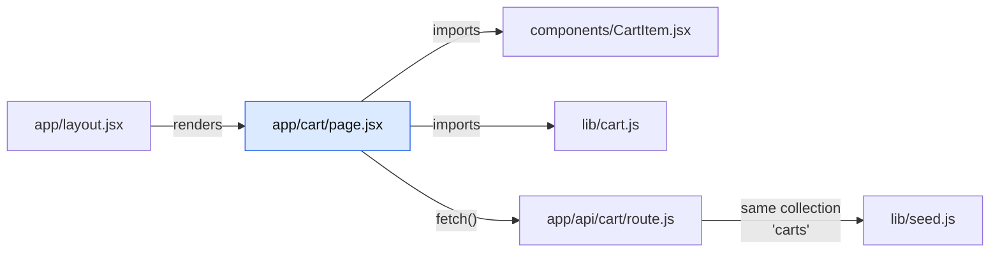

> 💡 **ඇයි මේක වැදගත්?**
> Cart page එකේ bug එකක් තියෙනවා කිව්වොත් — ප්‍රශ්නය `page.jsx` එකේ
> නොවෙන්නත් පුළුවන්. `route.js` එකේ, `CartItem.jsx` එකේ, `seed.js` එකේ
> වෙන්නත් පුළුවන්. මේ සිතියමෙන් **ඒ ඔක්කොම එකට** බලන්න පුළුවන්.
>
> මේක පාවිච්චි වෙන තැන් — `analyzer.py:_repair_paths()`,
> `scope_map.py:connected_files()`, `bugfixer_apply.py`.

➡️ **ඊළඟට:** Import/export check කරන family එක (Segment 11)

---

### 🟠 SEGMENT 11 — Exports family: import හරිද කියලා බලනවා

📁 **Files (4):**

| File path | පේළි | වැඩේ |
|---|---|---|
| `agents/core/exports_common.py` | 172 | මූලික මෙවලම් |
| `agents/core/exports_parse.py` | 154 | import/export කියවනවා |
| `agents/core/exports_checks.py` | 144 | වැරදි හොයනවා |
| `agents/core/exports_syntax.py` | ~90 | parse වෙනවාද බලනවා |

🎯 **වැඩේ:** File එකක් `import { Foo } from './bar'` කියලා ලිව්වම —
`bar.js` එකේ ඇත්තටම `Foo` කියලා දෙයක් තියෙනවාද කියලා **run කරන්නේ නැතුව** බලනවා.

🧠 **සරලව:** පොත් සාප්පුවක් හිතන්න. Catalog එකේ *"පොත් A ලාච්චුවේ"* කියලා
තියෙනවා. ඒත් ඇත්තටම A ලාච්චුවේ ඒක නෑ. පාරිභෝගිකයා එනකම් ඉන්නවා වෙනුවට,
**කලින්ම catalog එකයි ලාච්චුවයි ගළපනවා**.

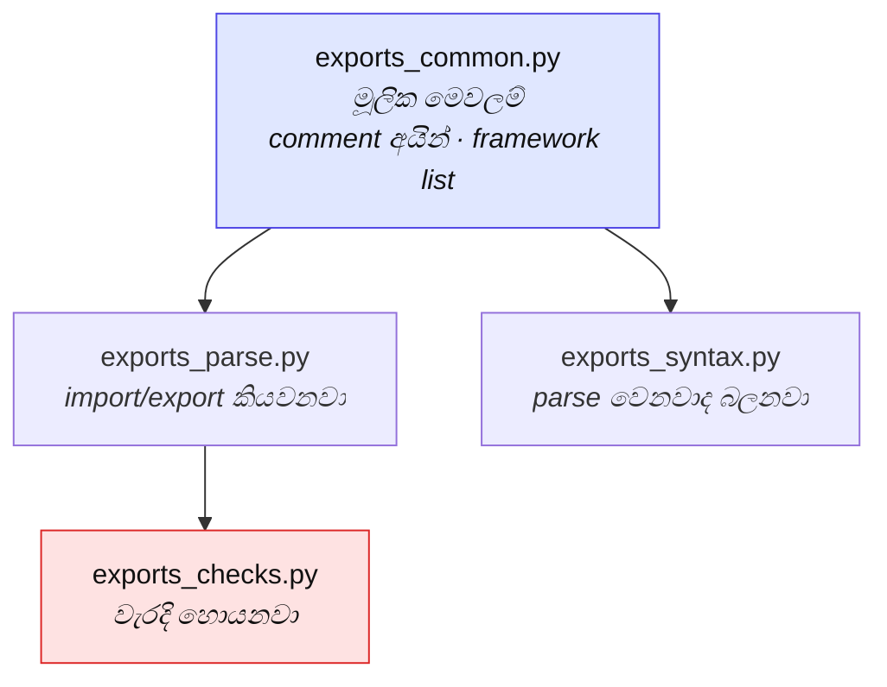

#### 📄 `exports_common.py` — මූලික මෙවලම්

💻 **imports:**

```python
# ═══ agents/core/exports_common.py ════════════════════════════
"""Shared helpers for finding imports that do not exist."""
from __future__ import annotations

import difflib
import re
from dataclasses import dataclass, field
from pathlib import PurePosixPath

LOCAL_PREFIXES = ("./", "../", "@/")
SKIP_SUFFIXES = (".css", ".scss", ".json", ".svg", ".png", ".jpg", ".webp")
CODE_SUFFIXES = (".js", ".jsx")
```

> 💡 **`difflib`** = Python එකේ built-in "සමානකම" මෙවලම. `getCrat`
> කියන එක `getCart` එකට කොච්චර සමානද කියලා මනිනවා.
>
> **`PurePosixPath`** = Windows එකේ වුණත් `/` පාවිච්චි කරන path.
> JavaScript import හැම වෙලාවෙම `/` පාවිච්චි කරනවා.

💻 **Framework එකේ තියෙන නම් ලැයිස්තුව:**

```python
# ═══ agents/core/exports_common.py ═══ (පේළි 14–34)

FRAMEWORK_EXPORTS = {
    "next/server": {"NextRequest", "NextResponse", "ImageResponse", "userAgent",
                    "URLPattern", "after", "connection"},
    "next/headers": {"cookies", "headers", "draftMode"},
    "next/navigation": {"redirect", "permanentRedirect", "notFound", "forbidden",
                        "unauthorized", "useRouter", "usePathname",
                        "useSearchParams", "useParams"},
    "next/cache": {"revalidatePath", "revalidateTag", "unstable_cache",
                   "cacheLife", "cacheTag"},
}
```

> 💡 **AI model නැති නමක් import කරන්න පුළුවන්.** උදා:
> `import { useNavigate } from 'next/navigation'` — ඒත් `useNavigate`
> කියලා දෙයක් Next.js එකේ නෑ (ඒක react-router-dom එකේ). මේ ලැයිස්තුවෙන්
> **වහාම** ඒක අඳුරගන්නවා.

💻 **Comment අයින් කරන දක්ෂ ක්‍රමය:**

```python
# ═══ agents/core/exports_common.py ═══ (පේළි 59–70)

def strip_noncode(src: str) -> str:
    """Hide comments and patterns without changing text positions."""

    def blank(a: int, b: int) -> None:
        # comment එකේ තියෙන අකුරු space වලින් replace කරනවා
        ...
```

> 💡 **ඇයි "positions" වෙනස් නොකර?**
> Comment එකක් **මකලා** දැම්මොත්, ඉතුරු code එකේ පේළි අංක වෙනස් වෙනවා.
> එතකොට *"line 42 එකේ වැරදි"* කිව්වම — user ට line 42 බැලුවම වෙන දෙයක්
> පේනවා. ඒ නිසා comment එකේ අකුරු **space වලින් replace** කරනවා.

**උදාහරණයක්:**

```javascript
// import { Fake } from './x'
import { Real } from './y'
```

`strip_noncode` වලින් පස්සේ:

```javascript
                              
import { Real } from './y'
```

Comment එකේ තිබ්බ `import` එක **තව හොයන්නේ නෑ** — ඒත් `Real` එකේ පේළි අංකය තාම 2.

#### 📄 `exports_parse.py` — කියවනවා

💻 **imports:**

```python
# ═══ agents/core/exports_parse.py ═════════════════════════════
"""Reads imports and exports from local JavaScript files."""
from agents.core.exports_common import *
```

> 💡 **`import *` කියන්නේ?** `exports_common.py` එකේ තියෙන **ඔක්කොම**
> මෙතනට ගේනවා (`re`, `difflib`, `dataclass`, `FRAMEWORK_EXPORTS`,
> `strip_noncode`, ...). සාමාන්‍යයෙන් `import *` හොඳ පුරුද්දක් නෙවෙයි —
> ඒත් මේ `exports_*` family එක **එකම module එකක් වගේ** හිතලා designed කරලා
> තියෙන්නේ. ඒ නිසා මෙතන ඒක හරි.

💻 **Export හොයනවා:**

```python
# ═══ agents/core/exports_parse.py ═══ (පේළි 44–55)

def parse_exports(src: str) -> ModuleExports:
    """Read every export while avoiding false matches in comments."""
    a = _parse_exports_one(src)                      # අමු code එකෙන්
    b = _parse_exports_one(strip_noncode(src))       # comment නැති එකෙන්
    return ModuleExports(
        named=a.named | b.named,                     # දෙකෙන්ම එකතුව
        has_default=a.has_default or b.has_default,
        star_from=sorted(set(a.star_from) | set(b.star_from)),
        named_from={**b.named_from, **a.named_from},
    )
```

**හඳුනාගන්න export වර්ග:**

| Code | හඳුනාගන්නවා |
|---|---|
| `export function foo() {}` | `foo` |
| `export const { a, b } = x` | `a`, `b` |
| `export default function Page()` | default එකක් තියෙනවා |
| `export * from './other'` | `./other` එකේ ඔක්කොම |
| `export { a, b as c }` | `a`, `c` |

💻 **Import path එක resolve කරනවා:**

```python
# ═══ agents/core/exports_parse.py ═══ (පේළි 113–129)

def resolve_local(importer_rel: str, spec: str, files: dict) -> str | None:
    """'./bar' කියන එක ඇත්තටම මොන file එකද කියලා හොයනවා."""
```

| Importer | Spec | හම්බෙන file |
|---|---|---|
| `app/cart/page.jsx` | `./CartItem` | `app/cart/CartItem.jsx` |
| `app/cart/page.jsx` | `../lib/cart` | `app/lib/cart.js` |
| `app/cart/page.jsx` | `@/lib/mongodb` | `lib/mongodb.js` |
| `app/cart/page.jsx` | `react` | `None` *(npm package)* |

💻 **`export *` හරහා යනවා:**

```python
# ═══ agents/core/exports_parse.py ═══ (පේළි 131–152)

def effective_exports(rel: str, files: dict, _seen: set = None) -> set | None:
    """Follow `export * from` chains to the real names."""
```

**උදාහරණයක්:**

```javascript
// lib/index.js
export * from './cart'
export * from './user'
```

`lib/index.js` එකෙන් **ඇත්තටම දෙන නම්** මොනවද? — `cart.js` සහ `user.js`
දෙකේම නම් ඔක්කොම. `_seen` කියන set එකෙන් **circular import** එකකදී
loop වෙන එක වළක්වනවා.

#### 📄 `exports_checks.py` — වැරදි හොයනවා

💻 **imports:**

```python
# ═══ agents/core/exports_checks.py ════════════════════════════
"""Finds broken imports and explains them clearly."""
from agents.core.exports_common import *
from agents.core.exports_parse import *
```

💻 **`BrokenImport` — වැරැද්දක් විස්තර කරන ආකෘතිය:**

```python
# ═══ agents/core/exports_checks.py ═══ (පේළි 6–28)

@dataclass
class BrokenImport:
    importer: str        # කවුද import කරන්නේ
    line: int            # මොන පේළියේද
    name: str            # මොන නමද
    module: str          # කොහෙන්ද
    spec: str            # ලියලා තියෙන path එක
    available: list      # ඇත්තටම තියෙන නම්

    def close_match(self) -> str | None:
        """Suggest a replacement only when the match is very close."""
        lower = self.name.lower()
        same = [n for n in self.available if n.lower() == lower]
        if len(same) == 1:
            return same[0]                    # case එක විතරයි වැරදි
        hit = difflib.get_close_matches(self.name, self.available, n=1,
                                        cutoff=0.92)
        return hit[0] if hit else None        # 92% ට වඩා සමාන නම් විතරයි

    def message(self) -> str:
        return (f"{self.importer}:{self.line}: imports {{ {self.name} }} from "
                f"'{self.spec}', which exports only: "
                f"{', '.join(self.available) or '(nothing)'}")
```

**උදාහරණයක්:**

```text
app/cart/page.jsx:3: imports { getCartItems } from '@/lib/cart',
which exports only: getCart, addToCart, removeFromCart
```

> 💡 **`cutoff=0.92` ඇයි එච්චර ලොකු?**
> `getCart` සහ `getCartItems` 70% ක් සමානයි — ඒත් ඒවා **වෙනස් දේවල්**.
> අඩු cutoff එකකින් වැරදි යෝජනා දෙනවා. 92% කියන්නේ **type කරද්දී වුණ
> පොඩි වැරැද්දක්** විතරයි (`getCrat` → `getCart` වගේ).

💻 **`check_named_imports()` — ප්‍රධාන check එක:**

```python
# ═══ agents/core/exports_checks.py ═══ (පේළි 30–71)

def check_named_imports(files: dict) -> list:
    """Find named imports that their local files do not provide."""
    cache, out = {}, []
    for rel, src in sorted(files.items()):
        if not rel.endswith(CODE_SUFFIXES) or not isinstance(src, str):
            continue
        for st in parse_imports(src):
            if not st.names:
                continue
            # 1️⃣ Framework module එකක්ද? (next/server වගේ)
            surface = FRAMEWORK_EXPORTS.get(st.spec)
            if surface is not None:
                for imported, _local in st.names:
                    if imported not in surface:
                        out.append(BrokenImport(importer=rel, line=st.line,
                                                name=imported, module=st.spec,
                                                spec=st.spec,
                                                available=sorted(surface)))
                continue
            # 2️⃣ Local file එකක්ද?
            if not st.spec.startswith(LOCAL_PREFIXES):
                continue
            if st.spec.endswith(SKIP_SUFFIXES):
                continue
            target = resolve_local(rel, st.spec, files)
            if target is None or not target.endswith(CODE_SUFFIXES):
                continue
            if target not in cache:
                cache[target] = effective_exports(target, files)
            avail = cache[target]
            if avail is None:
                continue
            # … නැති නම් හම්බුනොත් BrokenImport එකක්
    return out
```

💻 **`group_messages()` — එකම file එකේ ඒවා එකතු කරනවා:**

```python
# ═══ agents/core/exports_checks.py ═══ (පේළි 122–144)

def group_messages(broken: list) -> list:
    """Group broken imports by importer so one file is one message."""
```

File එකක **වැරදි import 5 ක්** තිබ්බොත් — message 5 ක් වෙනුවට **එකක්**.
Model එකට ඒක තේරුම් ගන්න ලේසියි.

#### 📄 `exports_syntax.py` — parse වෙනවාද බලනවා

💻 **imports:**

```python
# ═══ agents/core/exports_syntax.py ════════════════════════════
"""Checks whether generated JavaScript can be read by the build tools."""
from agents.core.exports_common import *
```

💻 **esbuild එකෙන් check කරනවා:**

```javascript
// ═══ agents/core/exports_syntax.py ඇතුළේ තියෙන JS script එක ═══
const fs = require('fs');
const path = require('path');
const esbuild = require(process.argv[2]);
const files = JSON.parse(fs.readFileSync(process.argv[3], 'utf8'));
const out = [];
for (const rel of files) {
  let src;
  try { src = fs.readFileSync(path.join(process.argv[4], rel), 'utf8'); }
  catch (e) { continue; }
  try {
    // `jsx` for .js too: Next lets a .js file contain JSX
    esbuild.transformSync(src, { loader: 'jsx', sourcefile: rel });
  } catch (e) {
    const first = (e.errors && e.errors[0]) || {};
    out.push({ path: rel, line: (first.location && first.location.line) || 0,
               message: first.text || String(e.message || e) });
  }
}
process.stdout.write(JSON.stringify(out));
```

```python
# ═══ agents/core/exports_syntax.py ═══ (පේළි 31–78)

def check_syntax(project_dir, files, node_cmd=None) -> tuple[list, str]:
    """Return syntax problems and any reason the check could not run."""
    import json, shutil, subprocess, tempfile
    from pathlib import Path

    root = Path(project_dir).resolve()
    esbuild_dir = root / "node_modules" / "esbuild"
    if not esbuild_dir.exists():
        return [], "esbuild is not installed in this project"

    node = node_cmd or shutil.which("node")
    if not node:
        return [], "node is not on PATH"

    targets = sorted(rel for rel in files
                     if rel.endswith((".js", ".jsx"))
                     and not rel.startswith(("node_modules/", ".next/"))
                     and not rel.endswith((".config.js", ".config.mjs")))
    if not targets:
        return [], ""
    # … temp folder එකක script එක ලියලා run කරනවා
```

> 💡 **ඇයි `npm run build` කරන්නේ නැතුව මේක?**
> `npm run build` කරන්න **විනාඩි 1-3** ක් යනවා. මේ check එක **තත්පර 1-2** යි.
> Syntax error එකක් තිබ්බොත් — build එකට කලින්ම දැනගන්න පුළුවන්.
>
> `return [], "reason"` කියන pattern එකත් වැදගත්. esbuild නැත්නම්
> *"වැරදි නෑ"* කියලා **බොරු කියන්නේ නෑ** — *"check කරන්න බැරි වුණා,
> මේ නිසා"* කියලා **ඇත්ත කියනවා**.

➡️ **ඊළඟට:** Documentation සහ ඉගෙනීම (Segment 12)

---

### 🟠 SEGMENT 12 — Docs + Lessons: උදව් හොයනවා, ඉගෙන ගන්නවා

📁 **Files (4):**

| File path | පේළි | වැඩේ |
|---|---|---|
| `agents/core/docsindex.py` | ~130 | Computer එකේ Next.js docs |
| `agents/core/nextdocs.py` | ~120 | Internet එකෙන් error help |
| `agents/core/nextmcp.py` | ~70 | App එකෙන්ම error අහනවා |
| `agents/core/lessons.py` | 202 | පරණ වැරදිවලින් ඉගෙනීම |

🎯 **වැඩේ:** Error එකක් ආවම **Next.js ගේම documentation** එකෙන් උදව් හොයනවා,
සහ **පරණ වැරදිවලින් ඉගෙන ගන්නවා**.

🧠 **සරලව:** ගොඩනැගිලි කාරයෙක් අලුත් උපකරණයක් පාවිච්චි කරද්දී — manual එක
බලනවා. ඒ වගේම, කලින් project එකක වුණ වැරැද්දක් **ආපහු කරන්නේ නෑ**.

#### 📚 `docsindex.py` — Computer එකේ තියෙන documentation

💻 **imports:**

```python
# ═══ agents/core/docsindex.py ═════════════════════════════════
"""Lets agents read the documentation bundled with the installed Next.js."""
import logging
import re
from pathlib import Path

log = logging.getLogger("docsindex")
```

💻 **Topic ලැයිස්තුව:**

```python
# ═══ agents/core/docsindex.py ═══ (පේළි 9–47)

TOPICS = {
    "use-client": (
        "01-app/03-api-reference/01-directives/use-client.md",
        "the 'use client' directive — what a Client Component may and may not do"),
    "server-and-client": (
        "01-app/01-getting-started/05-server-and-client-components.md",
        "the server/client boundary, and how to split a page across it"),
    "fetching-data": (
        "01-app/01-getting-started/06-fetching-data.md",
        "reading data in a Server Component vs a Client Component"),
    "page": (
        "01-app/03-api-reference/03-file-conventions/page.md",
        "page.js — its props, and that params/searchParams are Promises"),
    "route": (
        "01-app/03-api-reference/03-file-conventions/route.md",
        "route.js — named GET/POST exports, and the Response shape"),
    "cookies": (
        "01-app/03-api-reference/04-functions/cookies.md",
        "cookies() — where it may be called, and why it is async"),
    # …
}


def docs_root(project_dir: Path) -> Path | None:
    """Return the installed documentation folder when it exists."""
    root = Path(project_dir) / "node_modules" / "next" / "dist" / "docs"
    return root if root.is_dir() else None
```

> 💡 **වැදගත් අදහසක්!**
> `npm install next` කරාම, Next.js එකේ **documentation එකත් එනවා**
> `node_modules/next/dist/docs/` ඇතුළේ. Internet එකක් **අවශ්‍ය නෑ**.
> AI ට ඕන වෙලාවට ඒක කියවන්න පුළුවන් — **install කරලා තියෙන version එකේම** docs.

```python
# ═══ agents/core/docsindex.py ═══ (පේළි 64, 88, 109)

def index_block(project_dir: Path) -> str:
    """Builder ට දෙන 'මොනවද කියවන්න පුළුවන්' ලැයිස්තුව."""

def read(project_dir: Path, topic: str) -> str:
    """එක doc topic එකක් කියවනවා."""

def serve(project_dir: Path, reply: str) -> str:
    """Model එක ඉල්ලපු doc topic එක කියවලා දෙනවා."""
```

#### 🌐 `nextdocs.py` — Internet එකෙන් error help

💻 **imports:**

```python
# ═══ agents/core/nextdocs.py ══════════════════════════════════
"""Fetches and caches official Next.js help for reported errors."""
import logging
import re
import threading
from pathlib import Path

import requests

log = logging.getLogger("nextdocs")

MESSAGE_LINK_RE = re.compile(
    r"nextjs\.org/docs/messages/([a-z0-9][a-z0-9-]{2,60})", re.I)

BASE = "https://nextjs.org/docs/messages"
TIMEOUT = 12
MAX_BYTES = 60_000
MAX_PAGES = 2

_lock = threading.Lock()
_mem: dict = {}
```

> 💡 **`threading.Lock()` ඇයි?** Thread කිහිපයක් එකපාරට එකම cache එකට
> ලියන්න ගියොත් — දත්ත කැඩෙනවා. `Lock` එකෙන් **එකපාරට එක්කෙනයි** කියලා
> සහතික කරනවා.

💻 **Error එකේ link එක හොයනවා:**

```python
# ═══ agents/core/nextdocs.py ═══ (පේළි 32–41)

def slugs_in(text: str) -> list:
    """Find the error-help page names in build output."""
    seen, out = set(), []
    for m in MESSAGE_LINK_RE.finditer(text or ""):
        s = m.group(1).lower()
        if s not in seen:
            seen.add(s)
            out.append(s)
    return out
```

> 💡 **Next.js error message වල link එකක් තියෙනවා!**
> ```text
> Error: Functions cannot be passed directly to Client Components.
>   Read more: https://nextjs.org/docs/messages/server-actions-must-be-async
> ```
> `slugs_in()` එකෙන් `server-actions-must-be-async` කියන කොටස ගන්නවා,
> ඊට පස්සේ ඒ page එක download කරලා **model එකට දෙනවා**.

```python
# ═══ agents/core/nextdocs.py ═══ (පේළි 43–93)

def fetch(slug: str, *, offline: bool = False) -> str:
    """Read one error-help page, using the cache when possible."""
    slug = (slug or "").strip().lower()
    if not re.fullmatch(r"[a-z0-9][a-z0-9-]{2,60}", slug):
        return ""                      # 🛡 වැරදි slug එකක් නම් නවත්තනවා
    with _lock:
        if slug in _mem:
            return _mem[slug]          # memory cache
    fp = cache_dir() / f"{slug}.md"    # ~/.agentforge/docs/messages/
    # … disk cache, එහෙමත් නැත්නම් download
```

**Cache මට්ටම් 2 ක්:**

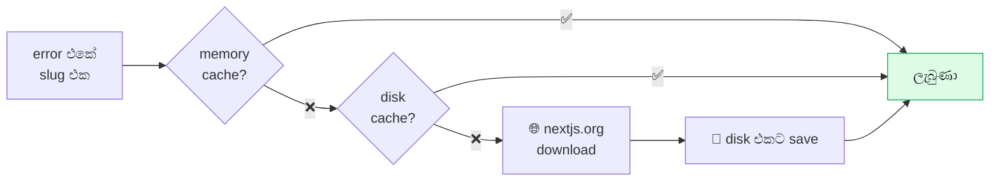

> 💡 **`MAX_PAGES = 2` ඇයි?**
> Error එකක **link 10 ක්** තිබ්බොත් — ඔක්කොම download කරලා model එකට
> දුන්නොත් **මතකය පිරෙනවා**. වැදගත්ම **2** විතරයි.

**පාවිච්චි කරන තැන් 3 ක්:**

```python
# ═══ agents/server/build_repair.py ═══
guidance = nextdocs.guidance_for(errors)

# ═══ agents/server/agent_pipeline.py ═══
guidance = nextdocs.guidance_for(all_errors)

# ═══ agents/analysis/analyzer.py ═══
guidance = nextdocs.guidance_for(server_log + "\n" + ...)
```

#### 📡 `nextmcp.py` — App එකෙන්ම error අහනවා

💻 **imports:**

```python
# ═══ agents/core/nextmcp.py ═══════════════════════════════════
"""Reads errors reported directly by a running Next.js app."""
import json
import logging
import urllib.error
import urllib.request

log = logging.getLogger("nextmcp")
TIMEOUT = 15

_HEADERS = {"Content-Type": "application/json",
            "Accept": "application/json, text/event-stream"}
```

```python
# ═══ agents/core/nextmcp.py ═══ (පේළි 16–48)

def call(base_url: str, tool: str, arguments: dict = None) -> dict:
    """Call one Next.js tool and return an empty result on failure."""
    payload = json.dumps({
        "jsonrpc": "2.0", "id": 1, "method": "tools/call",
        "params": {"name": tool, "arguments": arguments or {}},
    }).encode()
    try:
        req = urllib.request.Request(
            base_url.rstrip("/") + "/_next/mcp", data=payload, headers=_HEADERS)
        body = urllib.request.urlopen(req, timeout=TIMEOUT).read().decode("utf-8")
    except Exception as e:
        log.debug(f"mcp {tool}: {e}")
        return {}                              # fail වුණොත් හිස්
    # … SSE "data: " පේළි parse කරනවා


def available(base_url: str) -> bool:
    """Check whether the running app provides its diagnostic tools."""
    return bool(call(base_url, "get_project_metadata"))


def errors(base_url: str, limit: int = 8) -> str:
    """Recent errors the running app reported about itself."""
```

> 💡 **MCP කියන්නේ?**
> Next.js 16 එකේ `/_next/mcp` කියලා **විශේෂ endpoint** එකක් තියෙනවා.
> ඒකෙන් *"මොන error වලද දැන් තියෙන්නේ?"* කියලා **app එකෙන්ම** අහන්න පුළුවන්.
> Log file කියවනවා වෙනුවට, **app එකම කියනවා**.
>
> මේක **optional** — වැඩ නොකළොත් හිස් උත්තරයක් දෙනවා, crash වෙන්නේ නෑ.
> `agents/build/tester_routes.py` එකේ `_collect_mcp()` එකෙන් පාවිච්චි කරනවා.

#### 🎓 `lessons.py` — වැරදිවලින් ඉගෙන ගන්නවා

💻 **imports:**

```python
# ═══ agents/core/lessons.py ═══════════════════════════════════
"""Records repeated build mistakes so future builds can avoid them."""
from __future__ import annotations

import json
import logging
import os
import re
import tempfile
from datetime import datetime, timezone
from pathlib import Path

log = logging.getLogger("lessons")

STORE = Path.home() / ".agentforge" / "lessons.json"

# Limits keep the builder's lesson list short.
MAX_IN_PROMPT = 10       # builder ට දෙන්නේ උපරිම 10 ක්
MAX_CHARS = 1600         # අකුරු 1600 ට වඩා නෑ
MAX_KEPT = 120           # මතක තියාගන්නේ 120 ක්
MIN_PROJECTS = 2         # project 2 කවත් වුණ වැරැද්දක් වෙන්න ඕන
```

> 💡 **`STORE` එක `Path.home()` එකේ ඇයි?**
> `~/.agentforge/lessons.json` — ඒ කියන්නේ **project එකට පිටින්**.
> ඒ නිසා project 1 කින් ඉගෙන ගත්ත දේ, project 2 ට **ලැබෙනවා**.

💻 **පාඩම් හදනවා:**

```python
# ═══ agents/core/lessons.py ═══ (පේළි 99–177)

def from_findings(findings) -> list:
    """Analyzer finding ලැයිස්තුවෙන් නැවත නැවත එන pattern ගන්නවා."""

def from_qa_history(rounds) -> list:
    """QA round වලින් පාඩම් ගන්නවා."""

def record(project: str, entries, path: Path = None) -> int:
    """මේ project එකේ දැක්ක පාඩම් save කරනවා."""
```

💻 **Builder ට දෙන පාඩම් block එක:**

```python
# ═══ agents/core/lessons.py ═══ (පේළි 178–202)

def prompt_block(path: Path = None) -> str:
    """The lessons worth showing the builder, newest and most common first."""
```

**මේක `architecture.py` එකේ (S8) මෙතන පාවිච්චි වෙනවා:**

```python
# ═══ agents/planner/architecture.py ═══ (පේළි 196–206)

def _builder_sys(self) -> str:
    prompt = self._P["builder"]
    learned = __import__("agents.core.lessons",
                         fromlist=["prompt_block"]).prompt_block()
    if learned:
        prompt += "\n\nPROJECT-GENERATION LESSONS\n" + learned
    ...
```

**සහ `analyzer.py` එකේ (S15) මෙතන save වෙනවා:**

```python
# ═══ agents/analysis/analyzer.py ═══ (පේළි 565–568)

from agents.core import lessons
lessons.record(self.project_dir.name, lessons.from_findings(first))
```

> 💡 **`MIN_PROJECTS = 2` ඇයි?**
> එක project එකක වුණ වැරැද්දක් — ඒක **අහම්බයක්** වෙන්න පුළුවන්.
> **project දෙකකවත්** වුණා නම් විතරයි ඒක "පාඩමක්" කියලා ගන්නේ.

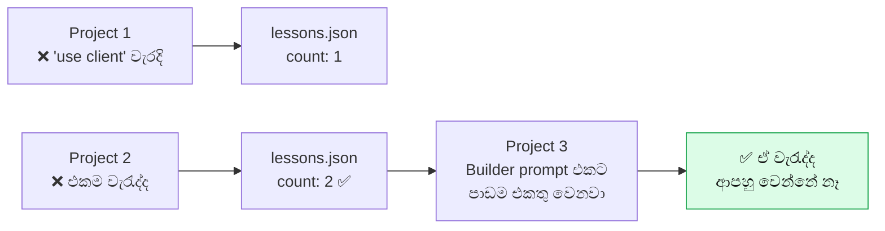

➡️ **ඊළඟට:** MongoDB — දත්ත ගබඩාව (Segment 13)

---

### 🍃 SEGMENT 13 — MongoDB: දත්ත ගබඩාව

📁 **Files (5):**

| File path | පේළි | වැඩේ |
|---|---|---|
| `agents/data/__init__.py` | 1 | Package විස්තරය |
| `agents/data/mongo_common.py` | 268 | මූලික මෙවලම් + base class |
| `agents/data/mongo_install.py` | 191 | MongoDB **download** කරනවා |
| `agents/data/mongo_lifecycle.py` | 196 | **start/stop** කරනවා |
| `agents/data/mongo_data.py` | ~110 | **Database clear** කරනවා |

🎯 **වැඩේ:** MongoDB කියන database එක **automatic ම** download කරලා, start කරලා,
හැම project එකකටම **වෙනම database එකක්** හදලා දෙනවා.

🧠 **සරලව:** ගෙදරට **ජල සම්බන්ධය**. User ට plumber කෙනෙක් ගෙන්නන්න ඕන නෑ —
AgentForge ම pipe ටික දාලා, ටැංකිය පුරවලා දෙනවා.

💻 **Package විස්තරය:**

```python
# ═══ agents/data/__init__.py ══════════════════════════════════
"""Start MongoDB and prepare isolated data for each generated app."""
```

#### 📄 `mongo_common.py` — මූලික මෙවලම්

💻 **imports:**

```python
# ═══ agents/data/mongo_common.py ══════════════════════════════
"""Downloads, starts, and isolates a MongoDB for generated apps."""
import io
import json
import logging
import os
import platform
import re
import shutil
import socket
import subprocess
import sys
import tarfile
import threading
import time
import zipfile
from pathlib import Path

import requests

DEFAULT_PORT = 27017
HOME = Path.home() / ".agentforge" / "mongodb"
BUDGET_S = 300
```

| Import | ඇයි ඕන |
|---|---|
| `platform`, `sys` | Windows ද Mac ද Linux ද කියලා බලන්න |
| `zipfile`, `tarfile` | Download කරපු archive එක ලිහන්න |
| `socket` | Port එක open ද කියලා බලන්න |
| `subprocess` | `mongod` process එක start කරන්න |
| `threading` | Lock එකක් — එකපාරට කීපදෙනෙක් start කරන්නේ නෑ |
| `requests` | MongoDB download කරන්න |

💻 **Platform එක අඳුරගන්නවා:**

```python
# ═══ agents/data/mongo_common.py ═══ (පේළි 67–107)

def _arch() -> str:
    """x86_64 ද arm64 ද?"""

def _linux_targets() -> list:
    """Ubuntu 22 ද, Debian 12 ද — මොන Linux එකද?"""

def _targets() -> list:
    """මේ computer එකට ගැළපෙන download target ලැයිස්තුව."""

def _exe(name: str) -> str:
    """Windows එකේ නම් 'mongod.exe', නැත්නම් 'mongod'."""
    return name + ".exe" if sys.platform.startswith("win") else name
```

💻 **Project එකට වෙනම database නමක්:**

```python
# ═══ agents/data/mongo_common.py ═══ (පේළි 109–119)

def get_uri_override() -> str:
    """User settings එකේ තමන්ගේම MONGODB_URI එකක් තියෙනවාද?"""

def db_name_for(project: str) -> str:
    """Project එකට වෙනම database නමක් — 'agentforge_' කියලා පටන් ගන්නවා."""
```

| Project නම | Database නම |
|---|---|
| `my-book-store` | `agentforge_my_book_store` |
| `todo-app-2` | `agentforge_todo_app_2` |

> 💡 **`agentforge_` prefix එක ඉතාම වැදගත්!**
> Database මකද්දී — `agentforge_` කියලා පටන් ගන්නේ නැති එකක් **කවදාවත්
> මකන්නේ නෑ**. User ගේ ඇත්ත data ආරක්ෂිතයි. (S13 අන්තිමට බලන්න.)

💻 **`_RangeReader` — දක්ෂ download trick එකක්:**

```python
# ═══ agents/data/mongo_common.py ═══ (පේළි 121–181)

class _RangeReader(io.RawIOBase):
    """Read a remote file in pieces, as if it were on disk."""

    def __init__(self, url: str, session: requests.Session = None):
        ...
    def seekable(self): return True
    def seek(self, off, whence=io.SEEK_SET): ...
    def _fetch(self, start: int, end: int) -> bytes:
        # HTTP Range header එකෙන් කෑල්ලක් විතරක් ඉල්ලනවා
```

> 💡 **මේකෙන් වෙන ලොකු වාසිය:**
> MongoDB download එක **~100MB**. ඒත් අපිට ඕන `mongod` කියන **එක file එක**
> විතරයි (~40MB). `_RangeReader` එකෙන් — ZIP එකේ **index එක විතරක්**
> download කරලා, `mongod` කොහෙද තියෙන්නේ කියලා බලලා, **ඒ කෑල්ල විතරක්**
> download කරනවා. **Data 60MB ක් ඉතුරු වෙනවා!**

#### 📄 `mongo_install.py` — Download කරනවා

💻 **imports:**

```python
# ═══ agents/data/mongo_install.py ═════════════════════════════
"""Focused install responsibilities for MongoManager."""
from agents.data.mongo_common import *
```

💻 **තියෙන එකක් හොයනවා:**

```python
# ═══ agents/data/mongo_install.py ═══ (පේළි 6–18)

def find_binary(self) -> Path:
    """Previously downloaded binary, else one already installed."""
    local = self.bin_dir / _exe("mongod")
    if local.exists():
        return local                            # 1️⃣ අපි කලින් download කරපු එක
    which = shutil.which("mongod")
    if which:
        return Path(which)                      # 2️⃣ PATH එකේ තියෙනවාද
    if sys.platform.startswith("win"):
        for p in sorted(Path("C:/Program Files/MongoDB/Server").glob(
                "*/bin/mongod.exe"), reverse=True):
            return p                            # 3️⃣ Windows install එකක්
    return None                                 # 4️⃣ නෑ — download කරන්න ඕන
```

💻 **Download link එක හොයනවා:**

```python
# ═══ agents/data/mongo_install.py ═══ (පේළි 20–50)

def resolve_download(self) -> dict:
    """{version, url, kind} for this platform, from the official feed."""
    arch = _arch()
    targets = _targets()
    try:
        r = requests.get(FEED_URL, timeout=30)          # නිල ලැයිස්තුව
        r.raise_for_status()
        feed = r.json()
        versions = [v for v in feed.get("versions", [])
                    if v.get("production_release")      # 🛡 stable විතරයි
                    and not v.get("release_candidate")] # 🛡 beta නෑ
        for want in targets:
            for v in versions:
                for dl in v.get("downloads", []):
                    if (dl.get("target") == want and dl.get("arch") == arch
                            and dl.get("edition") == "base"):
                        url = (dl.get("archive") or {}).get("url")
                        if url:
                            return {"version": v.get("version", "?"), "url": url,
                                    "kind": "zip" if url.endswith(".zip") else "tgz"}
    except Exception as e:
        self._log("WARN", f"   MongoDB version feed unreachable ({e}) — "
                          f"using {FALLBACK_VERSION}")

    for want in targets:                                # Internet නෑ නම්
        url = FALLBACK_URLS.get((want, arch))           # hard-coded link
        if url:
            return {"version": FALLBACK_VERSION, "url": url, ...}
    raise RuntimeError(f"No MongoDB build published for {sys.platform}/{arch}")
```

> 💡 **Fallback දෙකක්:** නිල feed එක වැඩ නොකළොත් → hard-coded link ටිකක්.
> ඒකත් නෑ නම් → පැහැදිලි error එකක්. **හංගන්නේ නෑ**.

💻 **ZIP එකෙන් file එකක් විතරක්:**

```python
# ═══ agents/data/mongo_install.py ═══ (පේළි 92–170)

def _extract_from_zip(self, url: str, out_path: Path) -> bool:
    """Stream just mongod out of a remote zip."""

def _extract_from_zip_full(self, url: str, out_path: Path) -> bool:
    """Fallback — download the whole zip, then extract."""

def _extract_from_tgz(self, url: str, out_path: Path) -> bool:
    """Linux/Mac tar.gz version."""
```

#### 📄 `mongo_lifecycle.py` — Start/Stop

💻 **imports:**

```python
# ═══ agents/data/mongo_lifecycle.py ═══════════════════════════
"""Focused lifecycle responsibilities for MongoManager."""
from agents.data.mongo_common import *
```

💻 **ප්‍රධාන function එක:**

```python
# ═══ agents/data/mongo_lifecycle.py ═══ (පේළි 134–185)

def ensure_running(self) -> bool:
    """
    Make a MongoDB available. Never raises, never exceeds BUDGET_S.

    Order: user override → adopt a listening server → resolve/download and
    start our own.
    """
    if get_uri_override():                      # 1️⃣ User ගේ තමන්ගේ DB එකක්?
        self.available = True
        self.override = True
        self._log("INFO", "🍃 Using MONGODB_URI from Settings")
        self._status("external")
        return True

    with self._lock:                            # 🔒 එකපාරට එක්කෙනයි
        self.override = False
        if self.proc and self.proc.poll() is None:
            self.available = True               # 2️⃣ අපිම කලින් start කරලා
            return True
        self.adopted = False
        self.available = False

        if self.is_port_open():                 # 3️⃣ දැනටමත් එකක් run වෙනවාද?
            self.available = True
            self.adopted = True
            self._log("INFO", f"   ✅ Adopting the MongoDB already on :{self.port}")
            self._status("running", port=self.port)
            return True

        deadline = time.time() + BUDGET_S       # 4️⃣ අපිම start කරනවා
        try:
            ok = self.start(timeout=min(90, max(10, int(deadline - time.time()))))
            if not ok and "locked" in (self.reason or ""):
                self._clear_stale_lock()        # පරණ lock file එකක්
                ok = self.start(timeout=45)
        except Exception as e:
            self.reason = str(e)
            ok = False

        self.available = ok
        if not ok:
            self._log("WARN", "   ⚠ Continuing without a database — the app "
                              "will still be generated, but DB pages will "
                              "error until MongoDB is available.")
            self._log("WARN", "      Fix: set a MONGODB_URI in Settings.")
        return ok
```

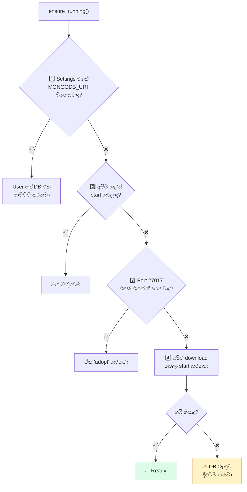

> 💡 **"Never raises" කියන එක වැදගත්!**
> DB එක නැති වුණත් **app එක හැදෙනවා**. Page ටික load වෙනවා. Data කියවන
> page විතරයි error දෙන්නේ. User ට *"DB එක නෑ, ඒත් app එක මේක"* කියලා
> පෙන්නන්න පුළුවන් — මුළු build එකම නවත්තනවා වෙනුවට.

💻 **`MongoManager` — ඔක්කොම එකතු කරන class එක:**

```python
# ═══ agents/data/mongo_lifecycle.py ═══ (පේළි 186–196)

from agents.data.mongo_install import MongoManagerInstallMixin
from agents.data.mongo_data import MongoManagerDataMixin


class MongoManager(MongoManagerInstallMixin, MongoManagerLifecycleMixin,
                   MongoManagerDataMixin, MongoManagerBase):
    """Concrete Mongo lifecycle/install/data manager."""
    pass


MONGO = MongoManager()          # 👈 මුළු app එකටම එකයි
```

> 💡 **"Mixin" කියන්නේ?**
> ලොකු class එකක් **කෑලි වලට** කඩලා, එක එක file එකේ තියලා, අන්තිමට
> **එකතු කරන** ක්‍රමයක්. `mongo_common.py` (268) + `mongo_install.py` (191)
> + `mongo_lifecycle.py` (196) + `mongo_data.py` (110) = එක `MongoManager`.
>
> ඇයි? — file එකක් පේළි 1000 ට වඩා ලොකු නොවෙන්න. `README.md` එකේ
> කියනවා: *"Keep implementation files focused and below 1000 lines."*

#### 📄 `mongo_data.py` — Database clear කරනවා

💻 **imports:**

```python
# ═══ agents/data/mongo_data.py ════════════════════════════════
"""Focused data responsibilities for MongoManager."""
from agents.data.mongo_common import *
```

💻 **Database එක drop කරන එක — ආරක්ෂක වැට 3 ක්:**

```python
# ═══ agents/data/mongo_data.py ═══ (පේළි 6–63)

def reset_project_db(self, project_dir: Path, node_bin: str = "node") -> dict:
    """
    Drop a generated app's database so its seed runs again.

    Generated apps guard `ensureSeeded()` with `countDocuments() > 0`, so a
    seed corrected after a bad first run can never take effect — the rows are
    already there. Dropping the database is the only way to let the fix land.

    Destructive, therefore fenced:
      * refuses when the user configured their own `MONGODB_URI`;
      * refuses any database whose name is not `agentforge_*`;
      * the check is repeated inside the Node script.
    """
    project_dir = Path(project_dir)
    if get_uri_override():                              # 🛡 වැට 1
        return {"ok": False, "error": "MONGODB_URI is set in Settings — "
                                      "AgentForge will not touch your own database"}
    env = project_dir / ".env.local"
    if not env.exists():
        return {"ok": False, "error": "no .env.local"}

    db = ""
    for line in env.read_text(encoding="utf-8").splitlines():
        if line.startswith("MONGODB_DB="):
            db = line.split("=", 1)[1].strip()

    if not db.startswith("agentforge_"):                # 🛡 වැට 2
        return {"ok": False, "error": f"refusing to drop '{db}' — not an "
                                      f"AgentForge-managed database"}

    script = project_dir / ".agentforge-reset.mjs"
    try:
        script.write_text(self._RESET_SCRIPT, encoding="utf-8")   # 🛡 වැට 3
        r = subprocess.run([node_bin, script.name], cwd=str(project_dir),
                           capture_output=True, text=True, timeout=60)
        # … ප්‍රතිඵලය කියවනවා
    finally:
        script.unlink(missing_ok=True)                  # script එක මකනවා
```

> 🛡 **වැට 3 ක් ඇයි?**
> Database එකක් **මකන** එක ආපහු හදන්න බැරි වැඩක්. ඒ නිසා:
> 1. User ගේ තමන්ගේ DB එකක් නම් — **කිසිසේත්ම නෑ**
> 2. නම `agentforge_` කියලා පටන් ගන්නේ නැත්නම් — **නෑ**
> 3. Node script එක ඇතුළෙත් **ආපහු** ඒ check එකම — `.env.local` එක
>    කවුරුහරි වෙනස් කරලා තිබ්බත් වැඩක් නෑ

> 💡 **ඇයි Python වෙනුවට Node script එකක්?**
> Project එකේ **තමන්ගේම `mongodb` driver එක** තියෙනවා (`node_modules`
> ඇතුළේ). ඒක පාවිච්චි කරාම — Python වලට තව dependency එකක් එකතු කරන්න
> ඕන නෑ. එක වැඩකට විතරක් library එකක් install කරන්නේ නෑ.

💻 **Project එකට URI එකක්:**

```python
# ═══ agents/data/mongo_data.py ═══ (පේළි 78–98)

def uri_for(self, project: str) -> str:
    override = get_uri_override()
    if override:
        return override
    return f"mongodb://127.0.0.1:{self.port}/{db_name_for(project)}"

def status(self) -> dict:
    """UI එකට පෙන්නන තත්වය."""
```

➡️ **ඊළඟට:** Build එක හදනවා (Segment 14)

---

### 🔨 SEGMENT 14 — Build repair: compile කරලා වැරදි හදනවා

📁 **File (1):** `agents/server/build_repair.py` — පේළි 551

📥 **Imports:** **නෑ** — `server_runtime.py` namespace එකෙන් (S4 intro බලන්න).
මේක `agents/server/` එකේ **පළවෙනියට load වෙන** file එක.

🎯 **වැඩේ:** `npm run build` කරලා, error තිබ්බොත් — **ඒ error ම** පාවිච්චි කරලා
code එක හදලා, ආපහු build කරනවා.

🧠 **සරලව:** QC engineer කෙනෙක්. ගෙදර හදලා ඉවර වුණාම — **පරීක්ෂා** කරනවා.
වැරැද්දක් තිබ්බොත් **ඒක පෙන්නලා** හදන්න කියනවා. හදලා ඉවර වුණාම **ආපහු**
පරීක්ෂා කරනවා. උපරිම වට 4 ක්.

💻 **Build එක run කරන එක:**

```python
# ═══ agents/server/build_repair.py ═══ (පේළි 4–36)

def _npm_build_errors(proj_dir: Path, stack: str = "vite"):
    """Return build errors and whether the check reached a conclusion."""
    timeout = NEXT_BUILD_TIMEOUT if stack == "next" else 120
    env = {**os.environ, "CI": "true", "NEXT_TELEMETRY_DISABLED": "1",
           "NO_COLOR": "1", "FORCE_COLOR": "0"}
    # … npm run build කරලා output එක ගන්නවා
```

> 💡 **`NO_COLOR`, `FORCE_COLOR=0` ඇයි?**
> Terminal එකේ error පාට පාටින් පෙන්නන්න `\x1b[31m` වගේ **විශේෂ අකුරු**
> දානවා. ඒවා AI model එකට **තේරෙන්නේ නෑ** — ඒවා නිකම් කුණු. ඒවා නවත්තලා
> **පිරිසිදු text** එකක් ගන්නවා.
>
> **`CI=true`** — Next.js එකට "මේක automatic system එකක්" කියලා කියනවා.
> එතකොට *"Continue? [Y/n]"* වගේ ප්‍රශ්න අහන්නේ නෑ.

💻 **ප්‍රධාන loop එක:**

```python
# ═══ agents/server/build_repair.py ═══ (පේළි 411–518)

def run_build_fix_loop(arch, proj_dir: Path, db_ok: bool,
                       max_rounds: int = MAX_BUILD_FIX) -> bool:
    """Compile before dev startup and repair conclusive build errors."""
    align_tailwind(arch, proj_dir)                      # tailwind config හදනවා

    for rnd in range(1, max_rounds + 1):
        estep("build", "active")
        eprog(f"Compiling (round {rnd})…", min(84 + rnd * 2, 92))
        elog("INFO", f"🔨 npm run build (round {rnd}/{max_rounds})…")

        # 1️⃣ Package ටික හරිද කියලා බලනවා
        try:
            arch.sync_dependencies()                    # S8
            missing_deps = arch.unresolved_packages()   # S8
            if missing_deps:
                arch.install_packages(missing_deps)
            ensure_node_deps(proj_dir)
        except Exception as e:
            elog("WARN", f"   ⚠ dependency reconciliation could not finish: {e}")

        # 2️⃣ Build කරනවා
        errors, conclusive = _npm_build_errors(proj_dir, "next")

        if not conclusive:                              # timeout වුණා
            elog("WARN", "   ⚠ Build check timed out — could not verify")
            return False
        if not errors:                                  # ✅ හරි!
            elog("INFO", "   ✅ Build clean")
            estep("build", "done")
            return True

        # 3️⃣ Error එක පෙන්නනවා
        lines = [ln.rstrip() for ln in errors.strip().splitlines() if ln.strip()]
        elog("WARN", f"   ❌ Build failed: {lines[0][:120]}")
        for ln in lines[1:9]:
            elog("WARN", f"      {ln[:160]}")

        # 4️⃣ Toolchain එකේ ප්‍රශ්නයක්ද? (node_modules කැඩිලාද)
        broken = _toolchain_break(proj_dir, errors)
        if broken and _repair_toolchain(proj_dir, broken):
            errors, conclusive = _npm_build_errors(proj_dir, "next")
            if conclusive and not errors:
                elog("INFO", "   ✅ Build clean once the toolchain was repaired "
                             "— no application file was touched")
                return True

        # 5️⃣ නැති package එකක්ද?
        wanted = arch.packages_named_in(errors)         # S8
        if wanted and arch.install_packages(wanted):
            errors, conclusive = _npm_build_errors(proj_dir, "next")
            if conclusive and not errors:
                elog("INFO", "   ✅ Build clean once the packages were in")
                return True

        if rnd == max_rounds:
            elog("WARN", f"   ⚠ Still failing after {max_rounds} rounds — "
                         f"serving anyway so you can see it")
            return False

        # 6️⃣ Next.js documentation එකෙන් උදව් (S12)
        guidance = nextdocs.guidance_for(errors)
        if guidance:
            elog("INFO", f"   📖 {', '.join(nextdocs.slugs_in(errors)[:2])} "
                         f"— attached Next.js's own fix guide")

        # 7️⃣ AI එකට හදන්න කියනවා
        arch.update(textwrap.dedent(f"""\
            `npm run build` failed. Fix every error below.

            Any package the compiler named has already been installed for
            you, and anything npm could not supply does not exist — so an
            unresolved import that is still here is a name to correct, not one
            to install. Rewrite the affected file completely.

            ```
            {_filter_db_noise(errors, db_ok)[:4000]}
            ```
            """) + _failing_sources(arch, errors)
            + ("\n" + guidance if guidance else ""))

        ensure_node_deps(proj_dir)

    return False
```

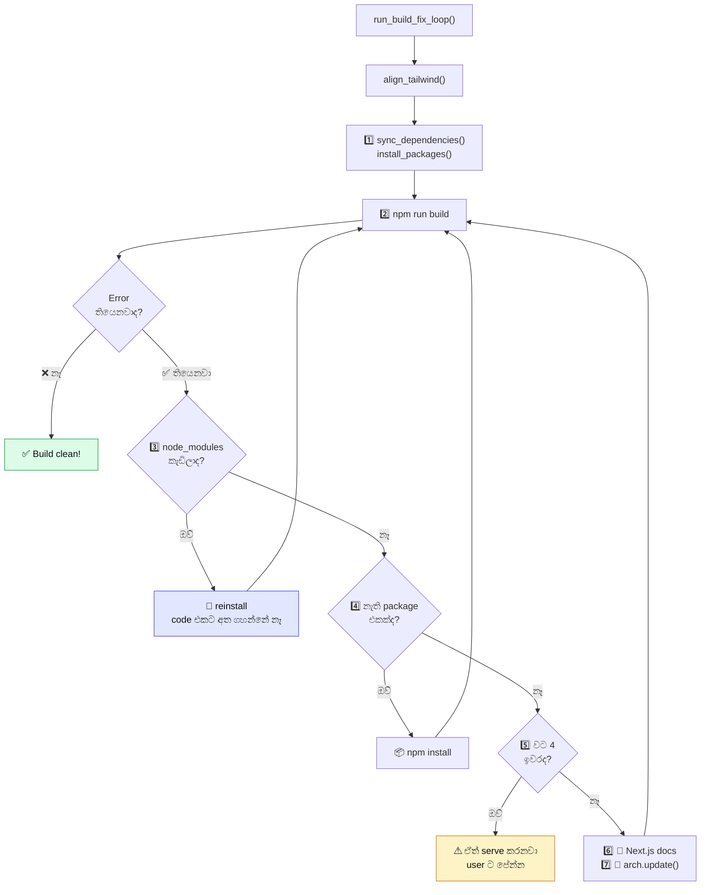

> 💡 **පිළිවෙල ඉතාම වැදගත්!**
> මුලින්ම **ලාභම** විසඳුම් — `node_modules` reinstall කරන එක, package
> install කරන එක. ඒවා **code එකට අත ගහන්නේ නෑ**. ඒවා වැඩ නොකළොත් විතරයි
> AI එකට code එක වෙනස් කරන්න කියන්නේ.
>
> ඇයි? — AI එකෙන් code වෙනස් කරද්දී **අලුත් වැරදි** එන්න පුළුවන්.
> ඒක **අන්තිම විසඳුම**.

💻 **Error එකේ නම කියපු file ටික දෙනවා:**

```python
# ═══ agents/server/build_repair.py ═══ (පේළි 519–548)

_ERR_FILE_RE = re.compile(r"^\s*\.?/?((?:app|components|lib)/[\w./\[\]@-]+"
                          r"\.(?:jsx?|mjs))\s*$", re.M)
FAIL_SRC_BUDGET = 26_000


def _failing_sources(arch, errors: str) -> str:
    """Quote current sources explicitly named by compiler diagnostics."""
    seen, blocks, used = set(), [], 0
    for rel in _ERR_FILE_RE.findall(errors or ""):
        rel = rel.replace("\\", "/")
        if rel in seen:
            continue
        seen.add(rel)
        body = (getattr(arch, "files", None) or {}).get(rel)
        if not body:
            continue
        block = f"--- {rel} ---\n{body[:9000]}"
        if used + len(block) > FAIL_SRC_BUDGET and blocks:
            break                                    # budget එක ඉවරයි
        blocks.append(block)
        used += len(block)
    if not blocks:
        return ""
    return ("\n\nThis is what those files contain right now. Rewrite each one "
            "COMPLETE, keeping everything about it that already works — the "
            "error is the only thing to change.\n\n```jsx\n"
            + "\n\n".join(blocks) + "\n```\n")
```

> 💡 **"the error is the only thing to change" — ඇයි මේ වචන?**
> AI model එකට file එකක් දුන්නම — ඒක **මුළුමනින්ම අලුතෙන්** ලියන්න
> පුළුවන්, තිබ්බ හොඳ දේවලුත් අයින් කරලා. මේ වචන වලින් *"වැරැද්ද විතරයි
> වෙනස් කරන්න"* කියලා **පැහැදිලිවම** කියනවා.

💻 **DB error කුණු පෙරහන:**

```python
# ═══ agents/server/build_repair.py ═══ (පේළි 218–253)

def _filter_db_noise(text: str, db_ok: bool) -> str:
    """Drop database-connection errors when there is no database."""
```

> 💡 MongoDB නෑ නම් — `MongoServerSelectionError` වගේ error **සිය ගණනක්**
> එනවා. ඒවා **ඇත්ත bug නෙවෙයි** — DB එක නැති නිසා එන ඒවා. ඒවා AI එකට
> දුන්නොත් — වැරදි දේවල් හදන්න යනවා. ඒ නිසා **පෙරලා අයින් කරනවා**.

💻 **Terminal fault ගන්නවා:**

```python
# ═══ agents/server/build_repair.py ═══ (පේළි 255–287)

def _transient_terminal_fault(line: str) -> bool:
    """තාවකාලික ප්‍රශ්නයක්ද? (compile වෙමින් තියෙනවා වගේ)"""

def terminal_faults(text: str, limit: int = 6) -> list:
    """Dev server එකේ ඇත්ත error ටික විතරක්."""
```

💻 **Tailwind එක හදනවා:**

```python
# ═══ agents/server/build_repair.py ═══ (පේළි 289–354)

def align_tailwind(arch, proj_dir: Path) -> bool:
    """Keep tailwind.config.js content globs matching the real source tree."""
```

> 💡 **ඇයි මේක?** Tailwind එකට *"මොන file වලද class තියෙන්නේ"* කියලා
> කියන්න ඕන (`content:` list එකේ). ඒක වැරදි නම් — **style එකක්වත් වැඩ
> කරන්නේ නෑ**, ඒත් build එක **pass වෙනවා**. හංගපු bug එකක්.

💻 **Toolchain එක කැඩුණාද:**

```python
# ═══ agents/server/build_repair.py ═══ (පේළි 356–409)

def _toolchain_break(proj_dir: Path, errors: str = "") -> str:
    """Is node_modules itself broken, rather than the app source?"""

def _repair_toolchain(proj_dir: Path, why: str) -> bool:
    """Reinstall node_modules — do not touch application files."""
```

> 💡 **වැදගත් වෙනසක්:** සමහර වෙලාවට ප්‍රශ්නය **app එකේ නෙවෙයි** —
> `node_modules` folder එක කැඩිලා. එතකොට code එක වෙනස් කරන එක
> **වැරදියි**. ඕන එකම දේ — reinstall.

➡️ **ඊළඟට:** Analyzer — plan එකයි code එකයි ගළපනවා (Segment 15)

---

### 🔍 SEGMENT 15 — Analyzer: plan එකයි code එකයි ගළපනවා

📁 **Files (3):**

| File path | පේළි | වැඩේ |
|---|---|---|
| `agents/analysis/__init__.py` | 8 | Package විස්තරය |
| `agents/analysis/analysis_prompt.md` | ~120 | Analyzer ට දෙන නීති |
| `agents/analysis/analyzer.py` | **807** | ⭐ වැරදි ලැයිස්තුව |

🎯 **වැඩේ:** හදපු app එකයි approve කරපු plan එකයි **ගළපලා**, අඩුපාඩු
ලැයිස්තුවක් හදනවා — ඊට පස්සේ **ඒවා හදනවා**.

🧠 **සරලව:** නිරීක්ෂකයෙක්. Blueprint එක අතේ තියාගෙන ගෙදර ඇතුළේ ඇවිදිනවා.
*"මෙතන කාමරයක් තියෙන්න ඕන — නෑනේ?"*, *"මේ දොර කොහෙටවත් යන්නේ නෑනේ?"*

💻 **Package විස්තරය:**

```python
# ═══ agents/analysis/__init__.py ══════════════════════════════
"""Tools for checking, repairing, and replaying app problems."""
from agents.analysis.analyzer import AnalyzerAgent, AnalyzerReport, Finding
from agents.analysis.bugfixer_apply import BugFixerAgent, FixVerdict
from agents.analysis.reproduce import Reproduction, reproduce, wanted_control

__all__ = ["AnalyzerAgent", "AnalyzerReport", "Finding", "BugFixerAgent",
           "FixVerdict", "Reproduction", "reproduce", "wanted_control"]
```

#### 📜 `analysis_prompt.md` — Analyzer ට දෙන නීති

```text
# ═══ agents/analysis/analysis_prompt.md ═══

# AgentForge analysis and repair contract

Mode තුනක් තියෙනවා:
1. SEMANTIC_AUDIT   — plan කරපු දේ ඇත්තටම connect වෙලාද කියලා ඔප්පු කරන්න
2. FINDING_REPAIR   — ඔප්පු වුණ වැරැද්ද විතරක් හදන්න
3. TEST_ARBITRATION — test එකද, code එකද, harness එකද වැරදි කියලා තීරණය කරන්න

## සාක්ෂි පිළිවෙල (Evidence hierarchy)
මේ පිළිවෙලට සාක්ෂි පාවිච්චි කරන්න. පහළ එකකින් උඩ එකක් **පැහැදිලි කරන්න
පුළුවන්**, ඒත් **විරුද්ධ වෙන්න බෑ**:

1. User ගේ approve කරපු requirements සහ plan එක
2. නැවත නැවත ලබාගන්න පුළුවන් runtime සත්‍ය:
   HTTP status, browser exception, failed request, session identity,
   server stack frame, persisted state
3. Workspace tool වලින් කියවපු සම්පූර්ණ current source
4. AgentForge දෙන deterministic finding
5. Generate කරපු test. **Test කියන්නේ සාක්ෂියක්, requirement එකක් නෙවෙයි.**
6. Framework memory හෝ convention

Library එකක්, component එකක්, route නමක්, හෝ සාමාන්‍ය product pattern එකක්
යෝජනා කරනවා කියලා **requirement එකක් හදන්න එපා**. Owning file එකයි
dependency/API/data destination එකයි කියවන්නේ නැතුව *"මේක නෑ"* කියන්න එපා.

## සම්පූර්ණ implementation එකක් කියන්නේ
හැම user-visible capability එකකටම මුළු දාමයම:
entry route → visible accessible control → handler → request/server action →
route method → authentication/authorization → validation → database read/write
→ response → visible UI update
```

> 💡 **"Tests are evidence, not requirements" — ඉතාම වැදගත් වාක්‍යයක්.**
> Test එකක් fail වුණා කියලා **code එක වැරදි කියලා අදහසක් නෑ**.
> Test එකත් වැරදි වෙන්න පුළුවන්! ඒක තමයි `TEST_ARBITRATION` mode එකේ වැඩේ.

#### 🔍 දැන් `analyzer.py`

💻 **imports:**

```python
# ═══ agents/analysis/analyzer.py ══════════════════════════════
"""Checks a finished app against its plan and observed behavior."""
from __future__ import annotations

import http.cookiejar
import json
import logging
import re
import urllib.error
import urllib.request
from dataclasses import dataclass, field
from pathlib import Path, PurePosixPath

from agents.core import nextdocs
from agents.core.commands import CommandRunner
from agents.core.exports_checks import check_default_imports, check_named_imports
from agents.core.exports_common import FRAMEWORK_EXPORTS, strip_noncode as _strip_noncode
from agents.core.exports_parse import parse_imports, resolve_local
from agents.core.exports_syntax import check_syntax
from agents.core.workspace import TOOL_HELP, WorkspaceTools
from agents.planner.architecture import FileStreamParser

log = logging.getLogger("analyzer")
SKIP_DIRS = {"node_modules", ".git", ".next", "dist", "out", ".vite",
             ".agentforge", ".turbo", "public", "coverage"}
SOURCE_EXT = {".js", ".jsx", ".mjs", ".css", ".json", ".md"}
CODE_EXT = {".js", ".jsx", ".mjs"}
NEXT_ROOTS = ("app/", "components/", "lib/")
SEVERITIES = ("blocker", "major", "minor")
PROMPT_FILE = Path(__file__).with_name("analysis_prompt.md")
```

| Import | කොහෙන් | ඇයි ඕන |
|---|---|---|
| `urllib.request` | Python | Page/API එකට HTTP request යවන්න |
| `http.cookiejar` | Python | Login cookie තියාගන්න |
| `nextdocs` | S12 | Error එකට Next.js උදව් |
| `CommandRunner` | S10 | `npm install` කරන්න |
| `check_named_imports` | S11 | කැඩුණු import |
| `check_syntax` | S11 | Parse වෙනවාද |
| `WorkspaceTools`, `TOOL_HELP` | S10 | File කියවන්න |
| `FileStreamParser` | S9 | Repair output → file |

💻 **`Finding` — වැරැද්දක් විස්තර කරන ආකෘතිය:**

```python
# ═══ agents/analysis/analyzer.py ═══ (පේළි 41–52)

@dataclass
class Finding:
    severity: str        # "blocker" · "major" · "minor"
    code: str            # "MISSING_FILE" · "DEAD_LINK" · "ROUTE_ERROR" …
    message: str         # මිනිස්සුන්ට තේරෙන විස්තරය
    path: str = ""       # මොන file එකේද
    fix: str = ""        # මොකද කරන්න ඕන
    extra: list = field(default_factory=list)   # තව අදාළ file

    def line(self) -> str:
        return f"[{self.severity}] " + (f"{self.path}: " if self.path else "") + self.message
```

**Severity 3 ක්:**

| Severity | අදහස | උදාහරණය |
|---|---|---|
| `blocker` | **App එක වැඩ කරන්නේ නෑ** | Page එකක් නෑ, API 500 දෙනවා |
| `major` | වැඩ කරනවා, ඒත් වැරදියි | Button එකක් කිසිම දෙයක් කරන්නේ නෑ |
| `minor` | පොඩි ප්‍රශ්නයක් | Lint warning |

💻 **`AnalyzerReport` — ඔක්කොම එකතුව:**

```python
# ═══ agents/analysis/analyzer.py ═══ (පේළි 54–79)

@dataclass
class AnalyzerReport:
    findings: list = field(default_factory=list)
    planned: list = field(default_factory=list)      # plan කරපු file
    missing: list = field(default_factory=list)      # නොලියපු file
    routes: dict = field(default_factory=dict)       # හම්බුණු route
    dead_links: list = field(default_factory=list)   # කොහෙටවත් නොයන link
    unresolved: list = field(default_factory=list)   # install නොකළ package
    credentials: dict = field(default_factory=dict)
    written: int = 0                                 # හදපු file ගාන

    def blockers(self):
        return [f for f in self.findings if f.severity == "blocker"]

    def is_clean(self):
        return not self.blockers()

    def summary(self):
        if not self.findings:
            return "no problems found"
        by = {s: sum(f.severity == s for f in self.findings) for s in SEVERITIES}
        return ", ".join(f"{n} {s}" for s, n in by.items() if n)
```

💻 **`scan()` — වැරදි ඔක්කොම හොයනවා:**

```python
# ═══ agents/analysis/analyzer.py ═══ (පේළි 278–300)

def scan(self):
    report = AnalyzerReport(planned=self.planned_paths(),
                            routes=self.enumerate_routes())
    report.missing = self.missing_files()
    report.dead_links = self.dead_links(report.routes)
    report.unresolved = self.unresolved_packages()

    # 1️⃣ නොලියපු file
    for path in report.missing:
        report.findings.append(Finding(
            "blocker", "MISSING_FILE",
            "this is still a scaffold placeholder" if self._is_placeholder(path)
            else "the accepted plan promises this file but it was never written",
            path, "write the complete planned file"))

    # 2️⃣ Check කණ්ඩායම් 6 ක්
    report.findings += (self._code_invariants()          # code නීති
                        + self._auth_invariants()        # login නීති
                        + self._data_ui_invariants()     # data/UI නීති
                        + self._cross_file_invariants()  # file අතර නීති
                        + self.contract_findings(report.routes)   # API contract
                        + self.capability_shape_findings())       # capability

    report.findings += (self.prop_contract_breaks() + self.credentials_exposed()
                        + self.seed_volume() + self.layout_chrome())

    # 3️⃣ කොහෙටවත් නොයන fetch
    for url in self.dead_endpoints(report.routes):
        report.findings.append(Finding(
            "blocker", "DEAD_ENDPOINT",
            f"source fetches {url}, but no API handler serves it",
            fix=f"implement app{url}/route.js", extra=[f"app{url}/route.js"]))

    # 4️⃣ කොහෙටවත් නොයන link
    for url in report.dead_links:
        if url not in {"/sign-in", "/signin", "/login"}:
            report.findings.append(Finding(
                "major", "DEAD_LINK",
                f"something links to {url}, but no page serves it",
                fix="create the planned page or remove the link"))

    # 5️⃣ කිසිම තැනකින් යන්න බැරි page
    orphans = self.unreachable_pages(report.routes)
    if orphans:
        report.findings.append(Finding(
            "blocker", "NO_WAY_THERE",
            f"{len(orphans)} page(s) are unreachable from /: {', '.join(orphans[:8])}",
            ..., "wire accepted navigation through the page shell or parent list"))

    # 6️⃣ Install නොකළ package
    for name in report.unresolved:
        report.findings.append(Finding("blocker", "MISSING_PACKAGE",
                                       f"'{name}' is imported but not installed",
                                       fix=f"npm install {name}"))

    # 7️⃣ Lint (S8 එකේ lint_generated)
    for problem in self.arch.lint_generated():
        path = problem.split(":", 1)[0]
        if "imported but not installed" not in problem:
            report.findings.append(Finding("major", "LINT", problem, path, ...))

    # 8️⃣ දෙපාරක් තියෙන ඒවා අයින්
    unique, seen = [], set()
    for finding in report.findings:
        key = (finding.code, finding.path, finding.message)
        if key not in seen:
            seen.add(key)
            unique.append(finding)
    report.findings = unique
    return report
```

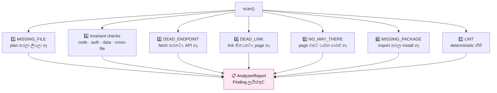

💻 **Route ඔක්කොම හොයාගන්නවා:**

```python
# ═══ agents/analysis/analyzer.py ═══ (පේළි 325–338)

def enumerate_routes(self):
    root, out = self.project_dir / "app", {}
    if not root.is_dir():
        return out
    for leaf, kind in (("page", "page"), ("route", "api")):
        for suffix in (".js", ".jsx"):
            for fp in sorted(root.rglob(leaf + suffix)):
                # (group) folder අයින් කරනවා — ඒවා URL එකට එන්නේ නෑ
                parts = [p for p in fp.relative_to(root).parts[:-1]
                         if not (p.startswith("(") and p.endswith(")"))]
                url = "/" + "/".join(parts) if parts else "/"
                if url in out:
                    continue
                body = fp.read_text("utf-8", errors="replace")
                out[url] = {
                    "file": fp.relative_to(self.project_dir).as_posix(),
                    "kind": kind,
                    "dynamic": "[" in url,
                    "methods": sorted(set(HTTP_METHOD_RE.findall(body)))
                               or (["GET"] if kind == "page" else []),
                }
    return out
```

| File | URL | Kind |
|---|---|---|
| `app/page.jsx` | `/` | page |
| `app/books/page.jsx` | `/books` | page |
| `app/books/[id]/page.jsx` | `/books/[id]` | page (dynamic) |
| `app/(marketing)/about/page.jsx` | `/about` | page *(`(marketing)` අයින්)* |
| `app/api/cart/route.js` | `/api/cart` | api |

💻 **කොහෙටවත් නොයන link හොයනවා:**

```python
# ═══ agents/analysis/analyzer.py ═══ (පේළි 339–352)

@staticmethod
def _route_matches(target, served):
    """'/books/5' කියන එක '/books/[id]' එකට ගැළපෙනවාද?"""
    want = [x for x in target.strip("/").split("/") if x]
    for url in served:
        got = [x for x in url.strip("/").split("/") if x]
        if len(got) == len(want) and all(a == b or a.startswith("[")
                                         for a, b in zip(got, want)):
            return True
    return False


def dead_links(self, routes=None):
    pages = [u for u, m in (routes or self.enumerate_routes()).items()
             if m["kind"] == "page"]
    dead = set()
    for body in self.code_files().values():
        for raw in ([a or b for a, b in LINK_HREF_RE.findall(body)]
                    + ROUTER_PUSH_RE.findall(body)):
            url = raw.split("?", 1)[0].split("#", 1)[0].rstrip("/") or "/"
            if not url.startswith("/api") and not self._route_matches(url, pages):
                dead.add(url)
    return sorted(dead)
```

💻 **Login නීති check කරනවා:**

```python
# ═══ agents/analysis/analyzer.py ═══ (පේළි 120–151)

def _auth_invariants(self):
    files, plan, out = self.code_files(), getattr(self.arch, "plan", None) or {}, []
    auth, routes = files.get("lib/auth.js", ""), self.enumerate_routes()

    if "betterAuth(" in auth:
        # 1️⃣ Demo account හරියට හදලාද?
        seeds = {p: b for p, b in files.items() if "seed" in p.lower()}
        accounts = [a for a in plan.get("demo_accounts") or []
                    if isinstance(a, dict) and a.get("email") and a.get("password")]
        if accounts and not any(
                re.search(r"\b(?:auth\.api\.signUpEmail|ensureDemoAccounts)\s*\(", b)
                for b in seeds.values()):
            out.append(Finding("blocker", "BETTER_AUTH_DEMO_SEED",
                "planned demo users bypass Better Auth's credential provider, "
                "so sign-in/email returns 401", next(iter(seeds), "lib/seed.js"),
                "idempotently create every demo identity through auth.api.signUpEmail"))

        # 2️⃣ localhost සහ 127.0.0.1 දෙකම trust කරලාද?
        origins = set(re.findall(r"(?:https?://)?(localhost:\*|127\.0\.0\.1:\*)", auth))
        if origins != {"localhost:*", "127.0.0.1:*"}:
            out.append(Finding("blocker", "AUTH_ORIGIN",
                "Better Auth does not trust both loopback preview hosts",
                "lib/auth.js", "trust http://localhost:* and http://127.0.0.1:* only"))

        # 3️⃣ Auth route එක තියෙනවාද?
        provider = files.get("app/api/auth/[...all]/route.js", "")
        if not provider or not all(x in provider for x in ("GET", "POST")):
            out.append(Finding("blocker", "AUTH_PROVIDER_ROUTE",
                "Better Auth has no complete GET/POST catch-all provider route", ...))

    # 4️⃣ session._id වෙනුවට session.id
    for rel, body in files.items():
        for var in re.findall(r"(?:const|let|var)\s+(\w+)\s*=\s*await\s+getSessionUser\s*\(",
                              body):
            if re.search(rf"\b{re.escape(var)}\s*\.\s*_id\b", body):
                out.append(Finding("blocker", "SESSION_USER_ID",
                    f"reads {var}._id from a Better Auth session; "
                    f"the string id is {var}.id", rel, ...))

        # 5️⃣ Seed එක auth redirect එකට පස්සේද?
        seed, redirect = body.find("ensureSeeded("), body.find("redirect(")
        if seed >= 0 and 0 <= redirect < seed:
            out.append(Finding("blocker", "SEED_BEHIND_AUTH",
                "ensureSeeded runs after an auth redirect and cannot create the "
                "first demo identity", rel, "seed before reading the session"))

    return out + self.role_contract_findings() + self.role_page_findings() + \
           self.auth_flow_findings()
```

> 💡 **`SEED_BEHIND_AUTH` — හරිම දක්ෂ check එකක්!**
> Page එකේ මුලින්ම `redirect('/sign-in')` කරලා, පස්සේ `ensureSeeded()`.
> එතකොට **කවදාවත් seed වෙන්නේ නෑ** — හැමෝම login page එකට යනවා.
> Login වෙන්නත් බෑ, account එකක් නෑනේ! **Deadlock එකක්.**
> මේ check එකෙන් `body.find()` දෙකක් සසඳලා ඒක අඳුරගන්නවා.

💻 **Repair — වැරදි හදනවා:**

```python
# ═══ agents/analysis/analyzer.py ═══ (පේළි 514–542)

def repair(self, report, server_log=""):
    candidates = self._repair_paths(report)               # මොන file ද
    safe = {p for p in candidates
            if p.startswith(("app/", "components/", "lib/", "styles/"))
            or p in {"middleware.js", "middleware.jsx"}}  # 🛡 safe ඒවා විතරයි
    if not safe:
        return 0

    guidance = nextdocs.guidance_for(server_log + "\n" +
                                     "\n".join(f.message for f in report.findings))
    listing = "\n".join(f"- {p} ({'exists' if p in self.source_files() else 'new'})"
                        for p in sorted(safe))
    messages = [
        {"role": "system", "content": self._analysis_contract() + "\n\n"
                                      + self.arch._builder_sys() + "\n\n" + TOOL_HELP},
        {"role": "user", "content": "MODE: FINDING_REPAIR\n\n"
                                    + self._evidence_ledger(report)
                                    + "\n\n## Runtime evidence\n" + server_log[-5000:]
                                    + "\n\n" + guidance
                                    + "\n\n## Writable dependency neighborhood\n" + listing
                                    + "\n\nInspect every affected owner first, then "
                                      "emit complete write_file blocks only."},
    ]

    proposed, tools = {}, WorkspaceTools(self.arch)
    parser = FileStreamParser(on_text=lambda _: None, on_file_start=lambda _: None,
                              on_file_token=lambda _: None,
                              on_file_end=lambda p, b: proposed.__setitem__(
                                  str(p or "").strip().replace("\\", "/"), b))
    for _ in range(4):                                     # උපරිම වට 4 ක්
        chunks = []
        self.arch._stream(messages, lambda t: (chunks.append(t), parser.feed(t)),
                          temperature=0.25)
        reply = "".join(chunks)
        messages.append({"role": "assistant", "content": reply})
        observation, used = tools.serve(reply)             # tool ඉල්ලුවාද
        if used and not proposed:
            messages.append({"role": "user", "content":
                             "Tool observations:\n\n" + observation +
                             "\n\nContinue the same repair from this evidence."})
            continue
        break

    parser.close()
    files, written = self.source_files(), []
    direct = {f.path for f in report.findings}
    for path, content in sorted(proposed.items()):
        if path not in safe or not content.strip():
            self._log("WARN", f"   ⛔ ignored unrelated/unsafe repair write {path}")
            continue
        if path in self._rewritten_this_stage and path not in direct:
            continue                                       # දෙපාරක් ලියන්නේ නෑ

        # 🛡 Export එකක් නැති වුණාද?
        old_exports = set(re.findall(
            r"export\s+(?:default\s+)?(?:async\s+)?(?:function|const|class)\s+(\w+)",
            files.get(path, "")))
        new_exports = set(re.findall(..., content))
        if old_exports - new_exports:
            self._log("WARN", f"   ⛔ {path} drops exports: "
                              f"{', '.join(sorted(old_exports - new_exports))}")
            continue                                       # 🛡 ප්‍රතික්ෂේප!

        if self.arch.write_file(path, content):
            written.append(path)

    self._files_cache = None
    self._rewritten_this_stage.update(written)
    report.written += len(written)
    return len(written)
```

> 🛡 **"drops exports" check එක ඉතාම වැදගත්!**
> AI එකට file එකක් හදන්න කිව්වම — ඒක **තිබ්බ function එකක් අයින්**
> කරන්න පුළුවන්. ඒත් වෙන file එකක් ඒක import කරනවා! එතකොට **අලුත්
> වැරැද්දක්** හැදෙනවා.
>
> මේ check එකෙන් — export එකක් නැති වුණොත් **ඒ write එකම ප්‍රතික්ෂේප**
> කරනවා. පරණ file එක ඒ විදියටම තියෙනවා.

💻 **`run()` — scan → repair → scan loop එක:**

```python
# ═══ agents/analysis/analyzer.py ═══ (පේළි 544–569)

def run(self, *, use_model=True, max_rounds=2, semantic=True):
    self._fire("on_phase", {"phase": -5, "title": "Analyzing project",
                            "status": "active"})
    report, total = self.scan(), 0
    first = list(report.findings)

    # නැති package තිබ්බොත් — මුලින්ම install
    if use_model and report.unresolved:
        self.cmd.run("npm install " + " ".join(report.unresolved))
        self._files_cache = None
        report = self.scan()

    def targets(value):
        return [f for f in value.findings
                if f.severity == "blocker" or f.code in REPAIRABLE_MAJOR]

    for _ in range(max_rounds if use_model else 0):
        before = targets(report)
        if not before:
            break                                   # ✅ ඉවරයි
        count = self.repair(AnalyzerReport(findings=before,
                                           missing=list(report.missing)))
        if not count:
            break                                   # හදන්න බැරි වුණා
        total += count
        self._files_cache = None
        newer = self.scan()
        report = newer
        if len(targets(newer)) >= len(before):
            break                                   # 🛑 හොඳ වෙන්නේ නෑ

    # Semantic audit — "plan කරපු දේ ඇත්තටම වැඩ කරනවාද?"
    if semantic and use_model and not report.blockers():
        findings = self.unbuilt_promises()
        first.extend(findings)
        if findings:
            total += self.repair(AnalyzerReport(findings=findings))
            self._files_cache = None
            report = self.scan()

    report.written = total
    # පාඩම් save කරනවා (S12)
    from agents.core import lessons
    lessons.record(self.project_dir.name, lessons.from_findings(first))
    return report
```

> 💡 **`if len(targets(newer)) >= len(before): break` — ඉතාම වැදගත්!**
> හදලා **වැරදි ගාන අඩු නොවුණොත්** — නවත්තනවා. නැත්නම් **අනන්තවත්**
> එකම වැඩේ කරගෙන යනවා. සමහර වෙලාවට AI එකට ඒක හදන්න බැරි වෙන්නත් පුළුවන් —
> ඒක පිළිගෙන, user ට කියලා, ඉස්සරහට යනවා.

💻 **HTTP probe — page ඔක්කොම open කරලා බලනවා:**

```python
# ═══ agents/analysis/analyzer.py ═══ (පේළි 583–597)

def probe_pages(self, report, *, skip_root=False):
    for url, meta in sorted(report.routes.items()):
        if meta["kind"] != "page" or meta["dynamic"] or (skip_root and url == "/"):
            continue
        status = self._get_status(self.base_url + url)
        if status is None:
            return                              # server එක නෑ — නවත්තනවා
        self._fire("on_test", "fail" if status >= 400 else "pass",
                   f"Route {url}", f"HTTP {status}")
        if status >= 400:
            report.findings.append(Finding("blocker", "ROUTE_ERROR",
                f"{url} returns HTTP {status}", meta["file"],
                f"fix {meta['file']} so {url} responds"))


def probe_api_routes(self, report, *, skip_health=False):
    for url, meta in sorted(report.routes.items()):
        if (meta["kind"] != "api" or meta["dynamic"]
                or "GET" not in meta["methods"]
                or (skip_health and url == "/api/health")):
            continue
        status = self._get_status(self.base_url + url)
        if status is None:
            return
        bad = status == 404 or status >= 500
        if bad:
            report.findings.append(Finding("blocker", "ROUTE_ERROR",
                f"{url} returns HTTP {status}", meta["file"], ...))
```

> 💡 **API එකට `status >= 400` වෙනුවට `404 or >= 500` ඇයි?**
> API එකක් **401 (login නෑ)** හෝ **400 (data වැරදි)** දෙන එක **හරි**.
> ඒවා **නිවැරදි හැසිරීම**. ප්‍රශ්නය තියෙන්නේ **404 (නෑ)** සහ
> **500 (crash)** විතරයි.

➡️ **ඊළඟට:** Tester — browser එකෙන් ඇවිදිනවා (Segment 16)

---

### 🚶 SEGMENT 16 — Tester: Chromium එකෙන් ඇවිදලා බලනවා

📁 **Files (4):**

| File path | පේළි | වැඩේ |
|---|---|---|
| `agents/build/__init__.py` | 1 | Package විස්තරය |
| `agents/build/tester_common.py` | 198 | මූලික කොටස + stack config |
| `agents/build/tester_browser.py` | 339 | Chromium open කරලා බලනවා |
| `agents/build/tester_routes.py` | 251 | Route ඔක්කොම probe කරනවා |

🎯 **වැඩේ:** ඇත්ත browser එකක් (Chromium) open කරලා, app එකේ page ඔක්කොම
බලලා — **ඇත්තටම වැඩ කරනවාද** කියලා පරීක්ෂා කරනවා.

🧠 **සරලව:** පදිංචිකරු. ගෙදර ඇතුළට ගිහින්, **හැම කාමරයකටම ගිහින්**,
switch ඔක්කොම ඔබලා, **ඇත්තටම වැඩ කරනවාද** කියලා බලනවා.

💻 **Package විස්තරය:**

```python
# ═══ agents/build/__init__.py ═════════════════════════════════
"""Write planned files, clean them, install packages, and repair builds."""
```

#### 📄 `tester_common.py` — මූලික කොටස

💻 **imports:**

```python
# ═══ agents/build/tester_common.py ════════════════════════════
"""Tester Agent — Python Playwright API only. Streams all output live to UI."""
import subprocess, sys, time, logging, re
from pathlib import Path
from urllib.parse import urlparse

from agents.core import nextmcp          # S12 — app එකෙන්ම error අහන්න

log = logging.getLogger("tester")
_emit = None
```

💻 **UI එකට කතා කරන පාර:**

```python
# ═══ agents/build/tester_common.py ═══ (පේළි 14–27)

def set_emit(fn):
    global _emit
    _emit = fn

def elog(lvl, txt):
    if _emit:
        _emit({"type": "log", "level": lvl, "text": txt})
    log.info(f"[{lvl}] {txt}")

def etest(status, msg, detail=""):
    """Emit a structured test result event to the UI."""
    if _emit:
        _emit({"type": "test_result", "status": status, "msg": msg,
               "detail": detail})
```

> 💡 **`set_emit()` ඇයි ඕන?**
> `tester_common.py` එකට `agents/server/` එකේ `emit()` **import කරන්න බෑ**
> (circular import එකක් වෙනවා). ඒ නිසා — server එක **පටන් ගන්නකොට**
> `set_tester_emit(emit)` කියලා **function එක දෙනවා**.
>
> `agent_pipeline.py` එකේ මුලින්ම කරන දේ ඒක:
> ```python
> set_tester_emit(emit)      # පේළි 9
> ```

💻 **Stack දෙකට වෙනස් settings:**

```python
# ═══ agents/build/tester_common.py ═══ (පේළි 42–82)

STACKS = {
    "vite": {
        "label": "Vite",
        "ready_timeout": 30, "req_timeout": 5, "poll": 1.5,
        "goto_timeout": 30000, "mount_timeout": 8000,
        "mount_selectors": ["#root > *", "#app > *", "canvas", "svg", "main"],
        "overlay_tag": "vite-error-overlay",
        "noise": _VITE_NOISE,
        "signals": _VITE_SIGNALS,
    },
    "next": {
        "label": "Next.js",
        "ready_timeout": 180, "req_timeout": 90, "poll": 2.0,
        "goto_timeout": 120000, "mount_timeout": 20000,
        "mount_selectors": ["main", "header", "nav", "section", "table",
                            "body > div"],
        "overlay_tag": "nextjs-portal",
        "noise": [
            "favicon", "Warning:", "DevTools", "Download the React",
            "[Fast Refresh]", "react-refresh", "webpack-hmr", "next-dev",
            "net::ERR_", "Failed to load resource",
        ],
        "signals": [
            "is not defined", "is not a function",
            "Cannot read prop", "Cannot read properties",
            "SyntaxError", "ReferenceError", "TypeError",
            "Module not found", "Can't resolve", "is not exported from",
            "only works in a Client Component", "Hydration failed",
            "Text content does not match", "Only plain objects",
            "Unhandled Runtime Error",
            "MongoServerSelectionError", "MongoNetworkError", "ECONNREFUSED",
        ],
    },
}
```

**`noise` සහ `signals` — ඉතාම වැදගත් වෙනසක්:**

| | අදහස | උදාහරණය |
|---|---|---|
| 🔇 `noise` | **නොසලකා හරින** message | `[Fast Refresh] rebuilding` |
| 🚨 `signals` | **ඇත්ත ප්‍රශ්න** | `TypeError: Cannot read properties of undefined` |

> 💡 Browser console එකේ **සිය ගණනක්** message එනවා. ඒවායින් **90%
> කුණු** (dev tool message). මේ පෙරහන නැත්නම් — AI එකට කුණු දාලා,
> **නැති bug** හදන්න යනවා.
>
> **Next.js ට timeout ලොකුයි ඇයි?** (180s vs 30s) — Next.js
> **page එකින් එක compile කරනවා**, ඉල්ලනකොට. පළවෙනි වතාවට page එකක්
> open කරද්දී තත්පර 30-60 ක් යන්න පුළුවන්.

💻 **Error overlay එක කියවනවා:**

```javascript
// ═══ agents/build/tester_common.py ඇතුළේ තියෙන JS ═══ (පේළි 88–104)
(re) => {
    const rx = new RegExp(re, 'i');
    for (const p of document.querySelectorAll('nextjs-portal')) {
        const r = p.shadowRoot; if (!r) continue;      // 👈 shadow DOM!
        const dlg = r.querySelector('[data-nextjs-dialog],'
            + '#nextjs__container_errors_desc,'
            + '[data-nextjs-terminal],[data-nextjs-dialog-body]');
        if (!dlg) continue;
        const t = (dlg.innerText || dlg.textContent || '').trim();
        if (!rx.test(t)) continue;
        return t.slice(0, 800);
    }
    return '';
}
```

> 💡 **Shadow DOM කියන්නේ?**
> Next.js එකේ error box එක **සාමාන්‍ය HTML එකේ නෙවෙයි** — ඒක
> "shadow root" එකක් ඇතුළේ (හංගපු කොටසක්). සාමාන්‍ය `querySelector`
> එකෙන් හම්බෙන්නේ නෑ. `p.shadowRoot` කියලා **විශේෂයෙන්ම** ඇතුළට යන්න ඕන.

#### 📄 `tester_browser.py` — Chromium එකෙන් බලනවා

💻 **imports:**

```python
# ═══ agents/build/tester_browser.py ═══════════════════════════
"""Focused browser responsibilities for TesterAgent."""
from agents.build.tester_common import *
```

💻 **Playwright install කරනවා:**

```python
# ═══ agents/build/tester_browser.py ═══ (පේළි 71–104)

def _ensure_playwright(self) -> bool:
    """Install playwright + Chromium if missing."""
    # … pip install playwright, playwright install chromium
    elog("INFO", "✅ Playwright + Chromium ready")
    return True
```

💻 **ප්‍රධාන test එක:**

```python
# ═══ agents/build/tester_browser.py ═══ (පේළි 106–180)

def _run_browser_tests(self) -> list:
    from playwright.sync_api import sync_playwright, TimeoutError as PWTimeout

    elog("INFO", "🎭 Launching Chromium (headless)...")
    errors, console_errors = [], []

    with sync_playwright() as pw:
        browser = pw.chromium.launch(headless=True)     # 👈 පේන්නේ නෑ
        ctx = browser.new_context(viewport={"width": 1280, "height": 720})
        page = ctx.new_page()

        # Console error ටික අල්ලාගන්නවා
        page.on("console", lambda m: console_errors.append(m.text)
                if m.type == "error" else None)
        page.on("pageerror", lambda e: console_errors.append(f"PageError: {e}"))

        # 1️⃣ Page එකට යනවා
        resp = page.goto(self.base_url, timeout=self.cfg["goto_timeout"],
                         wait_until="load")
        code = resp.status if resp else "?"
        if resp and resp.status >= 400:
            self._collect_mcp("/")                      # S12 — MCP error
            body = page.inner_text("body")[:400]
            errors.append(f"Page returned HTTP {code}\n{body}")
            browser.close(); return errors

        # 2️⃣ App එක render වුණාද?
        react_mounted = False
        for _sel in self.cfg["mount_selectors"]:         # main, header, nav …
            try:
                page.wait_for_selector(_sel, timeout=per_sel)
                react_mounted = True
                elog("INFO", f"✅ App rendered (selector: {_sel})")
                break
            except PWTimeout:
                continue

        if not react_mounted:
            # Selector එකක් හම්බුනේ නෑ — body එකේ මොකක් හරි පේනවාද?
            real_content = page.evaluate("""() => {
                const skip = new Set(['NEXTJS-PORTAL','NEXT-ROUTE-ANNOUNCER',
                    'SCRIPT','NOSCRIPT','TEMPLATE','STYLE','LINK']);
                return Array.from(document.body.children).some(
                    el => !skip.has(el.tagName)
                          && el.getBoundingClientRect().height > 0);
            }""")
            if real_content:
                react_mounted = True
            else:
                errors.append("App never rendered — likely a compile/runtime error")

        # 3️⃣ Error overlay එකක් තියෙනවාද?
        overlay_txt = self._overlay_error(page)
        if overlay_txt and len(overlay_txt) > 15:
            errors.append(f"{label} compile error: {overlay_txt[:500]}")

        # 4️⃣ Database එක වැඩ කරනවාද?
        if self.stack == "next":
            health = page.evaluate("""async () => {
                try {
                    const r = await fetch('/api/health')
                    return r.status + ' ' + (await r.text()).slice(0, 300)
                } catch (e) { return 'ERR ' + e }
            }""")
            if '"ok":true' in (health or ""):
                elog("INFO", "✅ MongoDB reachable via /api/health")
```

> 💡 **`getBoundingClientRect().height > 0` — දක්ෂ check එකක්!**
> Element එකක් **තියෙනවා** කියලා **පේනවා** කියලා අදහසක් නෑ.
> `height > 0` කියලා බැලුවම — **ඇත්තටම screen එකේ පේනවාද** කියලා දැනගන්නවා.
> `display: none` වුණ එකක් height 0 යි.

#### 📄 `tester_routes.py` — Route ඔක්කොම

💻 **imports:**

```python
# ═══ agents/build/tester_routes.py ════════════════════════════
"""Focused routes responsibilities for TesterAgent."""
from agents.build.tester_common import *
```

💻 **Route හොයාගන්නවා:**

```python
# ═══ agents/build/tester_routes.py ═══ (පේළි 6–57)

def _discover_routes(self) -> list:
    """app/ folder එකෙන් static route ටික."""

def _discover_dynamic_routes(self) -> list:
    """app/books/[id] වගේ dynamic route ටික."""
```

💻 **Page එකේ link ටික අහුලගන්නවා:**

```python
# ═══ agents/build/tester_routes.py ═══ (පේළි 84–142)

def _harvest_dynamic_links(self, page, origin: str):
    """Page එකේ තියෙන <a href> ටිකෙන් ඇත්ත ID ගන්නවා."""

def _probe_dynamic_links(self, page):
    """ඒ ඇත්ත link ටික open කරලා බලනවා."""
```

> 💡 **ඇයි මේක දක්ෂ?**
> `/books/[id]` කියන route එක **කෙලින්ම test කරන්න බෑ** — `[id]` කියන
> එකට ඇත්ත අගයක් ඕන. ඒ නිසා — **`/books` page එකට ගිහින්**, ඒකේ තියෙන
> link ටිකෙන් **ඇත්ත ID එකක්** අරගෙන (`/books/507f1f77bcf86cd799439011`),
> **ඒක** test කරනවා.

💻 **MCP error එකතු කරනවා:**

```python
# ═══ agents/build/tester_routes.py ═══ (පේළි 144–186)

def _collect_mcp(self, route: str):
    """Ask the running Next.js app for its own errors."""
    # nextmcp.errors(...) — S12

@property
def mcp_report(self) -> str:
    """App එකෙන්ම කියපු error ටික."""
```

💻 **`TesterAgent` — ඔක්කොම එකතුව:**

```python
# ═══ agents/build/tester_browser.py ═══ (පේළි 337–339)

class TesterAgent(TesterAgentRoutesMixin, TesterAgentBrowserMixin,
                  TesterAgentBase):
    """Concrete browser tester."""
```

```python
# ═══ agents/build/tester_common.py ═══ (පේළි 148–168)

def test(self) -> list:
    """Run every check and return the error list."""
    if not self._ensure_playwright():
        return ["Playwright is unavailable"]
    if not self._wait_for_server():
        return ["Dev server never became ready"]
    return self._run_browser_tests()
```

➡️ **ඊළඟට:** Bug එකක් ආපහු කරලා බලනවා (Segment 17)

---

### 🔁 SEGMENT 17 — Reproduce + BugFixer: ඇත්ත bug එක හොයනවා

📁 **Files (2):**

| File path | පේළි | වැඩේ |
|---|---|---|
| `agents/analysis/reproduce.py` | 348 | Error එක **ආපහු කරලා** බලනවා |
| `agents/analysis/bugfixer_apply.py` | 275 | Test/runtime වැරදි **හදනවා** |

#### 📄 `reproduce.py` — "මට පෙන්නන්න"

🎯 **වැඩේ:** User කියපු ප්‍රශ්නය **browser එකේ ආපහු කරලා**, ඇත්තටම මොකද
වෙන්නේ කියලා **record කරනවා**.

🧠 **සරලව:** User කියනවා *"cart එකට දාන button එක වැඩ කරන්නේ නෑ"*.
Fix කරන්න කලින් — **ඒක ඇත්තටම කරලා බලනවා**. Browser එක open කරලා, ඒ
button එක හොයාගෙන, **click කරලා**, මොකද වුණේ කියලා බලනවා.

💻 **imports:**

```python
# ═══ agents/analysis/reproduce.py ═════════════════════════════
"""Replay a reported problem in a browser before changing the app."""
from __future__ import annotations

import logging
import re
from dataclasses import dataclass, field

log = logging.getLogger("reproduce")

WAIT_MS = 2500
SETTLE_MS = 900
MAX_LINES = 12
```

> 💡 Playwright **මෙතන import කරලා නෑ** — function එක ඇතුළේ import කරනවා.
> ඇයි? Playwright install කරලා නැත්නම් — මුළු file එකම load වෙන්නේ නෑ.
> ඇතුළේ import කරාම, **ඒ function එක call කරද්දී විතරයි** ප්‍රශ්නයක් වෙන්නේ.

💻 **කුණු පෙරහන:**

```python
# ═══ agents/analysis/reproduce.py ═══ (පේළි 14–37)

_STOP = {
    "the", "a", "an", "is", "it", "on", "in", "to", "of", "and", "or", "not",
    "does", "do", "did", "click", "clicking", "clicked", "press", "button",
    "page", "screen", "app", "my", "this", "that", "broken", "wrong", "error",
    "blank", "empty", "white", "work", "works", "working", "should", …
}

_NOISE = re.compile(
    r"_next/(?:static|hmr)|/_next/webpack|hot-update|"
    r"Download the React DevTools|React DevTools|favicon\.ico|"
    r"Fast Refresh|\[HMR\]|webpack-internal|turbopack", re.I)
```

💻 **User කිව්ව button එක හොයාගන්නවා:**

```python
# ═══ agents/analysis/reproduce.py ═══ (පේළි 114–118)

def wanted_control(complaint: str) -> str:
    """Find the words most likely to name the reported control."""
    words = [w for w in re.findall(r"[A-Za-z][A-Za-z'-]+", complaint or "")
             if w.lower() not in _STOP and len(w) > 2]
    return " ".join(words[:3])
```

**උදාහරණයක්:**

| User කිව්වේ | හොයන්නේ |
|---|---|
| `"the Add to Cart button does nothing"` | `"Add Cart"` |
| `"checkout page is blank"` | `"checkout"` |

> 💡 `the`, `button`, `does`, `nothing`, `page`, `blank` — ඔක්කොම
> `_STOP` list එකේ. ඒවා **හැම complaint එකකම** තියෙනවා — ඒවායින්
> button එකක් හොයන්න බෑ.

💻 **`Reproduction` — දැක්ක දේ:**

```python
# ═══ agents/analysis/reproduce.py ═══ (පේළි 51–92)

@dataclass
class Reproduction:
    """What the browser observed while replaying the reported problem."""

    route: str = "/"
    ran: bool = False
    why_not: str = ""
    signed_in: bool = False
    console: list = field(default_factory=list)      # Browser errors
    page_errors: list = field(default_factory=list)  # Uncaught page errors
    network: list = field(default_factory=list)      # Failed requests
    clicked: str = ""                                # ඔබපු control එක
    filled: list = field(default_factory=list)       # පිරෙව්ව field
    changed: bool = False                            # Page එක වෙනස් වුණාද
    html: str = ""
    screenshot_b64: str = ""

    def is_clean(self) -> bool:
        return not (self.console or self.page_errors or self.network)

    def signature(self) -> set:
        """Return stable problem details for comparing two runs."""
        out = set()
        for line in list(self.console) + list(self.page_errors):
            text = re.sub(r"\d+", "#", " ".join(str(line).split()))  # අංක → #
            out.add(text[:160])
        # …
        return out
```

> 💡 **`signature()` — ඉතාම දක්ෂයි!**
> Error message එකක් මේ වගේ එනවා:
> `"Cannot read id of undefined at line 42"`
> ඊළඟ වතාවේ:
> `"Cannot read id of undefined at line 45"`
>
> මේවා **එකම bug එක** — ඒත් text එක වෙනස්. අංක ඔක්කොම `#` කරාම:
> `"Cannot read id of undefined at line #"` — **දෙකම එකයි!**
>
> ඒකෙන් *"fix එකෙන් පස්සේ ඒ bug එකම තියෙනවාද?"* කියලා **හරියටම** බලන්න පුළුවන්.

💻 **AI ට කියන ආකෘතිය:**

```python
# ═══ agents/analysis/reproduce.py ═══ (පේළි 94–112)

def as_prompt(self) -> str:
    parts = []
    # … clicked, filled, changed
    if self.page_errors:
        parts.append("Uncaught in the browser:\n"
                     + "\n".join(f"  {e}" for e in self.page_errors[:MAX_LINES]))
    if self.console:
        parts.append("The browser console:\n"
                     + "\n".join(f"  {c}" for c in self.console[:MAX_LINES]))
    if self.network:
        parts.append("Requests that failed:\n"
                     + "\n".join(f"  {n}" for n in self.network[:MAX_LINES]))
    if self.is_clean():
        parts.append("No console error, no failed request and no uncaught "
                     "exception. Whatever is wrong did not announce itself "
                     "to the browser — look for a handler that does nothing, "
                     "a condition that never matches, or data that is empty.")
    return "\n\n".join(parts)
```

> 💡 **අන්තිම කොටස ඉතාම වටිනවා!**
> Error එකක් **නෑ** කියලා — ප්‍රශ්නයක් නෑ කියලා අදහසක් නෑ. Button එකක්
> **කිසිම දෙයක් නොකර** ඉන්න පුළුවන් — error එකක් නැතුව. මේ වචන වලින්
> AI එකට *"මෙතන බලන්න"* කියලා **හරි දිශාව** පෙන්නනවා.

💻 **ප්‍රධාන function එක:**

```python
# ═══ agents/analysis/reproduce.py ═══ (පේළි 121–200)

def reproduce(route: str, complaint: str = "", *, port: int = 5173,
              login: tuple = None, login_endpoint: str = "",
              timeout: int = 45_000) -> Reproduction:
    """Open the route, perform the reported action, and record what happens."""
    out = Reproduction(route=route or "/")
    try:
        from playwright.sync_api import sync_playwright
    except Exception as e:
        out.why_not = f"Playwright is unavailable: {e}"
        return out

    base = f"http://127.0.0.1:{port}"
    target = wanted_control(complaint)               # හොයන button එක

    with sync_playwright() as pw:
        browser = pw.chromium.launch(headless=True)
        ctx = browser.new_context(viewport={"width": 1280, "height": 900})

        # 1️⃣ Login ඕන නම් — කලින්ම login වෙනවා
        if login and login_endpoint:
            email, password = login
            r = ctx.request.post(base + login_endpoint,
                                 data={"email": email, "password": password},
                                 timeout=20_000)
            out.signed_in = r.status < 400

        page = ctx.new_page()

        # 2️⃣ Error ටික අල්ලාගන්නවා (කුණු පෙරලා)
        def _pageerror(e):
            text = " ".join(str(e).split())[:600]
            if not _is_noise(text):
                out.page_errors.append(text)
        page.on("pageerror", _pageerror)

        def _console(m):
            if m.type not in ("error", "warning"):
                return
            where = (m.location or {}).get("url") or ""
            text = " ".join((m.text or "").split())[:400]
            if _is_noise(text) or _is_noise(where):
                return
            line = f"{text}  [{where}]" if where else text
            if line not in out.console:       # දෙපාරක් දාන්නේ නෑ
                out.console.append(line)
        page.on("console", _console)

        # 3️⃣ Page එකට ගිහින්, button එක හොයලා, ඔබනවා
        # 4️⃣ Page එක වෙනස් වුණාද කියලා බලනවා
```

#### 📄 `bugfixer_apply.py` — Test ද code ද වැරදි?

🎯 **වැඩේ:** Test එකක් fail වුණාම — **test එකද, code එකද, harness එකද**
වැරදි කියලා තීරණය කරලා, **හරි එක** හදනවා.

💻 **imports:**

```python
# ═══ agents/analysis/bugfixer_apply.py ════════════════════════
"""Repairs test and runtime failures using observed evidence."""
from __future__ import annotations

import logging
import re
import threading
from dataclasses import dataclass, field
from pathlib import Path

from agents.core.exports_parse import effective_exports, parse_imports, resolve_local
from agents.core.workspace import TOOL_HELP, WorkspaceTools
from agents.features.features_common import safe_change_path
from agents.features.picker import guard_scope
from agents.planner.architecture import FileStreamParser

log = logging.getLogger("agent.bugfixer")
TEMPERATURE, CALL_BUDGET, MAX_APP_FILES = 0.15, 600, 4
VERDICT_RE = re.compile(
    r"^\s*VERDICT\s*::\s*(test|code|harness|unclear)\s*(?:::\s*(.*))?$", re.I | re.M)
NEVER_CODE = frozenset({"lib/mongodb.js"})
PROMPT_FILE = Path(__file__).with_name("analysis_prompt.md")
```

| Import | කොහෙන් | ඇයි ඕන |
|---|---|---|
| `effective_exports`, `parse_imports` | S11 | Test එක import කරන්නේ මොකක්ද |
| `WorkspaceTools`, `TOOL_HELP` | S10 | Source කියවන්න |
| `safe_change_path` | S19 | Path එක safe ද |
| `guard_scope` | S22 | ලොකු වෙනසක් වළක්වන්න |
| `FileStreamParser` | S9 | Output → file |

💻 **`FixVerdict` — තීන්දුව:**

```python
# ═══ agents/analysis/bugfixer_apply.py ═══ (පේළි 30–43)

@dataclass
class FixVerdict:
    test_file: str
    target: str = ""
    verdict: str = "test"        # "test" · "code" · "harness" · "unclear"
    evidence: str = ""
    forced: str = ""
    written: str = ""
    quarantine: bool = False
    rejected: list = field(default_factory=list)
    failing: list = field(default_factory=list)

    @property
    def touched_code(self):
        return bool(self.written) and self.written == self.target
```

💻 **Mode දෙකක්:**

```python
# ═══ agents/analysis/bugfixer_apply.py ═══ (පේළි 51–53)

SYSTEM = _contract() + "\n\nMODE: TEST_ARBITRATION"      # test ද code ද?
RUNTIME_SYSTEM = _contract() + "\n\nMODE: FINDING_REPAIR"  # ඔප්පු වුණ එකක්
```

💻 **වේගවත් තීරණ (AI නැතුව):**

```python
# ═══ agents/analysis/bugfixer_apply.py ═══ (පේළි 118–140)

def prior(self, failures, *, build_ok=True, round_no=1):
    """Decide without the model when the evidence is already conclusive."""
    if not failures:
        return "test", "there is nothing to repair", "quarantine"

    first, kinds = failures[0], {f.kind for f in failures}
    target = str(first.target or "").strip()

    # SYNTAX error එකක් — parse වෙන්නේ නෑ
    if "SYNTAX" in kinds:
        named = re.search(r"((?:[A-Za-z]:)?[A-Za-z0-9_./\\-]+\.(?:jsx?|tsx?))"
                          r"\s*:\s*\d+\s*:\s*\d+", "\n".join(...))
        broken = (named.group(1).replace("\\", "/") if named else "")
        if broken and broken != first.test_file and self.editable(broken):
            return "code", f"{broken} does not parse", "model"    # 👈 code වැරදි
        return "test", "the test file does not parse", "quarantine"

    # CRASH — target එක throw කරලා
    if "CRASH" in kinds:
        return (("code", f"{target} threw during execution", "model")
                if target and self.editable(target)
                else ("test", "the crash is outside editable app source", "report"))
    # …
```

> 💡 **ඇයි AI නැතුව තීරණය?**
> **වේගවත්** සහ **විශ්වාසනීය**. Syntax error එකක් තියෙනවා නම් — ඒක
> **පැහැදිලිවම** code එකේ ප්‍රශ්නයක්. AI එකෙන් අහන්න ඕන නෑ. AI call
> එකකට තත්පර 30-60 ක් යනවා — ඒක ඉතුරු කරගන්නවා.

💻 **Test එක සැක කරන pattern:**

```python
# ═══ agents/analysis/bugfixer_apply.py ═══ (පේළි 24)

WEAKENED_RE = re.compile(
    r"\b(?:it|test|describe)\s*\.\s*(?:skip|todo)\b"
    r"|expect\s*\(\s*(?:true|1)\s*\)\s*\.\s*toBe\s*\(\s*(?:true|1)\s*\)")
```

> 🛡 **මේකෙන් අල්ලන්නේ මොකක්ද?**
> AI එකට *"test එක fail වෙනවා, හදන්න"* කිව්වම — **වංචා** කරන්න පුළුවන්:
> - `it.skip('should add to cart', ...)` — test එක **skip** කරනවා
> - `expect(true).toBe(true)` — **හැම වෙලේම pass** වෙන test එකක්
>
> දෙකෙන්ම test එක "pass" වෙනවා — ඒත් **කිසිම දෙයක් test කරන්නේ නෑ**!
> මේ pattern එකෙන් ඒක අල්ලලා **ප්‍රතික්ෂේප** කරනවා.

💻 **Test එක target එක import කරනවාද:**

```python
# ═══ agents/analysis/bugfixer_apply.py ═══ (පේළි 91–106)

def imports_target(self, test_file, target):
    body = self._read(test_file)
    if not body or not target:
        return True
    files = self._files_for(test_file, target)
    return any(resolve_local(test_file, stmt.spec, files) == target
               for stmt in parse_imports(body))          # S11

def missing_export(self, test_file, target):
    """Test එක ඉල්ලන නම, target එකේ නැති ඒවා."""
    body, files = self._read(test_file), self._files_for(test_file, target)
    available = effective_exports(target, files)          # S11
    for stmt in parse_imports(body):
        if stmt.names and resolve_local(test_file, stmt.spec, files) == target:
            gap = {name for name, _ in stmt.names if name not in available}
            if gap:
                return gap
    return set()
```

**තීරණ ගස:**

```mermaid
flowchart TD
    A["Test එකක් fail"] --> B{"SYNTAX<br/>error ද?"}
    B -->|"ඔව්"| C{"Test file එකේද<br/>Code එකේද?"}
    C -->|"Code"| D["🔧 verdict: code"]
    C -->|"Test"| E["🚫 quarantine"]
    B -->|"නෑ"| F{"CRASH ද?"}
    F -->|"ඔව්"| G["🔧 verdict: code"]
    F -->|"නෑ"| H{"Test එක target<br/>import කරනවාද?"}
    H -->|"නෑ"| I["📝 verdict: test"]
    H -->|"ඔව්"| J["🤖 AI එකෙන් අහනවා<br/>TEST_ARBITRATION"]
    J --> K{"VERDICT ::"}
    K -->|"code"| D
    K -->|"test"| I
    K -->|"harness"| L["⚙️ harness එක වැරදි"]

    style D fill:#dbeafe,stroke:#2563eb,color:#111
    style I fill:#fef3c7,stroke:#d97706,color:#111
    style E fill:#fee2e2,stroke:#dc2626,color:#111
```

➡️ **ඊළඟට:** Bug report එකක් හදන flow එක (Segment 18)

---

### 🐛 SEGMENT 18 — Chat bugfix: "මේක වැඩ කරන්නේ නෑ"

📁 **File (1):** `agents/server/chat_bugfix.py` — පේළි 735

📥 **Imports:** **නෑ** — shared namespace (S4 intro).

🎯 **වැඩේ:** User *"මේක වැඩ කරන්නේ නෑ"* කිව්වම — ඒක **ආපහු කරලා බලලා**,
**හදලා**, **ආපහු බලලා**, හරි නම් තියාගන්නවා; නැත්නම් **rollback**.

🧠 **සරලව:** වෛද්‍යවරයෙක්. රෝගියා *"මට කකුල රිදෙනවා"* කිව්වම —
1. **පරීක්ෂා** කරනවා (ඇත්තටම මොකද වෙන්නේ?)
2. **ප්‍රතිකාර** කරනවා
3. **ආපහු පරීක්ෂා** කරනවා
4. හොඳ නැත්නම් — **ප්‍රතිකාරය නවත්තනවා**

💻 **ප්‍රධාන flow එක:**

```python
# ═══ agents/server/chat_bugfix.py ═══ (පේළි 424–528)

def run_bug_report(proj_name: str, complaint: str, model: str, route: str = "",
                   think: bool = None, qa_model: str = "", console: str = ""):
    """Repair one bug transaction until its affected route is stable."""
    set_tester_emit(emit)
    tx = None
    try:
        proj_dir, arch, stack = _open_for_edit(proj_name, model, think)
        if arch is None:
            return
        analyzer = _analyzer_for(arch, proj_dir)
        elog("INFO", f"🐛 {complaint[:80]}")
        eprog("Reproducing…", 20)

        # 1️⃣ Dev server එක start කරනවා
        if not _dev_alive():
            elog("INFO", "   ▶ Starting the dev server to reproduce it")
            start_dev_server(proj_dir, stack)
            wait_for_dev(stack)

        # 2️⃣ මොන route එකේද කියලා හොයනවා
        effective_route = _infer_issue_route(route, complaint, console, "",
                                             arch, analyzer)
        if effective_route != (route or "/"):
            elog("INFO", f"   🎯 Repair route resolved from evidence: {effective_route}")

        # 3️⃣ ප්‍රශ්නය ආපහු කරලා බලනවා  (S17)
        mark = dev_log_mark()
        seen = _reproduce_complaint(proj_dir, effective_route, complaint, analyzer)
        trace = _filter_db_noise(dev_log_since(mark, limit=180), True)
        faults = terminal_faults(trace)                    # S14
        baseline_sig = _observation_fault_signature(seen, trace)
        baseline_sig.update(_evidence_fault_signature(console))

        # 4️⃣ AI ට කියන report එක හදනවා
        report = (f"The user reports: {complaint}\n\n"
                  f"They were on {effective_route}.\n\n")
        if console:
            report += ("Their own browser had already logged this on the page "
                       "they were looking at — this is primary evidence:\n"
                       f"{console.strip()}\n\n")
        report += seen.as_prompt()                         # S17
        if faults:
            report += ("\n\nThe dev server printed this at the same time:\n"
                       + "\n".join(faults[:6]))

        # 5️⃣ 📸 දැන් තියෙන ඔක්කොම copy කරගන්නවා (rollback එකට)
        tx = _capture_feature_transaction(arch, proj_dir)
        before = dict(getattr(arch, "files", {}) or {})

        # 6️⃣ හදනවා
        eprog("Repairing…", 45)
        focus = _exact_runtime_focus(arch, report + "\n" + trace)
        fixed = _repair_runtime(arch, proj_dir, None, analyzer, report, trace, 1,
                                model=model, focus_paths=focus or None)
        if not fixed:
            eerr("Nothing was changed — source evidence did not prove a safe repair")
            return

        # 7️⃣ Build එක තාම හරිද?
        eprog("Checking…", 65)
        check = verify_after_edit(arch, proj_dir, proj_name, stack=stack,
                                  build_rounds=1, probe=False, analyzer=analyzer)
        hard_red = (not check.get("build_ok", True)
                    or bool(check.get("syntax_broken"))
                    or bool(check.get("broken_imports")))
        if hard_red:
            reverted = _restore_feature_transaction(arch, proj_dir, tx)   # ↩ rollback
            _stop_dev_proc(); start_dev_server(proj_dir, stack); wait_for_dev(stack)
            elog("WARN", f"   ↩ Bug repair rolled back — compile/import "
                         f"verification stayed red ({len(reverted)} file(s) restored)")
            eerr("The attempted bug repair introduced a compile/import regression")
            return

        # 8️⃣ Live browser එකෙන් බලනවා
        eprog("Watching the repaired flow…", 78)
        stable, more, after = _stabilize_bug_repair(
            arch, proj_dir, proj_name, analyzer, route=effective_route,
            complaint=complaint, model=model, baseline_signature=baseline_sig)

        # 9️⃣ Undo point එකක් හදනවා
        touched = [p for p in all_fixed if p in before]
        undo_id = _snapshot(proj_name, touched, before) if touched else ""
        if undo_id:
            emit({"type": "undo_point", "id": undo_id, "files": touched})
        arch.save_convo()

        # 🔟 හදපු එකෙන් ප්‍රශ්නය නැති වුණාද කියලා කියනවා
        _report_symptom(seen, after or _reproduce_complaint(
            proj_dir, effective_route, complaint, analyzer))
        eprog("Done!", 100)
        edone(f"http://localhost:{DEV_PORT}", proj_name, preview=effective_route)
    except Exception as e:
        if tx is not None:
            _restore_feature_transaction(arch, proj_dir, tx)      # ↩ rollback
        eerr(f"Bug fix error: {e}")
    finally:
        stop_model(model)
```

```mermaid
flowchart TD
    A["🐛 'cart button<br/>වැඩ කරන්නේ නෑ'"] --> B["1️⃣ Dev server start"]
    B --> C["2️⃣ මොන route එකේද?<br/>_infer_issue_route()"]
    C --> D["3️⃣ 🔁 ආපහු කරලා බලනවා<br/>reproduce.py (S17)"]
    D --> E["4️⃣ 📋 සාක්ෂි report එක<br/>complaint + console + server log"]
    E --> F["5️⃣ 📸 ඔක්කොම copy<br/>_capture_feature_transaction()"]
    F --> G["6️⃣ 🔧 හදනවා<br/>_repair_runtime()"]
    G --> H{"7️⃣ Build එක<br/>හරිද?"}
    H -->|"❌"| R["↩ ROLLBACK<br/>ඔක්කොම ආපහු"]
    H -->|"✅"| I["8️⃣ 👀 Live browser<br/>_stabilize_bug_repair()"]
    I --> J["9️⃣ Undo point"]
    J --> K["🔟 ප්‍රශ්නය නැති<br/>වුණාද කියනවා"]

    style R fill:#fee2e2,stroke:#dc2626,color:#111
    style K fill:#dcfce7,stroke:#16a34a,color:#111
```

💻 **ප්‍රශ්නය තියෙන route එක හොයනවා:**

```python
# ═══ agents/server/chat_bugfix.py ═══ (පේළි 213–254)

def _infer_issue_route(route: str, complaint: str, console: str, trace: str,
                       arch, analyzer) -> str:
    """Pick the route the evidence actually points at."""
```

> 💡 User `/cart` page එකේ ඉඳන් complain කරන්න පුළුවන් — ඒත් ඇත්ත ප්‍රශ්නය
> `/checkout` එකේ. Console error එකේ, server log එකේ, complaint එකේ
> **වචන බලලා** — ඇත්ත route එක හොයනවා.

💻 **ප්‍රශ්නය නැති වුණාද කියලා සසඳනවා:**

```python
# ═══ agents/server/chat_bugfix.py ═══ (පේළි 135–167)

def _report_symptom(before, after) -> bool:
    """Compare the reproduction before and after the repair."""
```

**`signature()` (S17) පාවිච්චි කරලා — before/after සසඳනවා:**

| තත්වය | කියන දේ |
|---|---|
| Before එකේ තිබ්බ error, after එකේ **නෑ** | ✅ "ප්‍රශ්නය නැති වුණා" |
| දෙකේම **එකම** error | ⚠ "තාම එකම ප්‍රශ්නය" |
| After එකේ **අලුත්** error | ❌ "අලුත් ප්‍රශ්නයක් හැදුණා" |

💻 **`verify_after_edit()` — වෙනසකට පස්සේ check:**

```python
# ═══ agents/server/chat_bugfix.py ═══ (පේළි 561–688)

def verify_after_edit(arch, proj_dir: Path, proj_name: str, *,
                      stack: str = "next", build_rounds: int = 2,
                      probe: bool = True, analyzer=None) -> dict:
    """Check syntax, imports, build, dev startup, and optional routes."""
    out = {"build_ok": True, "routes_failed": [], "broken_imports": 0,
           "syntax_broken": []}

    # 1️⃣ Syntax check (S11)
    problems, why_not = check_syntax(proj_dir, arch.files)
    if why_not:
        elog("INFO", f"   ⚠ Syntax not checked — {why_not}")
    elif problems:
        elog("WARN", f"🧩 {len(problems)} file(s) do not parse — repairing")
        report = AnalyzerReport()
        report.findings = [Finding(severity="blocker", code="SYNTAX_ERROR",
                                   path=p["path"], message=msg)
                           for p, msg in zip(problems, syntax_messages(problems))]
        analyzer.repair(report)                          # S15
        still, _ = check_syntax(proj_dir, arch.files)
        out["syntax_broken"] = [p["path"] for p in still]

    # 2️⃣ Import check (S11)
    broken = check_named_imports(arch.files)
    out["broken_imports"] = len(broken)
    if broken:
        elog("WARN", f"🔗 {len(broken)} import(s) name something the target "
                     f"module does not export")
        report = AnalyzerReport()
        report.findings = analyzer.broken_imports()
        analyzer.repair(report)
        out["broken_imports"] = len(check_named_imports(arch.files))

    # 3️⃣ Build (S14)
    if compiling:
        out["build_ok"] = run_build_fix_loop(arch, proj_dir, MONGO.available,
                                             max_rounds=build_rounds)
        start_dev_server(proj_dir, stack)
    # …
    return out
```

> 💡 **පිළිවෙල ඉතාම වැදගත්!**
> **Syntax → Import → Build** කියන පිළිවෙල. ඇයි?
> - Syntax check එක **තත්පර 1-2**
> - Import check එක **තත්පර 1** (memory එකේ)
> - Build එක **විනාඩි 1-3**
>
> **ලාභම check එක මුලින්ම.** Syntax error එකක් තිබ්බොත් —
> build එකට යන්නෙම නෑ, කලින්ම හදනවා.

💻 **Code එක update කරලා restart කරලා නෑ නම්:**

```python
# ═══ agents/server/chat_bugfix.py ═══ (පේළි 689–716)

def _own_sources():
    """Every agent/server source file this runtime loaded."""

def warn_if_agents_stale():
    """Warn when the running server is older than the source on disk."""
```

> 💡 `agents/` folder එකේ code එක **edit කරලා** server එක **restart
> කරලා නෑ** නම් — පරණ code එකයි run වෙන්නේ. එතකොට *"මම fix කළා, ඒත්
> වැඩ කරන්නේ නෑ!"* කියලා **පැටලෙනවා**. මේ warning එකෙන් ඒක වළක්වනවා.

💻 **Intent save/load:**

```python
# ═══ agents/server/chat_bugfix.py ═══ (පේළි 717–735)

def save_run_intent(proj_dir: Path, **kw) -> None:
    """Remember prompt/model/think so a resume can restart cleanly."""

def load_run_intent(proj_dir: Path) -> dict:
    """Read it back."""
```

මේක S1 එකේ `run_agent_pipeline` එකේ පාවිච්චි කරනවා.

➡️ **ඊළඟට:** Feature system එකේ මූලික කොටස් (Segment 19)

---

### 🧩 SEGMENT 19 — Features: වෙනසක් විස්තර කරන ආකෘතිය

📁 **Files (4):**

| File path | පේළි | වැඩේ |
|---|---|---|
| `agents/features/__init__.py` | 1 | Package විස්තරය |
| `agents/features/feature_prompt.md` | ~200 | AI ට දෙන නීති (block කිහිපයක්) |
| `agents/features/source_guidance.py` | ~85 | Prompt load + රූප intent |
| `agents/features/features_common.py` | 247 | `FeatureSpec` + path safety |

🎯 **වැඩේ:** දැනටමත් තියෙන app එකකට **වෙනසක්** කරද්දී අවශ්‍ය මූලික දේවල්.

🧠 **සරලව:** ගෙදර හදලා ඉවරයි. දැන් user කියනවා *"මට තව කාමරයක් ඕන"*.
ඒක කරන්න කලින් — **මොනවද වෙනස් වෙන්නේ** කියලා ලියන ආකෘතියක් ඕන.

💻 **Package විස්තරය:**

```python
# ═══ agents/features/__init__.py ══════════════════════════════
"""Capture, scope, apply, and verify changes to an existing app."""
```

#### 📜 `feature_prompt.md` — නීති, block වලට කඩලා

```text
# ═══ agents/features/feature_prompt.md ═══

<!-- FOUNDATION -->
You work on one requested change in an existing Next.js App Router application.
Current source, routes, imports, runtime evidence, and workspace-tool
observations are authoritative. Historical plans are context, not proof.

Reason before writing:
1. දැන් app එක මොකද කරන්නේ, ඉල්ලීමයි ඒකයි අතර හරි පරතරය මොකක්ද කියන්න.
2. Route, component, caller, API, auth, database, seed — ඇත්තටම සම්බන්ධ
   ඒවා හරහා ownership එක trace කරන්න.
3. විශ්වාස නැති owner කෙනෙක් තියෙනවා නම් — workspace tool වලින් බලන්න.
   File නමක්, symptom එකක්, stack frame එකක් **සාක්ෂියක් නෙවෙයි**.
4. වෙනස් වෙන්නම ඕන file විතරක් නම් කරන්න — ඒත් behavior එක end-to-end
   වැඩ කරන්න ඕන හැම dependent වෙනසක්ම ඇතුළත් කරන්න.

තියෙන route සහ public contract තියාගන්න. දැනට තියෙන auth, database,
data-shape, design-system convention පාවිච්චි කරන්න. Owner කෙනෙක් ඉන්න
workflow එකකට **සමාන්තර route/API එකක් හදන්න එපා**. අදාළ නැති cleanup එපා.
<!-- /FOUNDATION -->

<!-- PLAN -->
You are planning one feature or visual change. Do not write code yet.

Output only this protocol, without markdown fences or prose:
CURRENT  :: observed current behavior or structure
GAP      :: exact missing or wrong behavior
CAUSE    :: source-level ownership/reason for the gap
EVIDENCE :: <existing-path> :: concrete fact observed in current source
SUMMARY  :: complete change in one sentence
PACKAGE  :: <npm-package> (only when genuinely required)
FILE     :: new|edit :: <project-relative-path> :: server|client :: why
ROUTE    :: /new-route (only when a route is genuinely added)
VERIFY   :: concrete end-to-end proof of completion
<!-- /PLAN -->

<!-- REPAIR -->  … <!-- /REPAIR -->
<!-- AUDIT_REQUEST -->  … <!-- /AUDIT_REQUEST -->
<!-- FEATURE_IMAGE -->  … <!-- /FEATURE_IMAGE -->
<!-- HUMAN_COMMENT -->  … <!-- /HUMAN_COMMENT -->
```

> 💡 **`<!-- NAME --> … <!-- /NAME -->` — දක්ෂ ක්‍රමයක්!**
> **එක `.md` file එකේ** නීති කණ්ඩායම් කිහිපයක් තියෙනවා. ඕන එක විතරක්
> ගන්න පුළුවන්. Plan කරද්දී `PLAN` block එක. Audit කරද්දී `AUDIT_REQUEST`
> block එක. `FOUNDATION` block එක **හැම එකකටම** එකතු වෙනවා.

#### 📄 `source_guidance.py` — Prompt load කරනවා

💻 **imports:**

```python
# ═══ agents/features/source_guidance.py ═══════════════════════
"""Shared feature prompts and small deterministic media-intent guard."""
from __future__ import annotations

import re
from functools import lru_cache
from pathlib import Path

PROMPT_FILE = Path(__file__).with_name("feature_prompt.md")
```

💻 **Block එකක් ගන්නවා:**

```python
# ═══ agents/features/source_guidance.py ═══ (පේළි 13–30)

@lru_cache(maxsize=None)
def feature_prompt(name: str, *, foundation: bool = False) -> str:
    """Load one named contract; keep a safe fallback for packaged installs."""
    try:
        text = PROMPT_FILE.read_text("utf-8")
        marker = str(name or "").strip().upper()
        match = re.search(
            rf"<!--\s*{re.escape(marker)}\s*-->(.*?)<!--\s*/{re.escape(marker)}\s*-->",
            text, re.S)
        body = match.group(1).strip() if match else ""
        if foundation and marker != "FOUNDATION":
            base = feature_prompt("FOUNDATION")
            body = f"{base}\n\n{body}" if base else body      # 👈 එකතු කරනවා
        if body:
            return body
    except OSError:
        pass
    return ("Inspect current source and evidence before changing only the "
            "requested behavior.")
```

> 💡 **`@lru_cache` කියන්නේ?**
> Function එකේ ප්‍රතිඵලය **මතක තියාගන්නවා**. `feature_prompt("PLAN")`
> කියලා 100 වතාවක් call කළත් — file එක කියවන්නේ **එක වතාවයි**.

💻 **Placeholder පුරවනවා:**

```python
# ═══ agents/features/source_guidance.py ═══ (පේළි 32–38)

def render_feature_prompt(name: str, **values) -> str:
    """Render explicit double-brace placeholders without template evaluation."""
    text = feature_prompt(name)
    for key, value in values.items():
        text = text.replace("{{" + key.upper() + "}}", str(value or ""))
    return text
```

> 🛡 **ඇයි `.format()` හෝ f-string පාවිච්චි නොකරන්නේ?**
> Prompt එකේ `{` සහ `}` **ගොඩක්** තියෙනවා (JSON උදාහරණ). `.format()`
> එකෙන් ඒවා **වැරදියට තේරුම්** ගන්නවා → crash. සරල `.replace()`
> එකෙන් — **හරියටම `{{NAME}}` විතරයි** වෙනස් වෙන්නේ.

💻 **රූප ඉල්ලුවාද කියලා බලනවා:**

```python
# ═══ agents/features/source_guidance.py ═══ (පේළි 45–75)

_IMAGE_INTENT_RE = re.compile(
    r"\b(?:img|imgs|pic|pics|image|images|photo|photos|"
    r"picture|pictures|photograph|photographs|"
    r"banner\s+image|hero\s+image|background\s+image|thumbnail|cover\s+image|"
    r"illustration|visual\s+asset)\b", re.I)

_IMAGE_NEGATION_RE = re.compile(
    r"\b(?:no|without|remove|delete|hide|disable)\b[^.!;\n]{0,40}"
    r"\b(?:img|pic|image|images|photo|photos|picture|pictures)s?\b", re.I)

_IMAGE_ADD_RE = re.compile(
    r"\b(?:add|include|generate|create|draw|use|put|insert|replace)\b[^.!;\n]{0,40}"
    r"\b(?:img|pic|image|images|photo|photos|picture|pictures)s?\b", re.I)


def feature_image_requested(text: str) -> bool:
    """True when a feature explicitly asks to add/use generated visual media."""
    value = " ".join(str(text or "").split())
    if not value:
        return False
    if _IMAGE_NEGATION_RE.search(value) and not _IMAGE_ADD_RE.search(value):
        return False                    # 👈 "remove the image" → False
    return bool(_IMAGE_INTENT_RE.search(value))
```

| User කිව්වේ | ප්‍රතිඵලය | ඇයි |
|---|---|---|
| `"add a hero image"` | ✅ True | `add` + `image` |
| `"remove the banner image"` | ❌ False | `remove` + `image` = negation |
| `"replace the image with a new photo"` | ✅ True | `replace` = add pattern එකේ |
| `"make the text bigger"` | ❌ False | image වචනයක් නෑ |

> 💡 **ඇයි මේක වැදගත්?**
> රූප generate කරන එකට **විනාඩි කිහිපයක්** යනවා (GPU වැඩක්). ඒක
> **ඕන වෙලාවට විතරයි** කරන්න ඕන. *"text එක ලොකු කරන්න"* කිව්වම
> රූප හදන්න ගියොත් — කාලය නාස්තියි.

#### 📄 `features_common.py` — `FeatureSpec` සහ path safety

💻 **imports:**

```python
# ═══ agents/features/features_common.py ═══════════════════════
"""Shared contracts and context helpers for dependency-aware feature changes."""
from __future__ import annotations

import logging
import re
from dataclasses import dataclass, field

from agents.planner.architecture import FileStreamParser         # S9
from agents.core.workspace import WorkspaceTools, TOOL_HELP      # S10
from agents.features.source_guidance import feature_prompt       # මේ segment එකේ

LOCAL_IMPORT_RE = re.compile(r"""from\s+['"]@/(components/[\w./-]+)['"]""")
log = logging.getLogger("features")
```

💻 **Path safety — වෙනස් කරන්න පුළුවන් තැන්:**

```python
# ═══ agents/features/features_common.py ═══ (පේළි 25–56)

# These are path-safety boundaries, not complexity limits.
CHANGE_DIRS = ("app/", "components/", "lib/", "styles/", "src/")
CHANGE_EXTS = (".js", ".jsx", ".ts", ".tsx", ".mjs", ".cjs", ".css")
CHANGE_ROOT_FILES = {
    "middleware.js", "middleware.jsx", "middleware.ts", "middleware.tsx",
    "instrumentation.js", "instrumentation.ts",
    "next.config.js", "next.config.mjs", "next.config.ts",
    "tailwind.config.js", "tailwind.config.mjs", "postcss.config.js",
}


def normalise_change_path(path: str) -> str:
    raw = str(path or "").strip().replace("\\", "/")
    if not raw or raw.startswith("/") or re.match(r"^[A-Za-z]:", raw):
        return ""                       # 🛡 absolute path — නෑ
    parts = raw.split("/")
    if ".." in parts:
        return ""                       # 🛡 පිටතට යන්න බෑ
    while raw.startswith("./"):
        raw = raw[2:]
    return raw


def safe_change_path(path: str) -> bool:
    rel = normalise_change_path(path)
    if not rel:
        return False
    if rel.startswith(("node_modules/", ".git/", ".next/", ".agentforge/")):
        return False                    # 🛡 මේ folder තහනම්
    if rel in CHANGE_ROOT_FILES:
        return True                     # ✅ දන්නා config file
    return rel.startswith(CHANGE_DIRS) and rel.endswith(CHANGE_EXTS)
```

| Path | Safe? | ඇයි |
|---|---|---|
| `app/cart/page.jsx` | ✅ | `app/` + `.jsx` |
| `components/Nav.jsx` | ✅ | `components/` + `.jsx` |
| `middleware.js` | ✅ | දන්නා root file එකක් |
| `tailwind.config.js` | ✅ | දන්නා config එකක් |
| `node_modules/react/index.js` | ❌ | `node_modules/` තහනම් |
| `../../../etc/passwd` | ❌ | `..` තියෙනවා |
| `C:/Windows/x.js` | ❌ | Absolute path |
| `package.json` | ❌ | `.json` — CHANGE_EXTS එකේ නෑ |

> 💡 **`MAX_FILES = None` ඇයි?**
> ```python
> # Legacy public names kept for compatibility.
> MAX_FILES = None
> MAX_PACKAGES = None
> MAX_READS = None
> ```
> කලින් *"උපරිම file 5 යි වෙනස් කරන්න පුළුවන්"* වගේ සීමා තිබ්බා.
> දැන් **ඒවා අයින්** කරලා. ඇයි? — feature එකක් ලොකු වෙන්න පුළුවන්.
> **ලොකුකම හේතුවක් නෙවෙයි** වැඩක් අඩුවෙන් කරන්න. Comment එකේ කියනවා:
> *"These are path-safety boundaries, not complexity limits."*

💻 **Protocol එක parse කරනවා:**

```python
# ═══ agents/features/features_common.py ═══ (පේළි 61–93)

def protocol_lines(text: str):
    """Yield normalized ``KIND, payload`` pairs from a line protocol."""
    for raw in str(text or "").splitlines():
        head, sep, rest = raw.strip().partition("::")
        if sep:
            yield head.strip().upper(), rest.strip().strip("`")


def change_entry(text: str) -> dict | None:
    """Parse and safety-check one FILE payload."""
    parts = [part.strip().strip("`") for part in text.split("::")]
    if len(parts) < 2:
        return None
    action, path = parts[0].lower(), normalise_change_path(parts[1])
    if action not in ("new", "edit") or not safe_change_path(path):
        return None                     # 🛡 safe නැත්නම් — ප්‍රතික්ෂේප
    return {
        "path": path,
        "action": action,
        "kind": parts[2].lower() if len(parts) > 2 else "",
        "why": parts[3] if len(parts) > 3 else "",
    }
```

**AI එකෙන් එන output එක:**

```text
FILE :: edit :: app/cart/page.jsx :: client :: add the dark mode toggle
       ↑        ↑                    ↑         ↑
     action   path                  kind      why
```

💻 **`FeatureSpec` — වෙනස විස්තර කරන ආකෘතිය:**

```python
# ═══ agents/features/features_common.py ═══ (පේළි 95–116)

@dataclass
class FeatureSpec:
    summary: str = ""                                # එක වාක්‍යයක්
    files: list = field(default_factory=list)        # වෙනස් වෙන file
    packages: list = field(default_factory=list)     # install කරන්න ඕන
    routes: list = field(default_factory=list)       # අලුත් route
    written: list = field(default_factory=list)      # ඇත්තටම ලිව්ව ඒවා
    rejected: list = field(default_factory=list)     # ප්‍රතික්ෂේප කරපු ඒවා
    context: dict = field(default_factory=dict)      # CURRENT/GAP/CAUSE/VERIFY

    def paths(self) -> set:
        return {f["path"] for f in self.files}

    def is_empty(self) -> bool:
        return not self.files
```

💻 **System prompt දෙකක්:**

```python
# ═══ agents/features/features_common.py ═══ (පේළි 118–120)

PLAN_SYSTEM = feature_prompt("PLAN", foundation=True)      # FOUNDATION + PLAN
REPAIR_SYSTEM = feature_prompt("REPAIR", foundation=True)  # FOUNDATION + REPAIR
```

💻 **Base class එක:**

```python
# ═══ agents/features/features_common.py ═══ (පේළි 123–247)

class FeaturesAgentBase:
    """Composition over ArchitectAgent, exactly like AnalyzerAgent."""

    def __init__(self, arch, project_dir=None, *, callbacks=None, analyzer=None,
                 model=None):
        self.arch = arch
        self.az = analyzer                       # AnalyzerAgent (S15)
        # …

    def _budget_chars(self) -> int:
        """මොන තරම් source එකක් model එකට දෙන්න පුළුවන්ද."""

    def full_source(self, budget: int = 0) -> str:
        """මුළු app එකේම source, budget එකට ගැළපෙන විදියට."""

    def feature_focus_paths(self, request: str, limit: int | None = None) -> list[str]:
        """ඉල්ලීමට අදාළ වෙන්න පුළුවන් file."""

    def _focused_source(self, paths: list[str], budget: int) -> str:
        """ඒ file ටිකේ source විතරක්."""
```

> 💡 **"Composition over ArchitectAgent" කියන්නේ?**
> `FeaturesAgent` කියන්නේ `ArchitectAgent` එකේ **උප වර්ගයක් නෙවෙයි**
> (inheritance නෙවෙයි). ඒක `ArchitectAgent` එකක් **තමන් ඇතුළේ තියාගන්නවා**
> (`self.arch`). ඒකෙන් `write_file()`, `_stream()` වගේ ඒවා පාවිච්චි කරනවා.
>
> ඇයි? — `ArchitectAgent` එකේ *"මුල ඉඳන් හදන"* behavior එක
> `FeaturesAgent` එකට **ඕන නෑ**. ඕන ඒවා විතරක් ගන්නවා.

➡️ **ඊළඟට:** Feature එකක් plan කරලා ලියනවා (Segment 20)

---

### 🧩 SEGMENT 20 — Feature: plan → apply → audit

📁 **Files (3):**

| File path | පේළි | වැඩේ |
|---|---|---|
| `agents/features/features_planning.py` | 423 | 🗺 වෙනස **plan** කරනවා |
| `agents/features/features_apply.py` | 257 | ✍️ වෙනස **ලියනවා** |
| `agents/features/features_audit.py` | 229 | 🕵️ **ඇත්තටම වුණාද** බලනවා |

🎯 **වැඩේ:** එක feature එකක් — plan කරලා, ලියලා, ඇත්තටම වුණාද කියලා බලනවා.

#### 📄 `features_planning.py` — Plan කරනවා

💻 **imports:**

```python
# ═══ agents/features/features_planning.py ═════════════════════
"""Focused planning responsibilities for FeaturesAgent."""
from agents.features.features_common import *
from agents.features.source_guidance import render_feature_prompt
```

💻 **Feature එකක් plan කරනවා:**

```python
# ═══ agents/features/features_planning.py ═══ (පේළි 7–28)

def plan_feature(self, request: str, max_reads: int | None = MAX_READS) -> FeatureSpec:
    routes = self.az.enumerate_routes()                          # S15
    route_hint = str(getattr(self, "route_hint", "") or "").split("?", 1)[0] or "/"
    focus = []

    # 1️⃣ User ඉන්න route එකේ file එක මුලින්ම
    meta = routes.get(route_hint) or {}
    route_owner = str(meta.get("file") or "")
    if route_owner:
        focus.append(route_owner)

    # 2️⃣ ඉල්ලීමට අදාළ තව file
    for rel in self.feature_focus_paths(request):
        if rel not in focus:
            focus.append(rel)

    # 3️⃣ ඒ file ටිකේ source එක (budget එකේ 20%)
    source = self._focused_source(focus, budget=int(self._budget_chars() * 0.20))

    # 4️⃣ රූප ඉල්ලුවාද? (S19)
    from .source_guidance import feature_image_prompt
    image_contract = feature_image_prompt(request)

    # 5️⃣ Prompt එක හදනවා
    user = render_feature_prompt(
        "PLAN_REQUEST", plan=self.az.plan_text()[:6000],
        routes=self.az.route_table(routes), route_hint=route_hint,
        route_owner=route_owner or "(not resolved)", request=request,
        image_contract=("## Image generation contract\n" + image_contract
                        if image_contract else ""),
        inventory=self.az.inventory(), source=source or "(none)")

    return self._plan(PLAN_SYSTEM, user, max_reads, "Feature planning",
                      mode="feature")
```

> 💡 **`budget * 0.20` ඇයි?**
> මුළු context එකෙන් **20%** විතරයි source එකට. ඉතුරු —
> plan එක, route table එක, inventory එක, සහ **model එකට උත්තර ලියන්න**.

💻 **හැම clause එකකටම owner කෙනෙක් ඉන්නවාද:**

```python
# ═══ agents/features/features_planning.py ═══ (පේළි 55–127)

def cover_whole_request(self, request: str, spec: FeatureSpec) -> FeatureSpec:
    """Ask a second model pass whether every request clause has an owner."""
    if not spec.files:
        return spec
    listing = "\n".join(f"  {f.get('action', 'edit'):4} {f['path']}"
                        for f in spec.files)
    # … "ඔයා මේ file ටික නම් කළා. ඉල්ලීමේ හැම කොටසකටම owner කෙනෙක් ඉන්නවාද?"
```

> 💡 **ඇයි දෙවෙනි pass එකක්?**
> User කියනවා: *"dark mode එකක් දාන්න, සහ cart එකේ total එක පෙන්නන්න"*.
> AI පළවෙනි වතාවට **dark mode විතරක්** plan කරන්න පුළුවන් —
> cart total එක **අමතක වෙනවා**. දෙවෙනි pass එකෙන් ඒක අල්ලනවා.

💻 **`_plan()` — model එකට කතා කරලා protocol එක parse කරනවා:**

```python
# ═══ agents/features/features_planning.py ═══ (පේළි 253–382)

def _plan(self, system: str, user: str, max_reads: int | None, what: str,
          mode: str = "feature", required_evidence_paths=None) -> FeatureSpec:
    """Stream the protocol, serve workspace tools, and demand evidence."""
    # … tool loop එකක් (S10), EVIDENCE :: line ඕන


def _parse(self, reply: str) -> FeatureSpec:
    """Turn the line protocol into a FeatureSpec."""
    spec = FeatureSpec()
    for kind, payload in protocol_lines(reply):          # S19
        if kind == "SUMMARY":
            spec.summary = payload
        elif kind == "FILE":
            entry = change_entry(payload)                # S19 — safety check
            if entry:
                spec.files.append(entry)
        elif kind == "PACKAGE" and package_requested(payload):
            spec.packages.append(payload)
        elif kind == "ROUTE":
            spec.routes.append(payload)
        elif kind in ("CURRENT", "GAP", "CAUSE", "VERIFY"):
            spec.context[kind.lower()] = payload
    spec.files = unique_paths(spec.files)
    return spec
```

#### 📄 `features_apply.py` — ලියනවා

💻 **imports:**

```python
# ═══ agents/features/features_apply.py ════════════════════════
"""Focused apply responsibilities for FeaturesAgent."""
from agents.features.features_common import *
from agents.features.source_guidance import render_feature_prompt
```

💻 **"Wave" වලට කඩලා ලියනවා:**

```python
# ═══ agents/features/features_apply.py ═══ (පේළි 7–50)

def apply(self, request: str, spec: FeatureSpec) -> int:
    """Implement the proven plan in context-sized, dependency-aware waves."""
    if spec.is_empty():
        return 0

    # 1️⃣ Package install
    for pkg in spec.packages:
        if not package_requested(pkg):
            continue
        self._log("INFO", f"   📦 npm install {pkg}")
        self.az.cmd.run(f"npm install {pkg}")             # S10

    # 2️⃣ File ටික "wave" වලට කඩනවා — context එකට ගැළපෙන්න
    files = self.az.source_files()
    planned = list(spec.files)
    wave_budget = max(30_000, int(self._budget_chars() * 0.34))
    waves, current, used = [], [], 0
    for f in planned:
        body = files.get(f["path"], "") or ""
        cost = len(body) + 1200
        if current and used + cost > wave_budget:
            waves.append(current)                         # මේ wave එක ඉවරයි
            current, used = [], 0
        current.append(f)
        used += cost
    if current:
        waves.append(current)

    if len(waves) > 1:
        self._log("INFO", f"   🧠 large change — {len(planned)} files across "
                          f"{len(waves)} context-sized implementation waves")
```

```mermaid
flowchart LR
    A["File 12 ක්<br/>වෙනස් කරන්න ඕන"] --> B{"මුළු ප්‍රමාණය<br/>context එකට<br/>ගැළපෙනවාද?"}
    B -->|"✅"| C["Wave 1<br/>ඔක්කොම එකට"]
    B -->|"❌"| D["Wave 1: file 5<br/>Wave 2: file 4<br/>Wave 3: file 3"]
    D --> E["එකින් එක<br/>ලියනවා"]

    style D fill:#fef3c7,stroke:#d97706,color:#111
```

> 💡 **"Wave" එකක් ඇයි?**
> File 12 ක් එකපාරට model එකට දුන්නොත් — **context එක පිරෙනවා**.
> එතකොට model එක **අඩක් ලියලා** නවතිනවා. ඒ නිසා — **budget එකට
> ගැළපෙන කණ්ඩායම්** වලට කඩලා, එකින් එක ලියනවා.
>
> **`budget * 0.34`** — 34%. ඇයි? file ටිකේ **දැන් තියෙන content** එකයි,
> **model එක ලියන අලුත් content** එකයි, **දෙකටම** ඉඩ ඕන.

💻 **අහල පහළ file reference විදියට දෙනවා:**

```python
# ═══ agents/features/features_apply.py ═══ (පේළි 51–80)

for wave_no, wave in enumerate(waves, 1):
    wave_paths = {f["path"] for f in wave}
    bodies = []
    latest_files = getattr(self.arch, "files", {}) or files

    # 1️⃣ මේ wave එකේ file ටිකේ සම්පූර්ණ content
    for f in wave:
        body = latest_files.get(f["path"])
        if body:
            bodies.append(f"--- {f['path']} (COMPLETE current contents) ---\n{body}")
        else:
            bodies.append(f"--- {f['path']} (NEW FILE) ---\n(create this file)")

    # 2️⃣ ඒවා import කරන component — reference විදියට
    shown = set(wave_paths)
    ref_used = sum(len(x) for x in bodies)
    for f in wave:
        for mod in dict.fromkeys(LOCAL_IMPORT_RE.findall(
                latest_files.get(f["path"], ""))):
            for ext in (".jsx", ".js", ""):
                rel = f"{mod}{ext}"
                if rel in latest_files and rel not in shown:
                    block = (f"--- {rel} (reference — do NOT rewrite unless the "
                             f"change truly requires it) ---\n{latest_files[rel]}")
                    if ref_used + len(block) <= wave_budget:
                        shown.add(rel); bodies.append(block); ref_used += len(block)
                    break

    # 3️⃣ හැම වෙලේම ඕන helper — layout, mongodb, auth
    for helper in ("app/layout.jsx", "app/layout.js", "lib/mongodb.js",
                   "lib/auth.js", "lib/auth-client.js"):
        if helper in latest_files and helper not in shown:
            block = f"--- {helper} (reference) ---\n{latest_files[helper][:5000]}"
            if ref_used + len(block) <= wave_budget:
                shown.add(helper); bodies.append(block); ref_used += len(block)
```

> 💡 **"reference — do NOT rewrite" කියන වචන ඉතාම වැදගත්!**
> AI එකට file එකක් **පෙන්නනවා** කියන්නේ *"මේකත් වෙනස් කරන්න"* කියලා
> **නෙවෙයි**. ඒක **තේරුම් ගන්න** විතරයි. මේ වචන නැත්නම් — AI එක
> අදාළ නැති file ටිකත් **වෙනස් කරන්න** යනවා.

💻 **`run()` — මුළු ගමන:**

```python
# ═══ agents/features/features_apply.py ═══ (පේළි 220–251)

def run(self, request: str) -> FeatureSpec:
    # 1️⃣ Plan
    self._fire("on_phase", {"phase": -9, "title": "Planning the feature",
                            "status": "active"})
    spec = self.plan_feature(request)                     # features_planning.py
    self._fire("on_phase", {"phase": -9, "title": "Planning the feature",
                            "status": "done"})
    if spec.is_empty():
        self._log("WARN", "   ⚠ The model did not name any files to change")
        return spec

    # 2️⃣ හැම clause එකකටම owner කෙනෙක් ඉන්නවාද
    spec = self.cover_whole_request(request, spec)

    self._log("INFO", f"   🧩 {spec.summary or request[:60]}")
    for f in spec.files:
        self._log("INFO", f"      {f['action']:4} {f['path']}")

    # 3️⃣ ලියනවා
    self._fire("on_phase", {"phase": -10, "title": "Writing the feature",
                            "status": "active"})
    n = self.apply(request, spec)
    self._fire("on_phase", {"phase": -10, "title": "Writing the feature",
                            "status": "done", "written": n})

    # 4️⃣ ඇත්තටම වුණාද කියලා බලලා, නැත්නම් තව හදනවා
    if n:
        spec = self.converge_semantics(request, spec, rounds=2)   # features_audit.py
        self.update_plan(request, spec)                   # plan.md update
        self.remember(request, spec)                      # convo එකට
    return spec
```

💻 **`FeaturesAgent` — ඔක්කොම එකතුව:**

```python
# ═══ agents/features/features_apply.py ═══ (පේළි 253–257)

from agents.features.features_planning import FeaturesAgentPlanningMixin
from agents.features.features_audit import FeaturesAgentAuditMixin


class FeaturesAgent(FeaturesAgentPlanningMixin, FeaturesAgentApplyMixin,
                    FeaturesAgentAuditMixin, FeaturesAgentBase):
    """Concrete feature planner/applicator/auditor."""
    pass
```

#### 📄 `features_audit.py` — ඇත්තටම වුණාද?

💻 **imports:**

```python
# ═══ agents/features/features_audit.py ════════════════════════
"""Read-only semantic audit and bounded repair convergence for feature edits."""
from __future__ import annotations

import re

from agents.features.features_common import (FeatureSpec, change_entry,
                                             protocol_lines, unique_paths)
from agents.features.source_guidance import feature_prompt, render_feature_prompt
from agents.core.workspace import WorkspaceTools, TOOL_HELP
```

💻 **Audit එක:**

```python
# ═══ agents/features/features_audit.py ═══ (පේළි 98–172)

def audit_change(self, request: str, spec: FeatureSpec, *,
                 selected_path: str = "", selected_route: str = "",
                 selected_element: str = "") -> dict:
    """Return PASS or an evidence-backed delta plan; never mutate source."""
    # 1️⃣ රූප ඉල්ලලා දාලා නැත්නම්
    image_gap = self._explicit_image_gap(request, spec, selected_path)
    if image_gap:
        return image_gap

    # 2️⃣ Plan එකේ CURRENT/GAP/CAUSE/VERIFY ආපහු පෙන්නනවා
    ctx = spec.context or {}
    receipt = "\n".join([
        f"CURRENT before change: {ctx.get('current') or '(not recorded)'}",
        f"GAP before change: {ctx.get('gap') or '(not recorded)'}",
        f"CAUSE/ownership: {ctx.get('cause') or '(not recorded)'}",
        f"Expected proof: {ctx.get('verify') or '(not recorded)'}",
    ])

    # 3️⃣ Model එකෙන් අහනවා — වට 3 ක්
    convo = ([{"role": "system", "content": AUDIT_SYSTEM + "\n\n" + TOOL_HELP}]
             + self._memory() + [{"role": "user", "content": user}])
    for _ in range(3):
        buf = []
        self.arch._stream(convo, buf.append, temperature=0.1, model=self.model)
        reply = "".join(buf)
        convo.append({"role": "assistant", "content": reply})

        observations, used = WorkspaceTools(self.arch).serve(reply)   # S10
        if used:
            convo.append({"role": "user", "content":
                          "Tool observations:\n\n" + observations +
                          "\n\nContinue the SAME read-only audit."})
            continue

        result = self._audit_parse(reply)
        if result["result"] == "PASS" and result["evidence"]:
            return result                       # ✅ හරි ගිහින්

        if (result["result"] == "FAIL" and result["gap"]
                and result["evidence"] and result["files"]):
            # 🛡 හැම edit file එකකටම EVIDENCE එකක් තියෙන්න ඕන
            evidence_paths = {e.get("path") for e in result["evidence"]}
            live = getattr(self.arch, "files", {}) or {}
            missing = [f.get("path") for f in result["files"]
                       if f.get("action") == "edit" and f.get("path") in live
                       and f.get("path") not in evidence_paths]
            if not missing:
                return result                   # ❌ තව හදන්න ඕන
            convo.append({"role": "user", "content":
                          "The FAIL delta still names existing edit files "
                          "without source evidence: " + ", ".join(missing[:10]) +
                          ". Inspect those exact files and output the COMPLETE "
                          "audit protocol again. Do not guess."})
            continue

        convo.append({"role": "user", "content":
                      "That audit was not source-grounded. Do not guess."})

    return {"result": "UNKNOWN", "gap": "audit could not prove pass or a repair",
            "evidence": [], "files": [], "verify": ""}
```

> 🛡 **"never mutate source" — audit එකෙන් code එකට අත ගහන්නේ නෑ.**
> ඒක **කියවනවා විතරයි**. ප්‍රතිඵලය: `PASS` හෝ *"මේවා තව හදන්න ඕන"*.
>
> 🛡 **EVIDENCE ඕන කරන එකත් වැදගත්!** AI එකට *"මේ file එකත් වෙනස්
> කරන්න ඕන"* කියන්න පුළුවන් — **හේතුවක් නැතුව**. මේ check එකෙන්
> *"මොනවද ඔයා ඒ file එකේ දැක්කේ?"* කියලා **සාක්ෂි ඉල්ලනවා**.

💻 **Convergence — හරි යනකම් හදනවා:**

```python
# ═══ agents/features/features_audit.py ═══ (පේළි 173–229)

def converge_semantics(self, request: str, spec: FeatureSpec, *,
                       selected_path: str = "", rounds: int = 2) -> FeatureSpec:
    """Audit → repair → audit, bounded by `rounds`."""
```

```mermaid
flowchart LR
    A["✍️ apply()"] --> B["🕵️ audit_change()"]
    B --> C{"ප්‍රතිඵලය?"}
    C -->|"PASS ✅"| D["🎉 ඉවරයි"]
    C -->|"FAIL + delta"| E["✍️ ඒ ටික හදනවා"]
    E --> F{"වට 2<br/>ඉවරද?"}
    F -->|"නෑ"| B
    F -->|"ඔව්"| G["⚠ තියෙන එකෙන් යනවා"]
    C -->|"UNKNOWN"| G

    style D fill:#dcfce7,stroke:#16a34a,color:#111
    style G fill:#fef3c7,stroke:#d97706,color:#111
```

➡️ **ඊළඟට:** Feature flow එකයි scope map එකයි (Segment 21)

---

### 🎯 SEGMENT 21 — Feature flow + Scope map

📁 **Files (2):**

| File path | පේළි | වැඩේ |
|---|---|---|
| `agents/server/feature_actions.py` | 655 | 🧩 Feature flow එක (rollback එක්ක) |
| `agents/server/scope_map.py` | 570 | 🎯 **අඩුම** file ගාන හොයනවා |

📥 **Imports:** දෙකටම **නෑ** — shared namespace (S4 intro).

#### 📄 `feature_actions.py` — Feature flow එක

🎯 **වැඩේ:** Feature එකක් — plan → ලියනවා → verify → live watch →
**හරි නම් තියාගන්නවා, නැත්නම් rollback**.

💻 **📸 Transaction — rollback එකට copy:**

```python
# ═══ agents/server/agent_pipeline.py ═══ (පේළි 563–590)
#     (feature_actions.py එකෙන් call කරනවා)

_FEATURE_TX_EXCLUDED_DIRS = {"node_modules", ".next", ".git"}


def _feature_tx_paths(proj_dir: Path) -> set:
    """Files whose bytes belong to a feature transaction baseline.

    The generated app can be small or large, so the transaction is not capped
    by file count. Build artefacts and dependencies are excluded; source,
    tests, assets, package metadata and the saved conversation are included.
    This makes rollback total: a failed feature cannot leave a new page, route,
    component or test behind after the old app is restored.
    """
    root = Path(proj_dir)
    out = set()
    for fp in root.rglob("*"):
        if not fp.is_file():
            continue
        rel = fp.relative_to(root).as_posix()
        parts = rel.split("/")
        if any(part in _FEATURE_TX_EXCLUDED_DIRS for part in parts):
            continue
        if parts and parts[0] == ".agentforge" and rel != ".agentforge/convo.json":
            continue
        out.add(rel)
    return out


def _capture_feature_transaction(arch, proj_dir: Path) -> dict:
    paths = _feature_tx_paths(proj_dir)
    snap = FileSnapshot(proj_dir)
    snap.capture(paths)                        # 📸 හැම file එකකම bytes
    return {
        "snapshot": snap,
        "paths": paths,
        "files": dict(getattr(arch, "files", {}) or {}),
        "plan_md": getattr(arch, "plan_md", ""),
        "convo": copy.deepcopy(getattr(arch, "convo", []) or []),
    }


def _restore_feature_transaction(arch, proj_dir: Path, tx: dict) -> list:
    """Restore the app to exactly the state before the feature started."""
    snap = tx.get("snapshot")
    restored = snap.restore() if snap is not None else []     # පරණ ඒවා ආපහු

    # අලුතෙන් හදපු file ටික මකනවා
    before_paths = set(tx.get("paths") or ())
    for rel in sorted(_feature_tx_paths(proj_dir) - before_paths, reverse=True):
        fp = Path(proj_dir) / rel
        if fp.is_file():
            fp.unlink()
            restored.append(rel)

    arch.files = dict(tx.get("files") or {})
    arch.plan_md = tx.get("plan_md", "")
    arch.convo = copy.deepcopy(tx.get("convo") or [])
    return sorted(set(restored))
```

> 💡 **"rollback total" කියන්නේ?**
> Feature එකක් fail වුණාම — **කිසිම හෝඩුවාවක් ඉතුරු වෙන්නේ නෑ**:
> - වෙනස් කරපු file → **පරණ bytes ම** ආපහු
> - අලුතෙන් හදපු file → **මකනවා**
> - `arch.files`, `plan_md`, `convo` → **පරණ තත්වයට**
>
> `reverse=True` ඇයි? — folder එකට කලින් ඒක ඇතුළේ තියෙන file මකන්න.

💻 **ප්‍රධාන flow එක:**

```python
# ═══ agents/server/feature_actions.py ═══ (පේළි 1–152)

# Feature flow: understand -> scope -> apply -> test -> refresh the preview.
def run_feature(proj_name: str, request: str, model: str, think: bool = None,
                qa_model: str = "", route: str = "", console: str = ""):
    """Apply, verify, stabilize, and test one dependency-aware change."""
    set_tester_emit(emit)
    try:
        proj_dir, arch, stack = _open_for_edit(proj_name, model, think)
        if arch is None:
            return
        elog("INFO", f"🧩 Feature — {request[:70]}")
        if arch.convo:
            elog("INFO", f"   🧠 Remembering the build ({len(arch.convo)} turns)")

        analyzer = _analyzer_for(arch, proj_dir)                    # S15
        agent = FeaturesAgent(arch, proj_dir, callbacks=_analyzer_callbacks(),
                              analyzer=analyzer, model=model)       # S20
        agent.route_hint = _infer_issue_route(route, request, "", "", arch, analyzer)

        # 1️⃣ 📸 ඔක්කොම copy
        tx = _capture_feature_transaction(arch, proj_dir)
        before = dict(tx["files"])
        baseline_keys = _feature_baseline_keys(analyzer.scan())     # දැනටමත් තියෙන වැරදි

        # 2️⃣ ✍️ Plan + ලියනවා
        eprog("Writing…", 40)
        spec = agent.run(request)                                   # S20
        if not spec.written:
            eerr("The feature agent changed nothing")
            return
        elog("INFO", f"   ✅ {len(spec.written)} file(s) written")
        if spec.rejected:
            elog("WARN", f"   ⛔ {len(spec.rejected)} unsafe/invalid write(s) rejected")

        # 3️⃣ Undo point
        touched = [p for p in spec.written if p in before]
        undo_id = _snapshot(proj_name, touched, before) if touched else ""
        if undo_id:
            emit({"type": "undo_point", "id": undo_id, "files": touched})
        arch.save_convo()

        # 4️⃣ Seed එක වෙනස් වුණාද? → DB clear (S13)
        if any(f.endswith("lib/seed.js") for f in spec.written) and db_ok():
            r = MONGO.reset_project_db(proj_dir, node_bin=NODE_BIN)
            if r.get("dropped"):
                elog("INFO", f"   🧹 The seed changed — cleared {r['db']} "
                             f"({r['dropped']} collection(s)) so it runs again")

        # 5️⃣ රූප (S23)
        eprog("Verifying…", 65)
        image_request = feature_image_requested(request)            # S19
        _fill_missing_images(arch, proj_dir, "the requested feature",
                             explicit_request=image_request)

        # 6️⃣ Build/syntax/import check (S18)
        res = verify_after_edit(arch, proj_dir, proj_name, stack=stack,
                                probe=False, analyzer=analyzer)
        hard_red = (not res["build_ok"] or bool(res.get("syntax_broken"))
                    or bool(res.get("broken_imports")))
        if hard_red:
            reverted = _restore_feature_transaction(arch, proj_dir, tx)   # ↩
            elog("WARN", f"   ↩ Feature rolled back — verification stayed red "
                         f"({len(reverted)} file(s) restored)")
            _stop_dev_proc(); start_dev_server(proj_dir, stack); wait_for_dev(stack)
            eerr("The feature introduced a compile/import regression")
            return

        # 7️⃣ 👀 Live browser එකෙන් බලනවා
        eprog("Watching the live app…", 78)
        stable, repaired, _live = _stabilize_feature_upgrade(
            arch, proj_dir, analyzer, baseline_keys=baseline_keys,
            before_files=before, db_ok=db_ok(), declared_routes=spec.routes,
            route_hint=getattr(agent, "route_hint", ""))
        if not stable:
            reverted = _restore_feature_transaction(arch, proj_dir, tx)   # ↩
            elog("WARN", f"   ↩ Feature rolled back after live regression "
                         f"({len(reverted)} file(s) restored)")
            eerr("The feature caused live regressions that could not be stabilized")
            return

        # 8️⃣ 🧪 Test
        eprog("Testing the feature…", 88)
        _feature_tests(arch, proj_dir, spec, model, qa_model, build_ok=True)

        # 9️⃣ අන්තිම gate එක — ආපහු check
        eprog("Final live watch…", 95)
        final_check = verify_after_edit(arch, proj_dir, proj_name, stack=stack,
                                        build_rounds=1, probe=False,
                                        analyzer=analyzer)
        if (not final_check.get("build_ok", True)
                or final_check.get("syntax_broken")
                or final_check.get("broken_imports")):
            reverted = _restore_feature_transaction(arch, proj_dir, tx)   # ↩
            eerr("The feature became red after QA, so the previous app was restored")
            return

        final_stable, final_repairs, _ = _stabilize_feature_upgrade(...)
        if not final_stable:
            _restore_feature_transaction(arch, proj_dir, tx)              # ↩
            eerr("A live regression appeared after feature QA")
            return

        eprog("Done!", 100)
        edone(f"http://localhost:{DEV_PORT}", proj_name,
              preview=getattr(agent, "route_hint", "") or "/")
    except Exception as e:
        eerr(f"Feature error: {e}")
    finally:
        stop_model(model)
```

```mermaid
flowchart TD
    A["🧩 Feature ඉල්ලීම"] --> B["1️⃣ 📸 tx = capture()"]
    B --> C["2️⃣ ✍️ agent.run()<br/>plan → apply → audit"]
    C --> D["3️⃣ Undo point"]
    D --> E{"4️⃣ seed.js<br/>වෙනස් වුණාද?"}
    E -->|"ඔව්"| F["🧹 DB clear"] --> G
    E -->|"නෑ"| G["5️⃣ 🎨 රූප"]
    G --> H{"6️⃣ build · syntax<br/>· import හරිද?"}
    H -->|"❌"| R1["↩ ROLLBACK"]
    H -->|"✅"| I{"7️⃣ 👀 Live watch<br/>stable ද?"}
    I -->|"❌"| R2["↩ ROLLBACK"]
    I -->|"✅"| J["8️⃣ 🧪 Test"]
    J --> K{"9️⃣ අන්තිම<br/>gate එක"}
    K -->|"❌"| R3["↩ ROLLBACK"]
    K -->|"✅"| OK["🎉 Feature එක save!"]

    style R1 fill:#fee2e2,stroke:#dc2626,color:#111
    style R2 fill:#fee2e2,stroke:#dc2626,color:#111
    style R3 fill:#fee2e2,stroke:#dc2626,color:#111
    style OK fill:#dcfce7,stroke:#16a34a,color:#111
```

> 💡 **Rollback gate 3 ක්!** Build එකට පස්සේ, live watch එකට පස්සේ,
> **test වලටත් පස්සේ**. ඇයි එච්චර? — feature එකක් *"හරි"* කියලා පේන්න
> පුළුවන්, ඒත් QA repair එකකින් පස්සේ **කැඩෙන්න** පුළුවන්.
> **අන්තිම මොහොත වෙනකම්** බලනවා.

💻 **අලුත් වැරදි විතරක් ගණන් ගන්නවා:**

```python
# ═══ agents/server/agent_pipeline.py ═══ (පේළි 662–702)

def _feature_finding_key(f) -> tuple:
    text = str(getattr(f, "message", "") or "").lower()
    text = re.sub(r"\b[0-9a-f]{24}\b", "<id>", text)     # Mongo ID → <id>
    text = re.sub(r"\b\d+\b", "#", text)                 # අංක → #
    text = re.sub(r"\s+", " ", text).strip()[:260]
    return (str(getattr(f, "code", "") or ""),
            str(getattr(f, "path", "") or "").replace("\\", "/"), text)


def _feature_baseline_keys(report) -> set:
    return {_feature_finding_key(f) for f in _serious_findings(report)}


def _feature_related_findings(report, baseline_keys: set, changed_paths: set) -> list:
    """Serious findings introduced by this feature, not pre-existing debt."""
    out = []
    for f in _serious_findings(report):
        key = _feature_finding_key(f)
        if key in baseline_keys:
            continue                    # 👈 කලින්ම තිබ්බ එකක් — අපේ වැරැද්දක් නෙවෙයි
        # …
        out.append(f)
    return out
```

> 💡 **ඉතාම වැදගත් අදහසක්!**
> App එකේ **කලින්ම** වැරදි 5 ක් තිබ්බා. දැන් feature එකක් දාලා
> — තාම වැරදි 5 යි. **Feature එක වැරදි නෑ!**
>
> `baseline_keys` එකෙන් *"කලින් තිබ්බ ඒවා"* මතක තියාගෙන, **අලුත් ඒවා
> විතරක්** ගණන් ගන්නවා. නැත්නම් හැම feature එකක්ම rollback වෙනවා.

#### 📄 `scope_map.py` — අඩුම file ගාන

🎯 **වැඩේ:** වෙනසක් කරද්දී — **වෙනස් කරන්නම ඕන** file විතරක් තෝරනවා.

🧠 **සරලව:** ගෙදර lightbulb එකක් මාරු කරන්න **මුළු ගෙදරම කඩන්න ඕන නෑ**.
ඒ bulb එක විතරයි.

💻 **Project සිතියම හදනවා:**

```python
# ═══ agents/server/scope_map.py ═══ (පේළි 69–125)

def _project_map(arch) -> str:
    """Build a fresh compact route, API, component, lib, and data map."""
    pages, apis, comps, libs, colls = [], [], set(), [], set()
    for rel, body in sorted(arch.files.items()):
        if not rel.endswith((".js", ".jsx")):
            continue
        colls.update(_MAP_COLLECTION_RE.findall(body))       # MongoDB collection

        if rel.startswith("app/") and rel.rsplit("/", 1)[-1].startswith("page."):
            seg = rel[len("app/"):].rsplit("/", 1)[0]
            route = "/" if seg.startswith("page.") else "/" + seg
            kind = ("client" if body.lstrip()[:40].lstrip("\"'").startswith("use client")
                    else "server")
            uses = [m.rsplit("/", 1)[-1].rsplit(".", 1)[0]
                    for m in dict.fromkeys(_MAP_IMPORT_RE.findall(body))]
            pages.append((route, rel, kind, uses))
        elif rel.startswith("app/api/") and rel.rsplit("/", 1)[-1].startswith("route."):
            ms = sorted(set(_MAP_METHOD_RE.findall(body)))
            apis.append(("/" + rel[len("app/"):].rsplit("/", 1)[0], rel,
                         ", ".join(ms) or "—"))
        elif rel.startswith("components/"):
            comps.add(rel)
        elif rel.startswith("lib/"):
            libs.append(rel)

    out = ["## The whole project, so you do not have to guess where things are",
           "", "### Routes"]
    for route, rel, kind, uses in sorted(pages, key=lambda p: p[0]):
        line = f"- `{route}` → {rel} ({kind})"
        if uses:
            line += " — renders " + ", ".join(uses[:6])
        out.append(line)

    out += ["", "### API", *[f"- `{r}` → {f} [{m}]" for r, f, m in sorted(apis)]]

    # කිසිම route එකකින් පාවිච්චි නොකරන component
    unused = sorted(c for c in comps
                    if not any(c.rsplit("/", 1)[-1].rsplit(".", 1)[0] in u
                               for _, _, _, us in pages for u in us))
    out += ["", "### Components", *[f"- {c}" for c in sorted(comps)]]
    if unused:
        out.append(f"  (rendered by no route: {', '.join(unused)})")

    if libs:
        out += ["", "### lib", *[f"- {l}" for l in sorted(libs)]]
    if colls:
        out += ["", "### MongoDB collections", "- " + ", ".join(sorted(colls))]

    out += ["", "A layout wraps every route beneath it — the navbar, header "
                "and footer are in a layout, never in the page."]
    return "\n".join(out)
```

> 💡 **අන්තිම වාක්‍යය ඉතාම වැදගත්!**
> *"A layout wraps every route beneath it — the navbar, header and footer
> are in a layout, never in the page."*
>
> මේක නැත්නම් — AI එක navbar එක **හැම page එකකටම වෙන වෙනම** දාන්න යනවා.
> එතකොට *"navbar එකේ link එකක් වෙනස් කරන්න"* කිව්වම — **page 20 ක්**
> වෙනස් කරන්න ඕන වෙනවා!

💻 **Element එකක් හම්බෙන route ටික:**

```python
# ═══ agents/server/scope_map.py ═══ (පේළි 127–202)

def _shared_routes(arch, rel: str) -> list:
    """Every route `rel` appears on. Never raises — scope advice is not worth
    failing an edit over."""


def _log_reach(rel: str, shared: list, route: str = "") -> None:
    """User ට කියනවා — 'මේක page 5 කම පේනවා'."""


def _scope_verdict(rel: str, shared: list, instruction: str, ...):
    """Should this edit be page-only or global?"""


def _layout_chain(arch, path: str, cap: int = 3) -> list:
    """Parent layout ටික."""
```

> 💡 **ඇයි මේක වැදගත්?**
> User `/cart` page එකේ ඉඳන් *"මේ button එකේ පාට වෙනස් කරන්න"* කියනවා.
> ඒත් ඒ button එක `components/Button.jsx` එකේ — **page 12 කම** පාවිච්චි
> කරනවා! වෙනස් කළොත් — **හැම තැනම** වෙනස් වෙනවා.
>
> `_log_reach()` එකෙන් user ට **කලින්ම කියනවා**:
> *"මේක page 12 කම පේනවා — ඔයාට ඕන මේ page එකේ විතරද?"*

💻 **සම්බන්ධ file ටික:**

```python
# ═══ agents/server/scope_map.py ═══ (පේළි 237–256)

def connected_files(arch, path: str, cap: int = 28) -> list:
    """Transitive import/caller/API/data neighborhood for a visual owner."""
    files = getattr(arch, "files", None) or {}
    if path not in files:
        return []
    try:
        paths = WorkspaceTools(arch).dependency_paths(       # S10
            [path], max_depth=4, cap=max(2, int(cap) + 1))
    except Exception as e:
        log.debug(f"connected dependency graph {path}: {e}")
        paths = [path]
    out = []
    for rel in paths:
        if rel == path:
            continue
        out.append((rel, "connected to"))
        if len(out) >= cap:
            break
    return out
```

💻 **Runtime error එකකින් automatic fix:**

```python
# ═══ agents/server/scope_map.py ═══ (පේළි 278–410)

MAX_ELEMENT_AUTOFIX = 2

def _autofix_from_terminal(arch, path, element, mark, rounds=MAX_ELEMENT_AUTOFIX,
                           proj_dir: Path = None, analyzer=None, model: str = None):
    """Repair a visual edit from runtime evidence and its dependency graph."""


def _autofix_from_browser_console(arch, path: str, console: str, *,
                                  proj_dir=None, analyzer=None, model=None,
                                  route: str = ""):
    """Repair from the user's own browser console output."""
```

> 💡 **User ගේ browser console එක!**
> Studio UI එකේ preview iframe එකෙන් — user ට පේන error ම **AgentForge
> එකට එනවා**. ඒක **හොඳම සාක්ෂිය** — user ට ඇත්තටම පේන දේ.

➡️ **ඊළඟට:** Pencil edit — screen එකේ ඇඳලා වෙනස් කරනවා (Segment 22)

---

### ✏️ SEGMENT 22 — Picker + Capture + Pencil: ඇඳලා වෙනස් කරනවා

📁 **Files (3):**

| File path | පේළි | වැඩේ |
|---|---|---|
| `agents/features/picker.py` | 391 | 👆 Click කරපු එක **code එකේ කොහෙද** |
| `agents/features/capture.py` | 172 | 📸 Screen එකේ **photo** ගන්නවා |
| `agents/server/pencil_page.py` | 599 | ✏️ ඇඳලා වෙනස් කරන flow එක |

🎯 **වැඩේ:** User screen එකේ **ඇඳලා** *"මේක වෙනස් කරන්න"* කිව්වම —
ඒක code එකේ කොහෙද කියලා හොයලා, වෙනස් කරනවා.

🧠 **සරලව:** ගෙදර හිමියා බිත්තියක් **ඇඟිල්ලෙන් පෙන්නලා** කියනවා —
*"මේක වෙනස් කරන්න"*. කම්කරුවා ඕන — **blueprint එකේ ඒක කොහෙද** කියලා හොයන්න.

#### 📄 `picker.py` — Click කරපු එක code එකේ කොහෙද

💻 **imports:**

```python
# ═══ agents/features/picker.py ════════════════════════════════
"""Resolve a selected DOM element to source and guard whole-file rewrites."""
from __future__ import annotations

import difflib
import logging
import re
from dataclasses import dataclass, field

from agents.core.exports_parse import parse_exports, resolve_local    # S11
from agents.features.source_guidance import feature_prompt            # S19
```

💻 **`Resolution` — හම්බුණු තැන:**

```python
# ═══ agents/features/picker.py ═══ (පේළි 22–30)

@dataclass
class Resolution:
    path: str = ""                                   # මොන file එකේද
    line: int = 0                                    # මොන පේළියේද
    score: int = 0                                   # කොච්චර විශ්වාසද
    candidates: list = field(default_factory=list)   # වෙන අපේක්ෂකයෝ
    used_model: bool = False                         # AI ට අහන්න වුණාද
    reason: str = ""
```

💻 **Route එකට අදාළ file ටික:**

```python
# ═══ agents/features/picker.py ═══ (පේළි 37–69)

def route_closure(self, route: str) -> list:
    """Return the route page, parent layouts, and local imports."""
    files = self.az.code_files()
    routes = self.az.enumerate_routes()               # S15
    path = (route or "/").split("?")[0].rstrip("/") or "/"

    entry = None
    for url, r in routes.items():
        if r["kind"] != "page":
            continue
        if url == path or self.az._route_matches(path, [url]):
            entry = r["file"]
            break
    seeds = [entry] if entry else []
    # … + parent layout + local import
```

💻 **අපේක්ෂකයන්ට ලකුණු දෙනවා:**

```python
# ═══ agents/features/picker.py ═══ (පේළි 71–147)

def score_candidates(self, el: dict, pool: list) -> list:
    """Rank the files most likely to own this DOM element."""


def disambiguate(self, el: dict, ranked: list) -> tuple:
    """Ask the model only when scoring cannot decide."""


def resolve(self, el: dict) -> Resolution:
    """Full resolve: closure → score → disambiguate."""
```

```mermaid
flowchart LR
    A["👆 Click කරපු<br/>DOM element එක"] --> B["1️⃣ route_closure()<br/>ඒ route එකේ file ටික"]
    B --> C["2️⃣ score_candidates()<br/>ලකුණු දෙනවා"]
    C --> D{"3️⃣ පැහැදිලි<br/>ජයග්‍රාහකයෙක්<br/>ඉන්නවාද?"}
    D -->|"✅"| E["📍 path + line"]
    D -->|"❌"| F["4️⃣ 🤖 AI එකෙන් අහනවා<br/>disambiguate()"]
    F --> E

    style E fill:#dcfce7,stroke:#16a34a,color:#111
```

💻 **`guard_scope()` — ලොකු වෙනසක් වළක්වනවා ⭐:**

```python
# ═══ agents/features/picker.py ═══ (පේළි 231–279)

def guard_scope(old: str, new: str, *, anchor: str = "", removing: bool = False,
                adding: bool = False, retexting: bool = False,
                designing: bool = False,
                max_changed_frac: float = 0.20, min_abs: int = 25) -> str | None:
    """Return a repairable reason when a whole-file edit violates scope."""
    if not new or not new.strip():
        return "the rewrite is empty"

    # 🛡 1. File එක කැපිලාද?
    floor = 0.25 if designing else 0.6
    if len(new) < floor * len(old):
        return (f"the rewrite is {len(new)} characters against {len(old)} before "
                f"— the file was truncated rather than edited")
    if designing:
        return None                      # design වෙනසක් — ලොකු වෙන්න පුළුවන්

    # 🛡 2. පේළි කීයක් වෙනස් වුණාද?
    old_lines, new_lines = old.splitlines(), new.splitlines()
    changed = 0
    for tag, i1, i2, j1, j2 in difflib.SequenceMatcher(
            None, old_lines, new_lines).get_opcodes():
        if tag != "equal":
            changed += max(i2 - i1, j2 - j1)
    ceiling = max(min_abs, int(len(old_lines) * max_changed_frac))
    if changed > ceiling and not adding:
        return (f"{changed} lines changed out of {len(old_lines)}; this edit "
                f"should touch at most {ceiling}. Rewrite the file again, "
                f"identical to the original except for the one element")

    # 🛡 3. Export එකක් නැති වුණාද?  (S11)
    a, b = parse_exports(old), parse_exports(new)
    lost = a.named - b.named
    if lost:
        return (f"the rewrite dropped {', '.join(sorted(lost))} from the file's "
                f"exports — other files import those")
    if a.has_default and not b.has_default:
        return "the rewrite dropped the default export"

    # 🛡 4. Element එකම නැති වුණාද?
    if (anchor and not removing and not retexting and len(anchor) >= 4
            and anchor not in new):
        return (f"the element is gone: {anchor[:60]!r} no longer appears in the "
                f"file, but the instruction was not to remove it")
    return None                          # ✅ හරි
```

> 🛡 **වැට 4 ක්!** *"මේ button එකේ පාට රතු කරන්න"* කිව්වම — AI එක
> **මුළු page එකම** අලුතෙන් ලියන්න පුළුවන්. ඒක **වළක්වනවා**:
> 1. File එක **කැපිලා** නෑ නේද?
> 2. පේළි **20%** ට වඩා වෙනස් වෙලා නෑ නේද?
> 3. **Export** එකක් නැති වෙලා නෑ නේද?
> 4. වෙනස් කරන්න කිව්ව **element එකම** තියෙනවා නේද?

💻 **සිංහල/Singlish තේරෙනවා! 🇱🇰**

```python
# ═══ agents/features/picker.py ═══ (පේළි 281–336)

REMOVAL_WORDS = ("remove", "delete", "hide", "get rid", "take out", "drop",
                 "ain karanna", "ayin karanna", "නැති කරන්න", "ඉවත් කරන්න")

GLOBAL_WORDS = ("everywhere", "all pages", "every page", "site-wide",
                "sitewide", "whole site", "across the site", "globally",
                "all routes", "hama thanama", "hama page ekakama",
                "siyaluma", "හැම තැනම", "හැම පිටුවකම", "සියලුම")

PAGE_ONLY_WORDS = ("only", "just this", "just on", "this page", "here only",
                   "on this route", "witharai", "vitharai", "විතරයි",
                   "මේ පිටුවේ", "me page eke")


def looks_like_global(instruction: str) -> bool:
    """Whether the user said, in so many words, that they mean every page."""
    low = (instruction or "").lower()
    return any(w in low for w in GLOBAL_WORDS)


def looks_like_page_only(instruction: str) -> bool:
    """Whether the user has said they mean this one route."""
    low = (instruction or "").lower()
    if looks_like_global(low):
        return False
    return any(w in low for w in PAGE_ONLY_WORDS)
```

> 🇱🇰 **මේක ඉතාම විශේෂයි!**
> AgentForge එකට **සිංහල සහ Singlish තේරෙනවා**:
>
> | User කිව්වේ | තේරෙන දේ |
> |---|---|
> | `"hama thanama dark mode"` | 🌐 හැම page එකකම |
> | `"හැම පිටුවකම"` | 🌐 හැම page එකකම |
> | `"me page eke witharai"` | 📄 මේ page එකේ විතරයි |
> | `"මේ පිටුවේ විතරයි"` | 📄 මේ page එකේ විතරයි |
> | `"ain karanna"` | 🗑 අයින් කරන්න |
> | `"නැති කරන්න"` | 🗑 අයින් කරන්න |

💻 **පේන text එක නැති වුණාද:**

```python
# ═══ agents/features/picker.py ═══ (පේළි 367–391)

def visible_strings(src: str) -> set:
    """JSX එකේ පේන text ටික."""


def lost_content(old: str, new: str, tolerance: float = 0.2) -> str | None:
    """Report when a rewrite silently dropped visible content."""
```

> 💡 Button එකේ පාට වෙනස් කරන්න කිව්වම — AI එක **text එකකුත් අයින්**
> කරන්න පුළුවන්. මේකෙන් ඒක අල්ලනවා.

#### 📄 `capture.py` — Screen එකේ photo

💻 **imports:**

```python
# ═══ agents/features/capture.py ═══════════════════════════════
"""Capture an annotated preview region with Playwright at the iframe viewport."""
from __future__ import annotations

import base64
import io
import logging
from dataclasses import dataclass, field

from agents.features.source_guidance import feature_prompt      # S19

PAD = 24
MIN_W, MIN_H = 240, 180
MAX_B64 = 900_000
```

💻 **ඇඳපු තැන වටේ box එකක්:**

```python
# ═══ agents/features/capture.py ═══ (පේළි 56–68)

def strokes_bounds(strokes, pad: int = PAD) -> dict:
    pts = [p for s in (strokes or []) for p in s if isinstance(p, dict)]
    if not pts:
        return {}
    xs = [p.get("x", 0) for p in pts]
    ys = [p.get("y", 0) for p in pts]
    x0, y0 = min(xs) - pad, min(ys) - pad       # 👈 වටේ ඉඩ ටිකක්
    x1, y1 = max(xs) + pad, max(ys) + pad
    return {"x": x0, "y": y0, "width": max(x1 - x0, MIN_W),
            "height": max(y1 - y0, MIN_H)}      # 👈 අඩුම size එකක්
```

💻 **ඇඳපු ඉරි screen එකට දානවා:**

```javascript
// ═══ agents/features/capture.py ඇතුළේ තියෙන JS ═══ (පේළි 70–96)
(strokes) => {
  const old = document.getElementById('__lc_ink'); if (old) old.remove();
  const ns = 'http://www.w3.org/2000/svg';
  const svg = document.createElementNS(ns, 'svg');
  svg.id = '__lc_ink';
  const w = Math.max(document.documentElement.scrollWidth, window.innerWidth);
  const h = Math.max(document.documentElement.scrollHeight, window.innerHeight);
  Object.assign(svg.style, {
    position: 'absolute', left: '0', top: '0', width: w + 'px',
    height: h + 'px', pointerEvents: 'none', zIndex: '2147483647'
  });
  for (const stroke of strokes) {
    if (!stroke || stroke.length < 2) continue;
    const pl = document.createElementNS(ns, 'polyline');
    pl.setAttribute('points', stroke.map(p => p.x + ',' + p.y).join(' '));
    pl.setAttribute('stroke', '#ff2d55');          // 🔴 රතු පාට
    pl.setAttribute('stroke-width', '3');
    pl.setAttribute('stroke-opacity', '0.75');
    svg.appendChild(pl);
  }
  document.body.appendChild(svg);
  return { w: w, h: h };
}
```

> 💡 **`zIndex: '2147483647'` — ලොකුම අගය!**
> ඇඳපු ඉරි **හැම දෙයකටම උඩින්** තියෙන්න ඕන. `pointerEvents: 'none'`
> කියන්නේ — ඒවා click වලට **බාධා කරන්නේ නෑ**.

💻 **Photo එක පොඩි කරනවා:**

```python
# ═══ agents/features/capture.py ═══ (පේළි 36–54)

def _small_screenshot(png: bytes, size: tuple[int, int]) -> str:
    """Keep a vision screenshot clear without sending full-size pixels."""
    encoded = base64.b64encode(png).decode()
    try:
        from PIL import Image
        image = Image.open(io.BytesIO(png)).convert("RGB")
        for bounds, quality in ((size, 82), ((size[0] // 2, size[1] // 2), 72)):
            image.thumbnail(bounds)
            out = io.BytesIO()
            image.save(out, "JPEG", quality=quality, optimize=True)
            encoded = base64.b64encode(out.getvalue()).decode()
            if len(encoded) <= MAX_B64:         # 900 KB
                break
    except Exception as e:
        log.debug(f"screenshot resize failed: {e}")
    return encoded
```

> 💡 **ඇයි පොඩි කරන්නේ?**
> Full-HD screenshot එකක් **3-5 MB**. ඒක AI model එකට යවන්න
> **විනාඩි කිහිපයක්** යනවා. පොඩි කරාම — **තත්පර කිහිපයයි**.
> මට්ටම් 2 ක් තියෙනවා: quality 82, ඊට පස්සේ අඩක් + quality 72.

#### 📄 `pencil_page.py` — ඇඳලා වෙනස් කරන flow එක

💻 **Vision model එකක් හොයනවා:**

```python
# ═══ agents/server/pencil_page.py ═══ (පේළි 2–27)

def _vision_model(preferred: str) -> str:
    """
    The model to send an image to.

    DEFAULT_BUILD (`qwen2.5-coder:14b`) has no vision capability, so this fires
    often. Borrowing one for a single call beats refusing the tool; returning ""
    means the caller degrades to text-only rather than failing.
    """
```

> 💡 **හැම model එකකට රූප බලන්න බෑ.** ඒ නිසා — රූප බලන්න පුළුවන් model
> එකක් **තාවකාලිකව** ණයට ගන්නවා. එහෙම එකක් නෑ නම් — **text විතරක්**
> පාවිච්චි කරලා දිගටම යනවා (fail වෙනවා වෙනුවට).

💻 **ප්‍රධාන flow එක:**

```python
# ═══ agents/server/pencil_page.py ═══ (පේළි 170–260)

def run_pencil_edit(proj_name: str, instruction: str, payload: dict,
                    model: str, think=None):
    """Redesign the region the user drew over."""
    set_tester_emit(emit)
    element = payload.get("element") or {}
    try:
        proj_dir, arch, stack = _open_for_edit(proj_name, model, think)
        analyzer = _analyzer_for(arch, proj_dir)
        resolver = ElementResolver(arch, analyzer)          # picker.py

        # 1️⃣ 📍 Code එකේ කොහෙද කියලා හොයනවා
        route = payload.get("route") or element.get("route") or "/"
        eprog("Finding the code…", 12)
        res = resolver.resolve({**element, "route": route})
        if not res.path:
            eerr(f"Could not find the code for that region — {res.reason}")
            return
        elog("INFO", f"   📍 {res.path}:{res.line or '?'}")

        # 2️⃣ මේක වෙන page වලත් පේනවාද?
        shared = _shared_routes(arch, res.path)             # scope_map.py
        emit({"type": "element_picked", "file": res.path, "line": res.line,
              "score": res.score, "candidates": res.candidates[:6],
              "used_model": res.used_model, "shared_routes": shared[:12]})
        _log_reach(res.path, shared, route)

        before = arch.files.get(res.path, "")
        if not before:
            eerr(f"{res.path} is empty or unreadable")
            return

        # 3️⃣ මේක ලොකු වෙනසක්ද? → full feature flow එකට යනවා
        broaden, change_request, impact = _visual_change_preflight(
            arch, analyzer, proj_dir, instruction, element, res.path, route, model)
        if broaden:
            count = len(getattr(impact, "files", []) or [])
            elog("INFO", f"   ↗ pencil change spans {count} source file(s) "
                         f"— switching to full agentic change")
            return run_feature(proj_name, change_request, model, think)   # S21

        # 4️⃣ 📸 Screenshot එක ගන්නවා
        vis_model = _vision_model(model)
        shot = None
        if vis_model:
            eprog("Capturing the region…", 30)
            creds = analyzer.demo_credentials()             # login ඕන නම්
            shot = capture_region(
                route, viewport=payload.get("viewport") or {},
                scroll=payload.get("scroll") or {},
                strokes=payload.get("strokes") or [], port=DEV_PORT,
                login=creds, ...)                           # capture.py

        # 5️⃣ ✍️ ලියනවා (guard_scope එක්ක)
        # 6️⃣ 👀 Runtime error එකක් ආවොත් — automatic fix
```

```mermaid
flowchart TD
    A["✏️ User ඇඳලා<br/>'මේක ලොකු කරන්න'"] --> B["1️⃣ 📍 resolver.resolve()<br/>picker.py"]
    B --> C["2️⃣ _shared_routes()<br/>වෙන page වලත් පේනවාද?"]
    C --> D{"3️⃣ ලොකු<br/>වෙනසක්ද?"}
    D -->|"ඔව්"| E["↗ run_feature()<br/>S21 ට යනවා"]
    D -->|"නෑ"| F["4️⃣ 📸 capture_region()<br/>capture.py"]
    F --> G["5️⃣ ✍️ ලියනවා<br/>+ guard_scope()"]
    G --> H["6️⃣ 👀 _autofix_from_terminal()<br/>scope_map.py"]
    H --> OK["🎉 ඉවරයි"]

    style E fill:#fef3c7,stroke:#d97706,color:#111
    style OK fill:#dcfce7,stroke:#16a34a,color:#111
```

💻 **තව flow දෙකක්:**

```python
# ═══ agents/server/pencil_page.py ═══ (පේළි 347–599)

def _page_file_for(arch, analyzer, route: str) -> str:
    """Route එකට අයිති page file එක."""

def run_page_update(proj_name: str, instruction: str, model: str, route: str, ...):
    """මුළු page එකම වෙනස් කරනවා."""

def run_agent_update(proj_name: str, instruction: str, model: str, ...):
    """සාමාන්‍ය chat වෙනසක්."""
```

➡️ **ඊළඟට:** රූප (Segment 23)

---

### 🎨 SEGMENT 23 — Images: රූප හදනවා

📁 **Files (2):**

| File path | පේළි | වැඩේ |
|---|---|---|
| `agents/features/images.py` | 350 | 🎨 Fooocus එකෙන් රූප හදනවා |
| `agents/server/images.py` | 523 | 🖼 රූප stage එක manage කරනවා |

🎯 **වැඩේ:** App එකට ඕන රූප — **AI එකෙන්ම අඳිනවා** (Fooocus කියන
image generator එකෙන්).

🧠 **සරලව:** ගෙදර හදලා ඉවර වුණාම — **බිත්තියේ එල්ලන්න පින්තූර**.
ඒවා **ඇඳලා දෙන** චිත්‍ර ශිල්පියෙක්.

#### 📄 `features/images.py` — `ImageAgent`

💻 **imports:**

```python
# ═══ agents/features/images.py ════════════════════════════════
"""Generate cached project images through a local or remote Fooocus Gradio UI."""
import base64
import json
import logging
import random
import re
import time
from pathlib import Path

import requests

log = logging.getLogger("images")


class _NoQueue(Exception):
    """Fooocus is busy — try later."""
```

💻 **රූපයක් හදනවා:**

```python
# ═══ agents/features/images.py ═══ (පේළි 154–197)

def generate(self, prompt: str, out_path: Path, *, aspect: str = "landscape",
             seed: int = 0, force: bool = False) -> bool:
    """Generate one image; cache unless forced and randomize a zero seed."""
    out_path = Path(out_path)

    # 1️⃣ 💾 කලින්ම හදලාද? → ආපහු හදන්නේ නෑ
    if not force and out_path.is_file() and out_path.stat().st_size > 1024:
        return True

    # 2️⃣ Fooocus එක තියෙනවාද?
    if not self.available():
        return False
    if not self._load_template():
        self._log("WARN", "   ⚠ could not read the Fooocus UI description")
        return False

    # 3️⃣ Parameter ටික සකසනවා
    args = list(self._payload)
    args[2] = prompt
    i = self._slot(ASPECT_LABEL, 6)
    want = self.ASPECTS.get(aspect, self.ASPECTS["landscape"])
    args[self._slot(COUNT_LABEL, 7)] = 1                 # රූප 1 ක් විතරයි
    args[self._slot(SEED_LABEL, 9)] = str(
        seed if seed else random.randint(1, 2 ** 31 - 1))

    # 4️⃣ 🎨 හදනවා
    url = self.base_url()
    self._log("INFO", f"   🎨 {out_path.name} — {prompt[:60]}")
    t0 = time.time()
    data = self._predict(url, args)
    if data is None:
        return False

    # 5️⃣ 💾 Save කරනවා
    raw = self._first_image(data)
    if not raw:
        self._log("WARN", "   ⚠ Fooocus returned no image")
        return False
    out_path.parent.mkdir(parents=True, exist_ok=True)
    out_path.write_bytes(raw)
    self._log("INFO", f"   ✅ {out_path.name} in {time.time() - t0:.0f}s")
    return True
```

> 💡 **Cache එක ඉතාම වැදගත්!**
> රූපයක් හදන්න **තත්පර 20-60** ක් යනවා (GPU වැඩක්). File එක
> **තියෙනවා නම් + 1KB ට වඩා ලොකු නම්** — ආපහු හදන්නේ නෑ.
>
> `> 1024` ඇයි? — අඩක් හදලා නැවතුණු file එකක් පොඩියි. ඒක **වැරදි** file
> එකක් — ආපහු හදන්න ඕන.

💻 **Gradio version දෙකට support:**

```python
# ═══ agents/features/images.py ═══ (පේළි 199–292)

def _predict(self, url: str, args: list):
    """Run the queued generator via Gradio 3 WebSocket or Gradio 4 SSE."""

def _predict_ws(self, ws_url: str, session: str, args: list, ...):
    """Gradio 3 — WebSocket."""
```

> 💡 Fooocus එකේ **version දෙකක්** තියෙනවා — පරණ එක WebSocket,
> අලුත් එක SSE (Server-Sent Events). **දෙකටම** support කරනවා.

💻 **Prompt එකෙන් file නමක්:**

```python
# ═══ agents/features/images.py ═══ (පේළි 345–350)

@staticmethod
def slug(text: str, limit: int = 40) -> str:
    """Turn a prompt into a stable file name."""
```

#### 📄 `server/images.py` — Stage එක manage කරනවා

📥 **Imports:** **නෑ** — shared namespace.

💻 **Fooocus එක හොයාගන්නවා:**

```python
# ═══ agents/server/images.py ═══ (පේළි 19–117)

def _find_fooocus_config() -> str:
    """Fooocus config file එක කොහෙද?"""

def _fooocus_folders() -> list:
    """බලන්න ඕන folder ටික."""

def _fooocus_launcher() -> str:
    """Start කරන script එක."""

def start_fooocus() -> str:
    """Fooocus එක start කරනවා."""
```

💻 **රූප stage එක:**

```python
# ═══ agents/server/images.py ═══ (පේළි 323–358)

def run_image_stage(arch, proj_dir: Path) -> int:
    """Generate planned images without making GPU failure fatal to the build."""
    plan_images = (arch.plan or {}).get("images") or []
    if not plan_images:
        return 0

    agent = image_agent()
    if not agent.enabled:
        elog("INFO", f"   🖼 {len(plan_images)} image(s) planned — image "
                     f"generation is off, so the app ships with the tags in "
                     f"place and the files missing")
        return 0
    if not agent.available():
        elog("WARN", "   ⚠ No Fooocus is answering — the planned images are "
                     "skipped. Start it, or set its address in Settings.")
        return 0

    ephase({"phase": -21, "title": f"Generating {len(plan_images)} image(s)",
            "status": "active"})
    out_dir = proj_dir / "public" / "generated"
    made = 0
    for n, im in enumerate(plan_images, start=1):
        eprog(f"Image {n}/{len(plan_images)}…", 78)
        if agent.generate(im["prompt"], out_dir / f"{im['key']}.png",
                          aspect=im.get("aspect", "landscape")):
            made += 1
    elog("INFO" if made else "WARN",
         f"   🎨 {made}/{len(plan_images)} image(s) generated")
    return made
```

> 💡 **"without making GPU failure fatal" — ඉතාම වැදගත්!**
> Fooocus එක නැත්නම්, GPU එක busy නම් — **app එක හැදෙනවා**.
> `` tag එක **තියෙනවා**, file එක නෑ.
> User ට පස්සේ Fooocus එක start කරලා **ආපහු generate** කරන්න පුළුවන්.
> **මුළු build එකම නවත්තන්නේ නෑ.**

💻 **පස්සේ එකතු වුණ රූප:**

```python
# ═══ agents/server/images.py ═══ (පේළි 359–478)

_GEN_IMG_RE = re.compile(r"/generated/([A-Za-z0-9._-]+)\.(?:png|jpg|jpeg|webp)")
_GEN_IMG_TPL_RE = re.compile(r"/generated/\$\{([^}]{1,80})\}\.(?:png|jpg|jpeg|webp)")
_SEED_LABEL_RE = re.compile(r"\b(?:name|title|label)\s*:\s*['\"]([^'\"]{1,80})['\"]")

IMAGE_STYLE = ("photographic, natural light, shallow depth of field, "
               "no text, no watermark, no people looking at the camera")


def _seeded_values(arch, field: str) -> dict:
    """Map seeded field values to labels from the same JS object literal."""


def _fill_missing_images(arch, proj_dir: Path, why: str = "an edit", *,
                         explicit_request: bool = False) -> int:
    """Generate image references added after the original build plan."""
```

> 💡 **`_GEN_IMG_TPL_RE` — දක්ෂයි!**
> Code එකේ මේ වගේ තියෙන්න පුළුවන්:
> ```jsx
> 
> ```
> මේකෙන් **හරියටම මොන file ද** කියලා දන්නේ නෑ. ඒත් `lib/seed.js` එකේ
> `slug: 'the-hobbit'` වගේ **ඇත්ත අගය** තියෙනවා! `_seeded_values()`
> එකෙන් ඒවා අරගෙන — `the-hobbit.png` කියලා **හරි file නම** හදනවා.
>
> **`alt` text එකෙන් prompt එකක්!** `alt={book.title}` → *"The Hobbit"*
> → ඒක image prompt එකක් විදියට පාවිච්චි කරනවා.

💻 **Seed එකේ එකම අගය දෙපාරක්:**

```python
# ═══ agents/server/images.py ═══ (පේළි 479–523)

def check_seed_duplicates(proj_dir: Path) -> list:
    """Find seeded records that would share one generated image file."""
```

> 💡 පොත් දෙකකට **එකම slug** එකක් තිබ්බොත් — **එකම රූපයයි** දෙකටම.
> ඒක අඳුරගෙන කියනවා.

💻 **Upload කරපු රූප:**

```python
# ═══ agents/server/images.py ═══ (පේළි 142–277)

def _safe_stem(raw: str, fallback: str = "upload") -> str:
    """🛡 File නම safe කරනවා."""

def save_uploaded_image(raw_b64: str, out: Path) -> str:
    """User upload කරපු රූපයක් save කරනවා."""

def read_attachment(filename: str, data_b64: str, proj_dir: Path = None) -> dict:
    """Chat එකට attach කරපු file එකක් කියවනවා."""

def preview_uri(out: Path) -> str:
    """UI එකට පෙන්නන්න data URI එකක්."""
```

➡️ **ඊළඟට:** Project operations (Segment 24)

---

### 📁 SEGMENT 24 — Project ops: list · delete · save

📁 **File (1):** `agents/server/project_ops.py` — පේළි 631

📥 **Imports:** **නෑ** — shared namespace.

🎯 **වැඩේ:** Studio UI එකට project ලැයිස්තුව දෙනවා, file save කරනවා,
project මකනවා.

🧠 **සරලව:** **ගොනු කළමනාකරු**. Project මොනවද තියෙන්නේ, ඒවායේ තත්වය
මොකක්ද, මකන්න ඕන එකක් තියෙනවාද.

💻 **Source file ටික ගණන් කරනවා:**

```python
# ═══ agents/server/project_ops.py ═══ (පේළි 1–20)

# Project flow: validate ownership -> read or change -> notify the Studio.
SRC_ROOTS = ("app", "components", "lib", "src", "pages")
SKIP_DIRS = {"node_modules", ".next", ".git", "dist", "out", ".vite", ".turbo",
             ".agentforge"}
SRC_EXT = {".js", ".jsx", ".css"}


def _iter_source(proj_dir: Path):
    """Yield every source file, skipping build output."""
```

💻 **🛡 Ownership check:**

```python
# ═══ agents/server/project_ops.py ═══ (පේළි 22–36)

def _owned_dir(root: Path, raw: str, label: str, ...):
    """Resolve a name inside `root`, refusing anything that escapes it."""
```

> 🛡 **ඉතාම වැදගත්!** User `../../Windows` වගේ නමක් යවන්න පුළුවන්.
> මේ check එකෙන් — `production-ready/` folder එකෙන් **පිටතට යන්න බෑ**.

💻 **Project ලැයිස්තුව:**

```python
# ═══ agents/server/project_ops.py ═══ (පේළි 113–141)

def list_projects() -> list:
    """Return all projects in production-ready/ with metadata."""
    projects = []
    if not PROD_DIR.exists():
        return projects
    for d in sorted(PROD_DIR.iterdir(), key=lambda p: p.stat().st_mtime,
                    reverse=True):                       # අලුත්ම එක උඩින්
        if not d.is_dir() or d.name.startswith("."):
            continue
        pkg = d / "package.json"
        title = d.name
        if pkg.exists():
            try:
                data = json.loads(pkg.read_text())
                title = data.get("name", d.name)
            except:
                pass
        projects.append({
            "name": d.name,
            "title": title,
            "mtime": int(d.stat().st_mtime),
            "file_count": sum(1 for _ in _iter_source(d)),
            "stack": detect_stack(d),                    # next ද vite ද
            "unfinished": _unfinished_count(d),          # 👈 නොලියපු file ගාන
            "deployed": _deploy_marker(d),               # deploy කරලාද
        })
    return projects
```

💻 **නොලියපු file ගණන් කරනවා:**

```python
# ═══ agents/server/project_ops.py ═══ (පේළි 143–174)

def _unfinished_count(proj_dir: Path) -> int:
    """Count planned files absent on disk without walking dependencies."""
    try:
        fp = proj_dir / ".agentforge" / "plan.json"
        if not fp.is_file():
            return 0
        plan = json.loads(fp.read_text(encoding="utf-8"))
        planned = [f.get("path", "") for ph in (plan.get("phases") or [])
                   for f in (ph.get("files") or []) if f.get("path")]
        missing = 0
        for rel in planned:
            rel = rel.lstrip("./")
            stem = re.sub(r"\.jsx?$", "", rel)
            if any((proj_dir / c).is_file()
                   for c in (rel, stem + ".js", stem + ".jsx")):
                continue
            missing += 1
        return missing
    except Exception as e:
        log.debug(f"unfinished count for {proj_dir.name}: {e}")
        return 0
```

> 💡 **UI එකේ "Resume" button එකට මේක ඕන.** Project එකක **file 3 ක්
> ඉතුරු** නම් — *"Resume (3 files left)"* කියලා පෙන්නනවා.

💻 **File save කරනවා:**

```python
# ═══ agents/server/project_ops.py ═══ (පේළි 176–209)

FILE_PRIORITY = [
    "app/page.js", "app/page.jsx", "app/layout.js", "lib/mongodb.js",
    "app/globals.css", "next.config.mjs", "jsconfig.json",
    "src/App.jsx", "src/main.jsx", "src/index.css", "index.html",
    "vite.config.js", "package.json", "tailwind.config.js", "plan.md",
]
MAX_LISTED_FILES = 120
MAX_FILE_BYTES = 256_000


def save_project_file(proj_name: str, rel: str, content: str) -> dict:
    """Write one manually edited file, fenced inside its project."""
    proj_dir = PROD_DIR / _safe_stem(proj_name, "")
    if not proj_dir.is_dir():
        return {"error": f"no such project: {proj_name}"}
    # 🛡 path check … ඊට පස්සේ ලියනවා
```

> 💡 **`FILE_PRIORITY` ඇයි?**
> Studio UI එකේ file list එකේ — **වැදගත්ම file උඩින්ම**. User ට
> `app/page.jsx` හොයන්න scroll කරන්න ඕන නෑ.

💻 **Project එකක් මකනවා:**

```python
# ═══ agents/server/project_ops.py ═══ (පේළි 53–111)

def discard_srs(srs_id: str) -> dict:
    """Delete one SRS document."""

def delete_project(proj_name: str) -> dict:
    """Delete one project, stopping anything using it first."""
    # … dev server නවත්තනවා, folder එක මකනවා
```

මේක `core/cancel.py` (S2) එකෙන් `cleanup()` එකේදී call කරනවා.

💻 **පරණ Vite update pipeline එක:**

```python
# ═══ agents/server/project_ops.py ═══ (පේළි 255–580)

def _decide_targets(update_prompt: str, components: list, codebase_ctx: str, ...):
    """මොන component ද වෙනස් කරන්න ඕන?"""

def _build_update_prompt(component_name: str, existing_code: str, ...):
    """Update prompt එක හදනවා."""

def run_update_pipeline(proj_name: str, update_prompt: str, build_model: str):
    """පරණ Vite app එකක් update කරනවා."""

def _inject_component_into_app(builder, proj_dir: Path, comp_name: str):
    """අලුත් component එකක් App.jsx එකට දානවා."""
```

➡️ **ඊළඟට:** පරණ Vite builder එක (Segment 25)

---

### 🗑 SEGMENT 25 — අයින් කරපු Vite ක්‍රමය

📁 **Files:** *(දැන් නෑ — මකලා)*

AgentForge එකට කලින් **ක්‍රම දෙකක්** තිබුණා:

| ක්‍රමය | මොකද කළේ | තත්වය |
|---|---|---|
| **Next.js** — `ArchitectAgent` | Plan එකෙන් සම්පූර්ණ app එකක් | ✅ මේකයි දැන් තියෙන්නේ |
| **Vite** — `BuilderAgent` | React component ටිකක් විතරක් | 🗑 මකලා |

මකපු file 18:

```text
agents/build/builder_common.py          agents/build/scaffold/package.json
agents/build/builder_generation.py      agents/build/scaffold/vite.config.js
agents/build/builder_sanitize.py        agents/build/scaffold/tailwind.config.js
agents/build/builder_templates.py       agents/build/scaffold/postcss.config.js
agents/build/builder_prompt.md          agents/build/scaffold/index.html
agents/server/pipeline/__init__.py      agents/build/scaffold/main.jsx
agents/server/pipeline/config.py        agents/build/scaffold/index.css
agents/server/pipeline/dev_server.py    agents/build/scaffold/Navbar.jsx
agents/server/pipeline/runner.py        agents/server/pipeline/watcher.py
```

ඒ එක්කම `pipeline.py`, `server_modules/core/build_entry.py`, `UIBuilder`,
`RefinerAgent`, සහ `run_update_pipeline` ත් ගියා. **Net −2,021 පේළි.**

> 💡 **ඇයි අයින් කළේ?**
> `builder_sanitize.py` එකේ **පේළි 587 ක්** තිබ්බේ AI එකේ JSX regex එකෙන්
> "හදන්න" — void tag වහනවා, icon නම් මාරු කරනවා, expression hoist කරනවා.
> Next.js ක්‍රමය ඒක **වෙනස් විදියකට** විසඳුවා: **ශක්තිමත් prompt** එකක් +
> `esbuild` syntax check එකක් + සාක්ෂි මත repair loop එකක්. Regex එකෙන්
> අනුමාන කරනවා වෙනුවට — **ඇත්ත parser එකකින් මනිනවා**.

➡️ **ඊළඟට:** දත්ත ගමන් මාර්ගය


---

## 5. දත්ත ගමන් මාර්ගය

`plan.json` කියන එක **මුළු පද්ධතියේම හදවත**. ඒක යන පාර:

```mermaid
flowchart TD
    U["👤 'මට පොත් සාප්පුවක් ඕන'"]

    U --> P["🧭 planner/planning.py<br/><b>PlannerAgent.create()</b>"]
    P --> J["📋 <b>plan (dict)</b><br/>requirements · routes · data_model<br/>api_contracts · file_plan · tasks · e2e_plan"]

    J --> M1["📄 plan.md"]
    J --> M2["📄 architecture.md"]
    J --> M3["📄 design.md"]
    J --> M4["💾 .agentforge/plan.json"]

    J --> T["🧱 build_templates.py<br/><b>render_templates(plan)</b><br/><i>package.json · auth ඕනද?</i>"]
    J --> A["🧱 architecture.py<br/><b>arch.plan</b><br/><i>task එකින් එක ලියනවා</i>"]
    J --> AN["🔍 analyzer.py<br/><b>planned_paths()</b><br/><i>plan vs disk</i>"]
    J --> F["🧩 features/<br/><b>az.plan_text()</b><br/><i>context විදියට</i>"]
    J --> Q["🧪 qa_agent/<br/><b>e2e_plan.journeys</b><br/><i>test journey</i>"]

    style J fill:#fef3c7,stroke:#d97706,color:#111
    style U fill:#e8f4fd,stroke:#2563eb,color:#111
```

### 📋 `plan` dict එකේ ඇතුළේ මොනවද?

| Key | ඇතුළේ | පාවිච්චි කරන්නේ |
|---|---|---|
| `project` | නම · title · summary · goal | S7 template, UI |
| `requirements` | REQ-001 … ලැයිස්තුව | S8 task prompt |
| `roles_and_access` | login ඕනද · role · demo account | S7 auth, S15 role check |
| `site_map` | page ඔක්කොම + parent | S5 normalize, S15 dead link |
| `routes` | path → file mapping | S8, S15, S20 |
| `api_contracts` | API ඔක්කොම (method, request, response) | S8 task prompt, S15 |
| `data_model` | MongoDB collection + field | S8, S15 seed check |
| `capabilities` | CAP-001 … "user ට කරන්න පුළුවන් දේ" | S8, S15 semantic audit |
| `file_plan` | ලියන්න ඕන file ඔක්කොම | S8 `_planned_files()` |
| `tasks` / `phases` | file කණ්ඩායම් | S8 `build_app()` |
| `e2e_plan` | browser journey | qa_agent |
| `design` | color · font · layout · **images** | S6 design.md, S23 රූප |
| `dependencies` | npm package | S8 `install_planned_deps()` |

### 🔄 File එකක ජීවිත කතාව

```mermaid
sequenceDiagram
    participant P as planner/planning.py
    participant A as planner/architecture.py
    participant F as FileStreamParser
    participant D as 💾 Disk
    participant AN as analysis/analyzer.py
    participant B as server/build_repair.py
    participant T as build/tester_browser.py

    P->>A: file_plan: ["app/cart/page.jsx", …]
    A->>A: _task_prompt() — මේ file එකට ඕන දේ විතරක්
    A->>F: model output (වචනෙන් වචනය)
    F->>F: write_file tag එක අඳුරගන්නවා
    F->>A: on_file_end(path, body)
    A->>D: write_file() — 🛡 _safe_path()
    D->>AN: scan() — plan එකේ තියෙනවා, disk එකේ තියෙනවාද?
    AN->>AN: lint · import · auth · route check
    AN->>D: repair() — 🛡 export drop check
    D->>B: npm run build
    B->>A: arch.update(errors) — වැරදි හදනවා
    A->>D: write_file()
    D->>T: Chromium එකෙන් open කරනවා
    T->>B: console error · overlay error
    B->>A: ආපහු හදනවා
```

### 🧠 Model context එකේ බෙදීම

```mermaid
pie showData
    title Context window එක බෙදෙන විදිය (architecture.py)
    "කතාව — history (62%)" : 62
    "උත්තර ලියන්න (38%)" : 38
```

```python
# ═══ agents/planner/architecture.py ═══
CHARS_PER_TOKEN = 3.4
HISTORY_BUDGET = 0.62

def _budget_chars(self) -> int:
    return int(self.num_ctx * HISTORY_BUDGET * CHARS_PER_TOKEN)
```

**උදාහරණයක් — cloud model එකකට:**

| | ගණන |
|---|---|
| `num_ctx` | 262,144 tokens |
| History budget | 262,144 × 0.62 = 162,529 tokens |
| අකුරු වලින් | 162,529 × 3.4 = **552,598 අකුරු** |
| ඉතුරු (ලියන්න) | 99,615 tokens |

**Local model එකකට (16,384):** history = 34,502 අකුරු විතරයි. **ගොඩක් අඩුයි!**

---

## 6. ඔබම type කරන අනුපිළිවෙල

ඔබ මේ මුළු පද්ධතියම **මුල ඉඳන්** හදනවා නම් — මේ පිළිවෙලට යන්න.
හැම පියවරකදීම **කලින් පියවර මත** ගොඩනැගෙනවා.

```mermaid
flowchart TD
    subgraph PH1 ["🟢 අදියර 1 — අත්තිවාරම (dependency නෑ)"]
        A1["1. core/cancel.py"]
        A2["2. core/ollama_client.py"]
        A3["3. core/commands.py"]
        A4["4. core/exports_common.py"]
        A5["5. core/exports_parse.py"]
        A6["6. core/exports_checks.py"]
        A7["7. core/exports_syntax.py"]
        A8["8. core/docsindex · nextdocs · nextmcp · lessons"]
    end

    subgraph PH2 ["🔵 අදියර 2 — Plan + ලිවීම"]
        B1["9. planner/planning_prompt.md"]
        B2["10. planner/planning.py"]
        B3["11. planner/architecture_runtime.py"]
        B4["12. planner/build_templates.py"]
        B5["13. core/workspace.py"]
        B6["14. planner/architecture.py ⭐"]
    end

    subgraph PH3 ["🍃 අදියර 3 — Database"]
        C1["15. data/mongo_common.py"]
        C2["16. data/mongo_install.py"]
        C3["17. data/mongo_lifecycle.py"]
        C4["18. data/mongo_data.py"]
    end

    subgraph PH4 ["🔍 අදියර 4 — පරීක්ෂාව"]
        D1["19. analysis/analysis_prompt.md"]
        D2["20. analysis/analyzer.py ⭐"]
        D3["21. build/tester_common.py"]
        D4["22. build/tester_routes.py"]
        D5["23. build/tester_browser.py"]
        D6["24. analysis/reproduce.py"]
    end

    subgraph PH5 ["🧩 අදියර 5 — වෙනස්කම්"]
        E1["25. features/feature_prompt.md"]
        E2["26. features/source_guidance.py"]
        E3["27. features/features_common.py"]
        E4["28. features/picker.py"]
        E5["29. features/features_planning.py"]
        E6["30. features/features_apply.py"]
        E7["31. features/features_audit.py"]
        E8["32. features/capture.py"]
        E9["33. features/images.py"]
        E10["34. analysis/bugfixer_apply.py"]
    end

    subgraph PH6 ["🎬 අදියර 6 — Server (import නෑ!)"]
        F1["35. server_modules/core/bootstrap.py"]
        F2["36. server/build_repair.py"]
        F3["37. server/images.py"]
        F4["38. server/chat_bugfix.py"]
        F5["39. server/agent_pipeline.py ⭐"]
        F6["40. server/feature_actions.py"]
        F7["41. server/scope_map.py"]
        F8["42. server/pencil_page.py"]
        F9["43. server/project_ops.py"]
        F10["44. server_runtime.py"]
    end

    subgraph PH7 ["🕰 අදියර 7 — පරණ Vite mode"]
        G1["45. build/scaffold/* (8)"]
        G2["46. build/builder_prompt.md"]
        G3["47. build/builder_common.py"]
        G4["48. build/builder_templates.py"]
        G5["49. build/builder_sanitize.py"]
        G6["50. build/builder_generation.py"]
        G7["51. server/pipeline/* (5)"]
        G8["52. pipeline.py"]
    end

    PH1 --> PH2 --> PH3 --> PH4 --> PH5 --> PH6 --> PH7

    style PH1 fill:#dcfce7,stroke:#16a34a,color:#111
    style PH2 fill:#dbeafe,stroke:#2563eb,color:#111
    style PH6 fill:#fef3c7,stroke:#d97706,color:#111
```

### ✅ හැම අදියරකින්ම පස්සේ test කරන්න පුළුවන් දේ

| අදියර | ඉවර වුණාම test කරන්න | Command |
|---|---|---|
| 1 | Import වෙනවාද | `python -c "from agents.core import cancel, commands"` |
| 2 | Plan එකක් හැදෙනවාද | `python -c "from agents.planner import PlannerAgent"` |
| 3 | Mongo start වෙනවාද | `python -c "from agents.data.mongo_lifecycle import MONGO; MONGO.ensure_running()"` |
| 4 | Analyzer import වෙනවාද | `python -c "from agents.analysis import AnalyzerAgent"` |
| 5 | Features import වෙනවාද | `python -c "from agents.features.features_apply import FeaturesAgent"` |
| 6 | **මුළු server එකම** | `python server.py` |

**ඔක්කොම compile වෙනවාද කියලා බලන්න:**

```bash
python -m compileall -q agents
```

### 📏 පිළිවෙල මෙහෙම ඇයි?

```mermaid
flowchart LR
    A["🧰 core/<br/><i>කිසිම agent එකකින්<br/>import කරන්නේ නෑ</i>"]
    B["🧭 planner/<br/><i>core/ විතරයි</i>"]
    C["🔍 analysis/<br/>🧩 features/<br/><i>core/ + planner/</i>"]
    D["🎬 server/<br/><i>ඔක්කොම</i>"]

    A --> B --> C --> D

    style A fill:#dcfce7,stroke:#16a34a,color:#111
    style D fill:#fef3c7,stroke:#d97706,color:#111
```

**නීතිය:** එක folder එකක් **තමන්ට පහළින් තියෙන** ඒවා විතරයි import කරන්නේ.
`core/` කිසිම agent එකක් import කරන්නේ නෑ. `server/` ඔක්කොම import කරනවා.
ඒ නිසා **circular import** එකක් **කවදාවත් වෙන්නේ නෑ**.

---

## 7. File 54 ම — ලකුණු කරන ලැයිස්තුව

මේ ලැයිස්තුවේ **එකක්වත් අතහැරලා නෑ**. හැම එකක්ම මොන segment එකේද කියලා තියෙනවා.

### 🧰 `core/` — 13 files

| ✓ | File | Segment | වැඩේ |
|---|---|---|---|
| ✅ | `core/__init__.py` | S3 | Package විස්තරය |
| ✅ | `core/cancel.py` | S2 | Cancel + cleanup |
| ✅ | `core/ollama_client.py` | S3 | AI model client |
| ✅ | `core/commands.py` | S10 | Safe command runner |
| ✅ | `core/workspace.py` | S10 | Read-only file tools |
| ✅ | `core/exports_common.py` | S11 | Import/export මූලික |
| ✅ | `core/exports_parse.py` | S11 | Import/export කියවනවා |
| ✅ | `core/exports_checks.py` | S11 | කැඩුණු import |
| ✅ | `core/exports_syntax.py` | S11 | esbuild parse check |
| ✅ | `core/docsindex.py` | S12 | Local Next.js docs |
| ✅ | `core/nextdocs.py` | S12 | Online error help |
| ✅ | `core/nextmcp.py` | S12 | App එකෙන්ම error |
| ✅ | `core/lessons.py` | S12 | පරණ වැරදිවලින් ඉගෙනීම |

### 🧭 `planner/` — 6 files

| ✓ | File | Segment | වැඩේ |
|---|---|---|---|
| ✅ | `planner/__init__.py` | S4 | Package exports |
| ✅ | `planner/planning_prompt.md` | S4 | Planner නීති |
| ✅ | `planner/planning.py` | S4·S5·S6 | ඉල්ලීම → JSON plan |
| ✅ | `planner/build_templates.py` | S7 | Scaffold templates |
| ✅ | `planner/architecture.py` | S8 | ⭐ Code ලියනවා |
| ✅ | `planner/architecture_runtime.py` | S9 | FileStreamParser |

### 🍃 `data/` — 5 files

| ✓ | File | Segment | වැඩේ |
|---|---|---|---|
| ✅ | `data/__init__.py` | S13 | Package විස්තරය |
| ✅ | `data/mongo_common.py` | S13 | Base + platform |
| ✅ | `data/mongo_install.py` | S13 | Download |
| ✅ | `data/mongo_lifecycle.py` | S13 | Start/stop |
| ✅ | `data/mongo_data.py` | S13 | DB clear |

### 🔍 `analysis/` — 5 files

| ✓ | File | Segment | වැඩේ |
|---|---|---|---|
| ✅ | `analysis/__init__.py` | S15 | Package exports |
| ✅ | `analysis/analysis_prompt.md` | S15 | Analyzer නීති |
| ✅ | `analysis/analyzer.py` | S15 | ⭐ වැරදි ලැයිස්තුව |
| ✅ | `analysis/reproduce.py` | S17 | Bug එක ආපහු කරනවා |
| ✅ | `analysis/bugfixer_apply.py` | S17 | Test/runtime fix |

### 🚶 `build/` — 4 files

| ✓ | File | Segment | වැඩේ |
|---|---|---|---|
| ✅ | `build/__init__.py` | S16 | Package විස්තරය |
| ✅ | `build/tester_common.py` | S16 | Test base + stack config |
| ✅ | `build/tester_browser.py` | S16 | Chromium |
| ✅ | `build/tester_routes.py` | S16 | Route probe |


### 🧩 `features/` — 10 files

| ✓ | File | Segment | වැඩේ |
|---|---|---|---|
| ✅ | `features/__init__.py` | S19 | Package විස්තරය |
| ✅ | `features/feature_prompt.md` | S19 | Feature නීති (block) |
| ✅ | `features/source_guidance.py` | S19 | Prompt load + image intent |
| ✅ | `features/features_common.py` | S19 | FeatureSpec + path safety |
| ✅ | `features/features_planning.py` | S20 | වෙනස plan |
| ✅ | `features/features_apply.py` | S20 | වෙනස ලියනවා |
| ✅ | `features/features_audit.py` | S20 | ඇත්තටම වුණාද |
| ✅ | `features/picker.py` | S22 | Element → source |
| ✅ | `features/capture.py` | S22 | Screenshot |
| ✅ | `features/images.py` | S23 | Fooocus රූප |

### 🎬 `server/` — 9 files

| ✓ | File | Segment | වැඩේ |
|---|---|---|---|
| ✅ | `server/__init__.py` | S1 | Package විස්තරය |
| ✅ | `server/agent_pipeline.py` | S1 | ⭐ මුළු වැඩෙන්ම භාරකරු |
| ✅ | `server/build_repair.py` | S14 | Build fix loop |
| ✅ | `server/chat_bugfix.py` | S18 | Bug report flow |
| ✅ | `server/feature_actions.py` | S21 | Feature flow |
| ✅ | `server/scope_map.py` | S21 | අඩුම file ගාන |
| ✅ | `server/pencil_page.py` | S22 | Pencil edit |
| ✅ | `server/images.py` | S23 | Image stage |
| ✅ | `server/project_ops.py` | S24 | List · delete · save |


### 📖 Root — 2 files

| ✓ | File | Segment | වැඩේ |
|---|---|---|---|
| ✅ | `__init__.py` | S1 | Package විස්තරය |
| ✅ | `README.md` | S1 | English guide |

### 📊 එකතුව

| Folder | ගාන |
|---|---|
| `core/` | 13 |
| `features/` | 10 |
| `server/` | 9 |
| `build/` | 9 |
| `planner/` | 6 |
| `data/` | 5 |
| `analysis/` | 5 |
| root | 2 |
| **එකතුව** | **72** ✅ |

---

## 8. වචන මාලාව

### 🐍 Python වචන

| වචනය | සරලව | උදාහරණය කොහෙද |
|---|---|---|
| `class` | දේවල් + ක්‍රියා එකට තියෙන කන්ටේනරය | `ArchitectAgent` (S8) |
| `def` | Function එකක් — වැඩක් කරන කෑල්ලක් | `write_file()` (S8) |
| `@dataclass` | දත්ත තියාගන්න පොඩි class එකක් | `Finding` (S15) |
| `@property` | Function එකක්, ඒත් variable එකක් වගේ පාවිච්චි | `api_key` (S3) |
| `@staticmethod` | `self` ඕන නැති function එකක් | `_route_matches` (S15) |
| `@classmethod` | Class එකම දෙන function එකක් | `imported_packages` (S8) |
| `@lru_cache` | ප්‍රතිඵලය මතක තියාගන්නවා | `feature_prompt` (S19) |
| `Mixin` | Class එකක් කෑලි වලට කඩලා එකතු කරන එක | `MongoManager` (S13) |
| `yield` | ටිකෙන් ටික දෙන එක (generator) | `chat_stream` (S3) |
| `with` | ඇතුළට/පිටතට යද්දී automatic වැඩ | `cancel.track` (S2) |
| `try/except` | වැරදුනොත් crash නොවී දිගටම | හැම තැනම |
| `finally` | වැරදුනත් **හැම වෙලේම** run වෙනවා | `run()` (S8) |
| `threading.Thread` | සමාන්තරව වැඩ දෙකක් | MongoDB start (S1) |
| `threading.Lock` | එකපාරට එක්කෙනයි | `nextdocs` (S12) |
| `subprocess` | වෙන program එකක් run කරනවා | `npm install` (S10) |
| `re` (regex) | Text pattern හොයන එක | හැම තැනම |
| `Path` | File path හසුරුවන එක | හැම තැනම |
| `import *` | ඔක්කොම ගේනවා | `exports_parse` (S11) |
| `__init__.py` | "මේ folder එක package එකක්" | හැම folder එකකම |
| `__all__` | පිටතට දෙන නම් ලැයිස්තුව | `planner/__init__.py` (S4) |
| `exec()` | Code එකක් **run කරන** එක | `server_runtime.py` (S4 intro) |
| `globals()` | Namespace එකේ ඔක්කොම | `server_runtime.py` |

### 🤖 AI වචන

| වචනය | සරලව |
|---|---|
| **Model** | AI එක. උදා: `qwen3-coder:480b-cloud` |
| **Token** | වචනයක කෑල්ලක්. `"hello"` = token 1 ක් වගේ |
| **Context window** | Model එකේ මතකයේ ප්‍රමාණය (token වලින්) |
| **Prompt** | Model එකට දෙන උපදෙස් |
| **System prompt** | *"ඔයා කවුද, මොකද කරන්නේ"* කියන ස්ථිර නීති |
| **Streaming** | උත්තරය වචනෙන් වචනය එන එක |
| **Temperature** | 0 = ස්ථිර/එකම උත්තර. 1 = නිර්මාණශීලී |
| **Tool call** | Model එකට *"මේ වැඩේ කරන්න"* කියන්න පුළුවන් function |
| **Cloud model** | Internet එකේ run වෙන ලොකු model එකක් |
| **Local model** | ඔබේ computer එකේ run වෙන model එකක් |

### 🌐 Web වචන

| වචනය | සරලව |
|---|---|
| **Next.js** | React framework එකක් — page ඔක්කොම server එකේ |
| **App Router** | Next.js 13+ එකේ routing ක්‍රමය (`app/` folder) |
| **Route** | URL එකක්. `/books` වගේ |
| **Server Component** | Server එකේ run වෙන React component |
| **Client Component** | Browser එකේ run වෙන එක (`'use client'`) |
| **API route** | Data දෙන endpoint එකක් (`app/api/…/route.js`) |
| **MongoDB** | Document database එකක් |
| **Collection** | MongoDB එකේ "table" එකක් |
| **Seed** | මුල් data ටික database එකට දාන එක |
| **Better Auth** | Login system library එකක් |
| **Session** | Login වුණ user කවුද කියන තොරතුරු |
| **Tailwind** | CSS class වලින් style කරන ක්‍රමය |
| **Vite** | වේගවත් build tool එකක් |
| **Playwright** | Browser automatic ම පාලනය කරන tool එකක් |
| **Chromium** | Chrome browser එකේ open-source එක |
| **Shadow DOM** | HTML එකේ "හංගපු" කොටසක් |
| **HMR** | Hot Module Replacement — save කරාම වහාම update |

### 🏗 AgentForge වචන

| වචනය | සරලව | කොහෙද |
|---|---|---|
| **Plan** | JSON එකේ තියෙන සම්පූර්ණ නිර්මාණය | S4 |
| **Scaffold** | හැම app එකකටම එකම මූලික file | S7 |
| **Finding** | හම්බුණු වැරැද්දක් | S15 |
| **Blocker** | App එක වැඩ නොකරන තරම් වැරැද්දක් | S15 |
| **Invariant** | *"මේක හැම වෙලේම මෙහෙම වෙන්න ඕන"* නීතියක් | S15 |
| **Repair** | සාක්ෂි එක්ක code එක හදන එක | S15 |
| **Transaction** | Rollback කරන්න පුළුවන් වෙනස් කණ්ඩායමක් | S21 |
| **Rollback** | ඔක්කොම කලින් තැනට ආපහු දාන එක | S21 |
| **Stabilize** | හරි යනකම් නැවත නැවත බලලා හදන එක | S21 |
| **Baseline** | *"කලින්ම තිබ්බ වැරදි"* — අලුත් ඒවා වෙන් කරන්න | S21 |
| **Scope** | වෙනස් කරන file ගාන | S21 |
| **Convergence** | නැවත නැවත කරලා **හරි යන** තැනට එන එක | S20 |
| **Semantic audit** | *"plan කරපු දේ ඇත්තටම වැඩ කරනවාද?"* | S15, S20 |
| **Workspace tools** | Agent ට file කියවන්න දෙන මෙවලම් | S10 |
| **Evidence** | ඇත්තටම දැක්ක දෙයක් — අනුමානයක් නෙවෙයි | හැම තැනම |

---

## 🎓 අවසාන වචන

### මතක තියාගන්න ඕන දේවල් 5 ක්

**1️⃣ Plan එක තමයි නීතිය.**
හැම agent එකක්ම `plan.json` එකට එකඟ වෙනවා. Builder plan එකේ නැති දෙයක්
හදන්නේ නෑ. Analyzer plan එකට සාපේක්ෂවයි වැරදි හොයන්නේ.

**2️⃣ සාක්ෂි නැතුව අත ගහන්නේ නෑ.**
Browser එකේ error එකක්, HTTP 500 එකක්, compile error එකක් — **ඇත්තටම
දැක්කම** විතරයි code වෙනස් කරන්නේ.

**3️⃣ වැරදුනොත් ආපහු කලින් තැනට.**
Rollback gate 3 ක්. කැඩුණු app එකක් user ට දෙන්නේ නෑ.

**4️⃣ ලාභම check එක මුලින්ම.**
Syntax (1s) → Import (1s) → Build (2min) → Browser (5min).
වැරැද්දක් තිබ්බොත් — **කලින්ම** අල්ලනවා.

**5️⃣ පිටතට යන්න බෑ.**
`_safe_path()`, `safe_change_path()`, `validate()`, `agentforge_` prefix —
project folder එකෙන් පිටතට **කිසිසේත්ම** යන්න බෑ.

### 📚 කියවන්න ඕන පිළිවෙල (ආපහු බලනකොට)

```mermaid
flowchart LR
    A["🎬 S1<br/>agent_pipeline.py<br/><i>මුළු චිත්‍රය</i>"]
    B["🧭 S4-S6<br/>planning.py<br/><i>plan එක</i>"]
    C["🧱 S8<br/>architecture.py<br/><i>code ලිවීම</i>"]
    D["🔍 S15<br/>analyzer.py<br/><i>වැරදි හොයන එක</i>"]
    E["🧩 S21<br/>feature_actions.py<br/><i>වෙනස්කම්</i>"]

    A --> B --> C --> D --> E

    style A fill:#fef3c7,stroke:#d97706,color:#111
    style C fill:#dbeafe,stroke:#2563eb,color:#111
    style D fill:#fce7f3,stroke:#db2777,color:#111
```

### ✅ Code එක check කරන command

```bash
python -m compileall -q agents
```

---

*මේ ලියවිල්ල `agents/` folder එකේ **source file 54 ම** ආවරණය කරනවා.
`__pycache__` සහ `.pyc` file — ඒවා Python ම automatic ම හදන ඒවා, code නෙවෙයි.*
