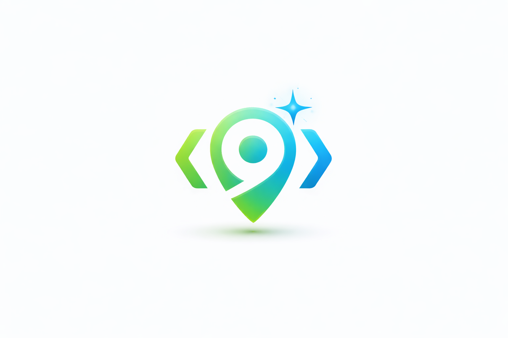

<div align="center">



# ⚡ codegenAI

**The first fully local AI app builder — powered entirely by your Ollama models.**


*No cloud. No API keys. No subscriptions. Just your machine and your imagination.*

<br>

[](#)

**v1.0.0 · Apple Silicon (arm64)**

</div>

---

## ✨ What is codegenAI?

codegenAI is an open-source, fully local alternative to tools like Lovable or v0 — except everything runs on your machine using Ollama.

You describe an app in plain English → codegenAI generates a complete **full-stack Next.js + MongoDB** project → It tests it → Fixes it → Iterates with you.

The database is **zero-setup**: generated apps bundle an in-memory MongoDB, so they boot and persist data even with no database installed (point `MONGODB_URI` at a real database whenever you want one).

All locally. Always free.

---

## 🏗️ Features

| Feature | Description |
|---|---|
| 🏗️ **Full-Stack Generation** | Build complete Next.js (App Router) + MongoDB projects — pages, API routes, and data models — from a plain-English description |
| 🗄️ **Zero-Setup Database** | Generated apps bundle `mongodb-memory-server`, so they run and persist data with no MongoDB install |
| ✏️ **Smart Reprompt** | Three modes — patch (instant), modify (targeted), feature (new component) |
| 🧭 **Intent Classification** | Automatically routes your request: text/color tweaks skip the full rebuild cycle |
| 🔧 **Auto-Fix Pipeline** | Playwright + LLM catch and fix errors automatically |
| ➕ **Feature Injection** | Add new sections or features to existing projects via natural language |
| 📦 **ZIP Export** | Download your generated project as a ready-to-use ZIP |
| 👀 **Live Preview** | Real-time preview across desktop, tablet, and mobile |
| 📄 **Streaming Code Viewer** | Watch your code generate live, token by token |
| 💰 **Savings Calculator** | See how much you saved vs. ChatGPT, Claude API, and Lovable after every build |
| 💻 **Native macOS DMG** | Install and run as a native desktop app |

---

## 💻 Installation (macOS)

[](#)

1. Click the **Download** button above
2. Open the downloaded `codegenAI` DMG
3. Drag **codegenAI** to your Applications folder
4. Make sure [Ollama](https://ollama.ai) is running with at least one model pulled
5. Open codegenAI and start building

> **First launch:** If macOS blocks the app ("Apple could not verify"):
> 1. Right-click (or Control-click) **codegenAI** in your Applications folder
> 2. Select **Open** from the menu
> 3. Click **Open** again in the warning dialog

Alternatively, go to **System Settings → Privacy & Security** and scroll down to click **Open Anyway**.

### 🧹 Full Uninstallation / Reset

To completely remove all codegenAI data (including generated projects and settings) on macOS:

```bash
rm -rf ~/Library/Application\ Support/codegenai*
```

*(You can also use the **Maintenance → Factory Reset** menu option inside the app.)*

---

## 🚀 Run from Source

### Prerequisites

- Python 3.9+
- Node.js 20 LTS
- [Ollama](https://ollama.ai) installed and running

### 1. Pull your preferred models

codegenAI is tuned for **Gemma 4 12B**, running at a ~98K context window with thinking set to low. One model drives all six agents:

```bash
# Recommended
ollama pull gemma4:12b     # Google Gemma 4 12B — the default for every stage

# Fallback if Gemma 4 is not yet available in your Ollama:
ollama pull gemma3:12b
```

You can pick a different model for the **Refine** and **Build** roles inside the app — any Ollama model works — but the deterministic scaffold, the fixed API contract, and the sanitizer are what keep output bug-free, so even a 12B model produces a working full-stack app.

> Context window (~98K) and the low thinking level are configured centrally in [`agents/llm.py`](agents/llm.py).

### 2. Clone and install

```bash
git clone <your-codegenAI-repository-url>
cd codegenAI
npm install
pip3 install -r requirements.txt
```

### 3. Run

```bash
python3 server.py
```

### 4. Open in browser

```
http://localhost:7824
```

---

## ✏️ Reprompt Modes

Once an app is built, the toolbar gives you three ways to iterate:

| Tab | When to use | How it works |
|---|---|---|
| **Reprompt** | Change text, colors, layout, logic | Regenerates the targeted section component(s), then re-tests |
| **Feature** | Add a brand-new section or component | Creates a new section matched to the existing style and injects it into `app/page.jsx` |
| **Fix Bugs** | Something looks broken | Runs the full auto-fix pipeline: `next build` → LLM fix → Playwright retest |

### How updates work

The Reprompt/Feature flow asks the model which section component(s) to touch, regenerates
each through the same generate → sanitize → integrate path as a fresh build, then restarts
Next.js and runs the test/fix loop.

- **modify** — `"redesign the hero section layout"` → targeted rewrite of that component → Next.js restart → test.
- **feature** — a new section is generated and injected into `app/page.jsx`, then tested.

---

## 💰 Savings Calculator

After every build, codegenAI shows a popup comparing what the same token usage would have cost on paid APIs:

| Service | Pricing basis |
|---|---|
| ChatGPT (GPT-4o) | $5 input / $15 output per 1M tokens |
| Claude (Sonnet) | $3 input / $15 output per 1M tokens |
| Lovable | ~$40 per 1M tokens equivalent |
| **codegenAI** | **$0.00** |

A typical full-stack build uses 60k–180k tokens across the six agents. The savings add up fast.

---

## 🏗 Architecture

```
codegenAI/
├── server.py              # Main server — HTTP :7824, WebSocket :7825; run_pipeline()
├── agents/
│   ├── llm.py             # Central Ollama access — gemma4:12b, ~98K ctx, thinking low
│   ├── refiner.py         # Agent 1 · Architect — spec + data_model + page sections
│   ├── scaffold.py        # Deterministic Next.js file generators (config, DB, models, routes)
│   ├── schema_agent.py    # Agent 2 · Data — writes lib/mongodb.js + models/*.js
│   ├── api_agent.py       # Agent 3 · API — writes app/api/**/route.js (CRUD)
│   ├── builder.py         # Agent 4 · Frontend — Navbar + long-page sections + page shell
│   ├── integrator.py      # Agent 5 · Integrator — 'use client' + frontend↔API wiring
│   └── tester.py          # Agent 6 · Tester — next build + page loads + API smoke tests
├── ui/index.html          # Frontend interface
├── electron/              # Electron wrapper
├── production-ready/      # Generated project output
└── logs/                  # Run logs
```

**Guiding principle:** a 12B model can't reliably hand-write a whole full-stack app,
so codegenAI generates as much as possible **deterministically** — config, the Mongo
connection singleton, Mongoose models, and standard CRUD routes are fixed strings, never
LLM output. The model's job is reduced to the **frontend**, given a fixed, documented API
contract. Then verification is hard (`next build` + API smoke tests) with an auto-fix loop.

### Generated project (App Router)

```
app/layout.jsx · app/globals.css · app/page.jsx      # shell + long page
app/api/<resource>/route.js · [id]/route.js          # CRUD (deterministic)
lib/mongodb.js  # cached connection + in-memory fallback (deterministic)
lib/api.js      # JSON helpers (deterministic)
models/<Name>.js  # Mongoose schema, overwrite-guarded (deterministic)
components/*.jsx   # Navbar + rich sections (LLM, sanitized)
```

### Agent pipeline

```
User prompt
   │
   ▼  1 Architect (refiner.py) ─ spec + data_model + sections
   ▼  2 Schema   (schema_agent) ─ lib/mongodb.js, lib/api.js, models/*.js   [deterministic]
   ▼  3 API      (api_agent)    ─ app/api/**/route.js                        [deterministic]
   ▼  4 Frontend (builder.py)   ─ Navbar + long-page sections + app/page.jsx [LLM + sanitizer]
   ▼  5 Integrator (integrator) ─ 'use client' + snap fetch to real routes   [deterministic]
   ▼  6 Tester   (tester.py)    ─ next build → load pages → GET each API → fix loop
   ▼
Live at http://localhost:3000
```

### Update Pipeline (Reprompt / Feature / Fix)

```
User reprompt
    │
    ▼
_decide_targets()  ← model picks which section component(s) to touch
    │
    ├── modify existing  ──▶ regenerate component → Integrator → Next.js restart → test loop
    └── new component     ──▶ generate + _inject_component_into_app() (app/page.jsx) → test loop
```

---

## 📄 License

[MIT](LICENSE) — free to use, modify, and distribute.

Author: ravindu b subasinha

---

<div align="center">

⚡ codegenAI · Built with Ollama · Next.js · MongoDB · Tailwind · Playwright · Electron

</div>
